[TOC]

## Avaddon勒索

该勒索病毒使用C++语言进行编写，采用RSA-2048和AES-256加密算法对文件进行加密，加密库使用的是Windows自带的CryptAPI

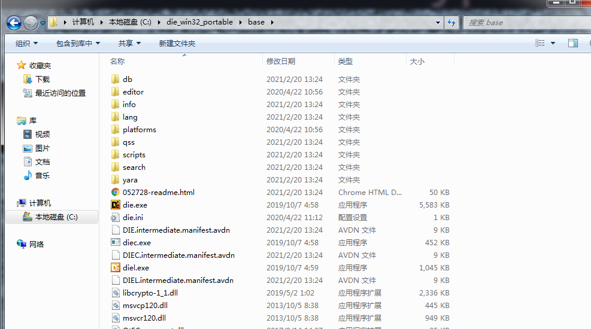

被该勒索加密后的文件后缀为avdn

## 解密工具

国外安全研究人员发布了一款Avaddon勒索病毒解密工具，解密工具源代码地址：

https://github.com/JavierYuste/AvaddonDecryptor

经过测试，这个工具确实是可以解密被Avaddon勒索加密的文件，下面是 我输出的解密时的日志

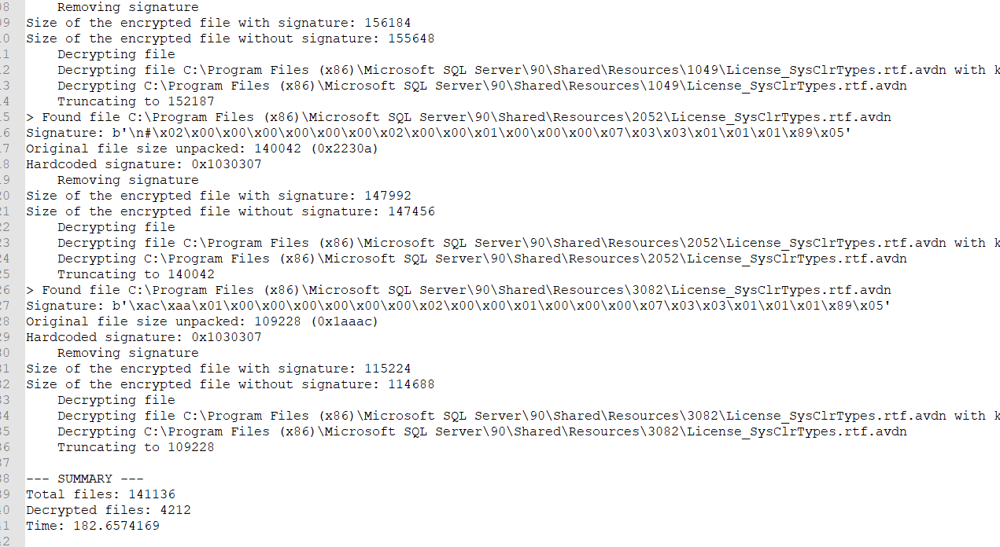

想要解密被加密的文件 需要具备下面几个条件

1. 当前存活的勒索进程
2. 勒索进程的dump文件
3. 一份被加密的文件
4. 一份被加密文件的原始文件

然后调用下面这个命令

```python
python3 main.py -f <encrypted_file> -o <original_file> -d <memory_dump> --folder <folder_to_decrypt>
```

就可以解密机器上所有的被加密文件了（需要修改源码中写死的三个路径 才能把解密脚本跑起来)

## 解密工具原理

目前我的需求是把这个解密能力集成的到公司的工具里，再来分析一下代码

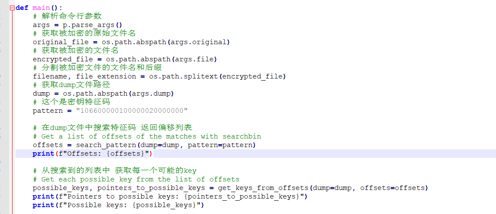

首先在dump文件中搜索所有可能的密钥，然后返回一个偏移列表，再根据这个偏移列表，去拿到所有的key

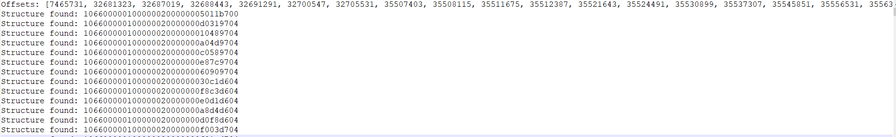

输出的日志显示offset有90个，也就是说有90个AES的密钥

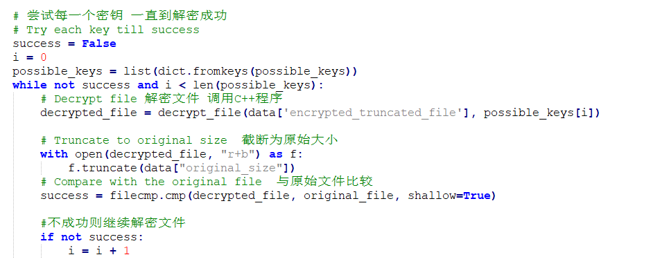

然后利用搜索到的key去解密文件，每解密一次，都去和源文件进行比对，比对成功则说明密钥正确

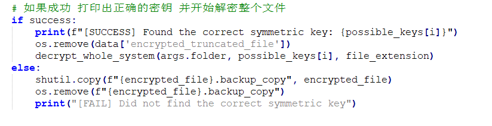

比对成功之后，开始解密整个系统的文件。

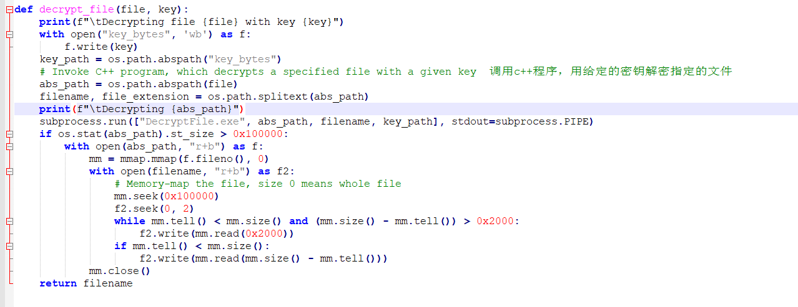

解密文件时，传入被加密的文件路径和解密后的文件路径以及密钥文件路径，然后调用DecryptFile.exe对文件进行解密

需要特殊处理的是，如果文件大小大于0x100000个字节，那么解密完成之后需要将0x10000字节后的数据全部复制到解密后的文件。

也就是说这个勒索实际上只会加密前0x10000个字节，这个细节在目前已有的分析报告中并没有提及。

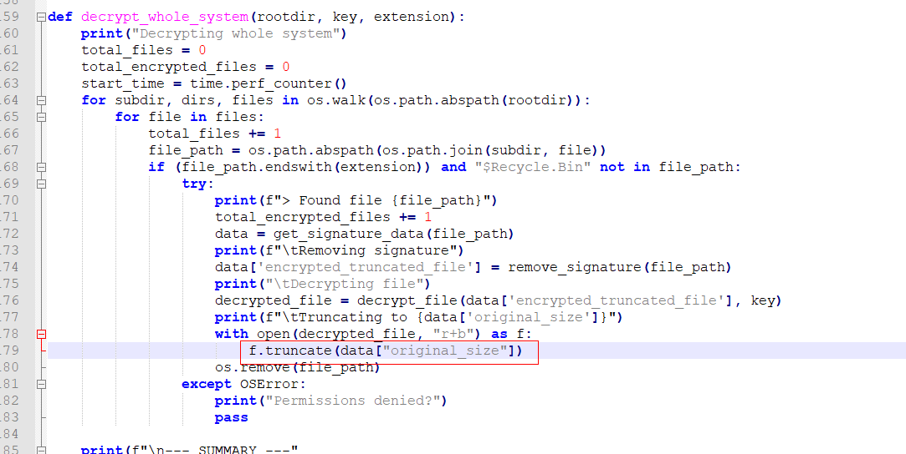

解密完成之后，将文件截断为原始文件大小


那么这里其实有一个问题，为什么可以根据内置的特征码搜索到AES密钥？那个密钥的特征码是哪来的？

作者在代码中给出了这样一句注释

```python
# Dump the process with procdump.exe -ma <PID>
# Pattern to search for (part of the key_data_s structure, in particular alg_id, flags and key_size):
# 106600000100000020000000
```

根据这个提示，找到了这个结构体，原文出处：https://forums.codeguru.com/showthread.php?79163-Structure-of-HCRYPTKEY-Data

```c++
struct key_data_s
{
    void *unknown; // XOR-ed
    uint32_t alg;
    uint32_t flags;
    uint32_t key_size;
    void* key_bytes;
};
```

勒索采用的是AES256 ，那 alg = 0x00006610,keysize=0x00000020, flags= 0x1

则特征值对应：106600000100000020000000

这个结构体来自于CryptApi，作者是逆向了cryptsp.dll和rsaenh.dll这两个dll得到的这个数据结构。

也就是说，这种在内存中暴力搜索密钥去解密被加密文件的方式，只适用于调用了CryptApi，并且随机生成密钥的情况。

那么有没有可能将作者的源码进行优化呢？答案是有

## 解密工具优化

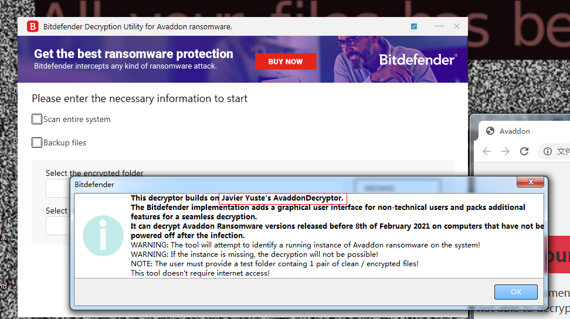

在这之后，bd也针对该勒索发布了一款解密工具，根据提示，也是基于上面的代码做了一个图形化的工具而已。

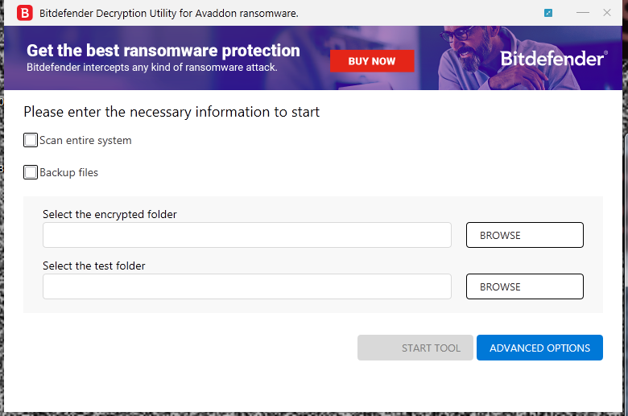

工具只需要一个被加密文件和被加密前的源文件，不需要选择进程，不需要dump文件，就能对整个文件夹进行解密，但是我这里测试是解密失败的。分析一下这个工具有没有什么可借鉴的地方

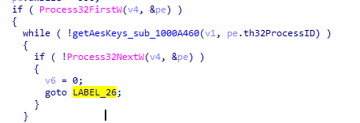

bd的做法是遍历整个系统的进程

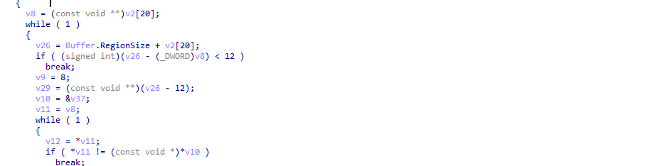

直接在内存里匹配密钥，

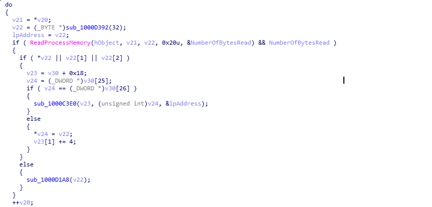

如果匹配完成，就直接读取，然后调用解密程序。

## 关于文件大小的疑惑

根据网上的分析报告提示

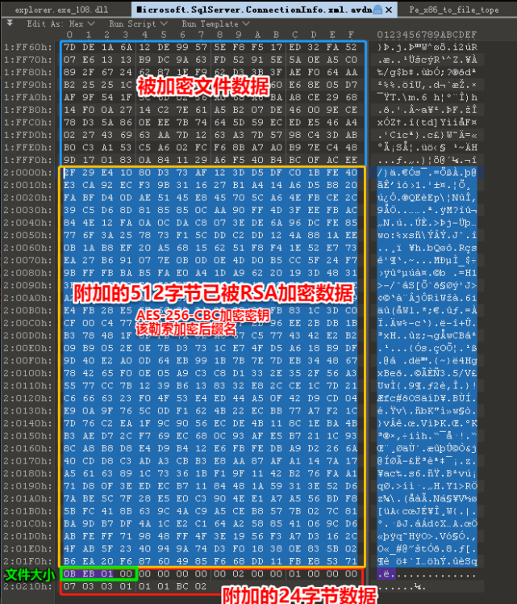

最后附加的24个字节中前4个字节是原始文件大小，但这个大小似乎不太对。如果原始文件大小是0x01EB0B，那么

```
0x01EB0B-512-24=0x1E8F3
```

但上图被加密文件数据的大小是0x20000，这个文件大小这么来看的话是对不上的。直到我即将完成我的解密工具的时候，解密出来的文件在末尾总是会出现一堆0。

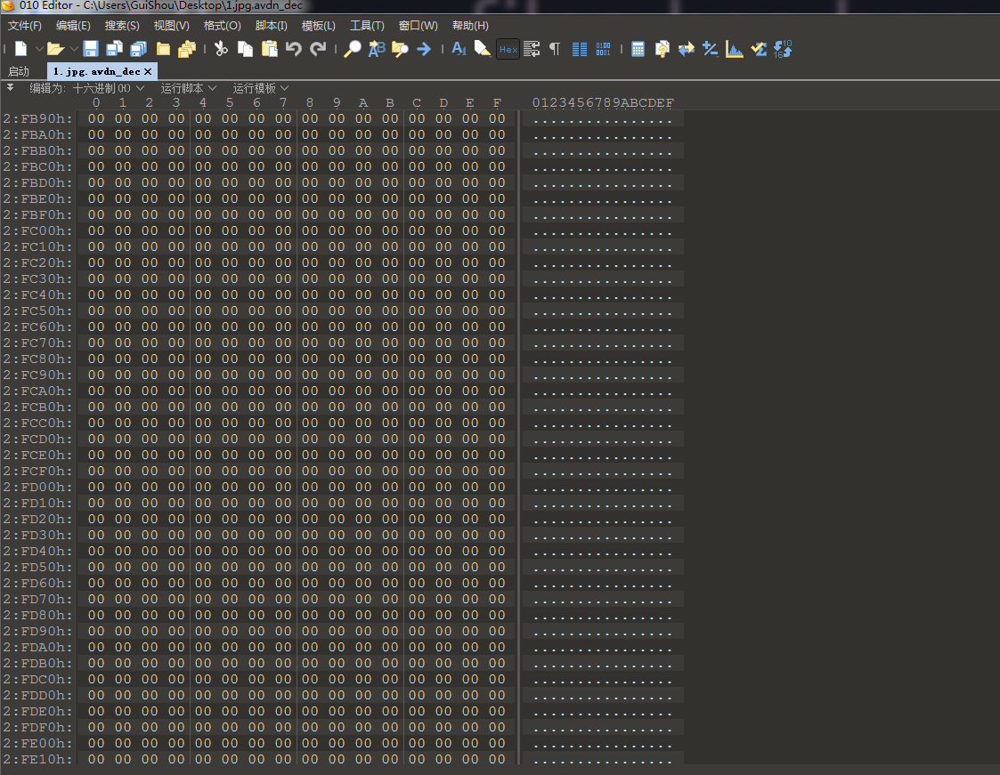

末尾的这一堆0，直接导致了解密后的文件和解密前的文件md5对比失败，一开始我以为是程序逻辑上的bug，但是后来发现并不是。实际上

文件的计算方式如下：

```
加密后的文件大小(小于0x100000)=原始文件大小+填充0的字节数+512+24
```

以下面某个文件为例：

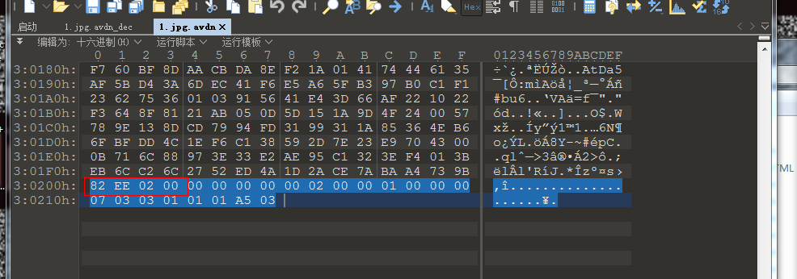

- 原始文件大小为：0x2EE82
- 加密后的文件大小为:0x30218

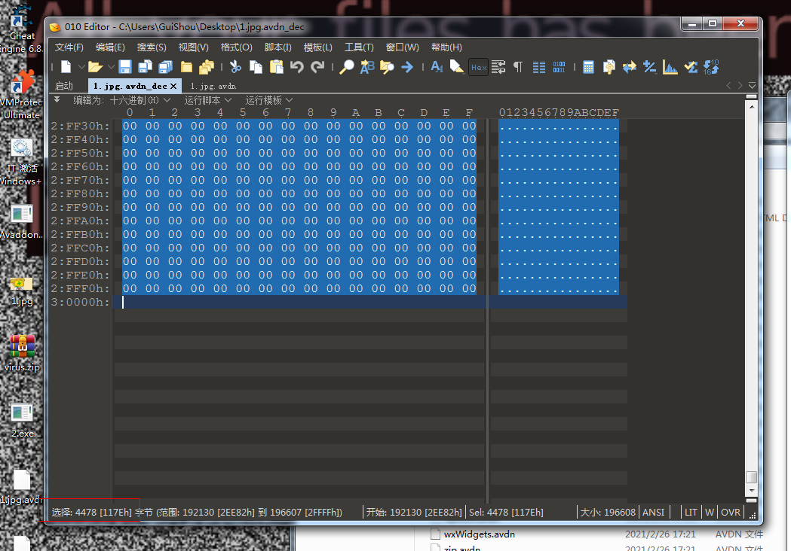

- 填充0的字节数为4478

```
0x30218=0x2EE82+4478+512+24
```

最后填充的0实际上是为了对齐到0x2000个字节，因为该样本每次会加密0x2000个字节，如果不足2000那么在加密的过程可能会导致异常退出。

## Avaddon勒索加密流程补充

解决了文件大小的问题，这里对Avaddon勒索的AES加密流程做一个补充。

对于文件大小小于0x10000的文件，首先会在文件末尾填充0，将大小补齐到0x2000，然后将样本进行加密处理，每次加密0x2000个字节

对于文件大小小于0x10000的文件，不需要进行填充，直接加密前0x10000个字节，0x10000以后的部分不做加密处理

## 解密工具实现

那么到这里，已经填完了所有的坑，可以做一个相对来说最优化的解决方案。整个解密流程如下：

```c++
BOOL Check(LPCTSTR lpszFile);
```

首先判断是否是该家族的加密文件，判断条件有三个，两个末尾24字节写死的特征码和文件大小的计算是否满足条件

```c++
void GetValidPid();
```

首先获取有效进程的PID，遍历整个进程，并且获取进程映像文件的md5，将md5和注册表启动项中的映像文件做对比，如果对比成功，说明可能是潜在的勒索进程

```c++
ScanAddress(hProcess, (char*)"106600000100000020000000", 0);
```

接着遍历所有的有效进程，搜索特征码，获取到所有可能的Key

```c++
BOOL GetUniqueKey(LPCTSTR szSourceFile, LPCTSTR szEncryptedFile);
```

用所有可能的Key文件去解密被加密文件，如果解密出来的文件和源文件md5一致，那么视为密钥获取成功

```c++
void DecryptAllFiles(LPCTSTR FileDirectory);
```

开始解密整个需要解密的目录

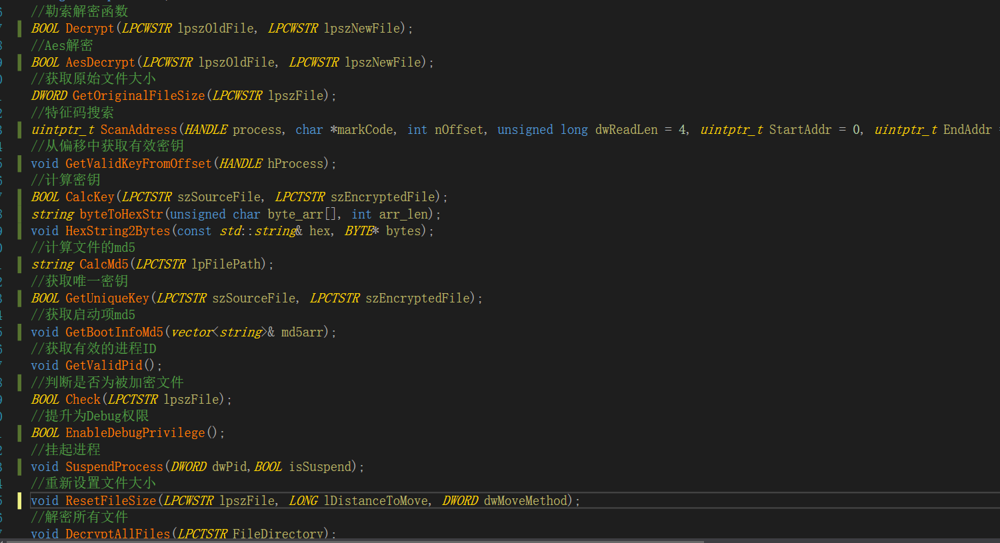

整个解密工具写了快1100行代码，花了6天左右。工程这里就不发了，记录一下整个过程和一些踩过的坑。

## 相关资料

勒索分析：https://www.freebuf.com/articles/others-articles/249109.html

解密工具: https://github.com/JavierYuste/AvaddonDecryptor

勒索解密工具分析：https://mp.weixin.qq.com/s?__biz=MzA4ODEyODA3MQ==&mid=2247486514&idx=1&sn=6464b9066980a6c045a33ef58dd5b6b0&chksm=902fa31aa7582a0c88242eb816fb466cbb7f94fe33b3e8b14f1f769d6d493961eaf9721cc87d#rd


