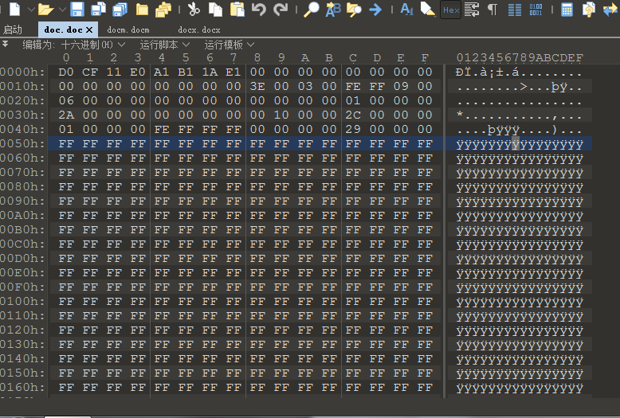
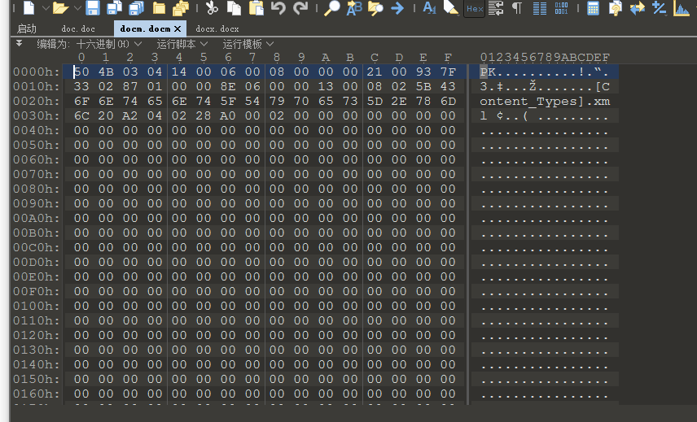
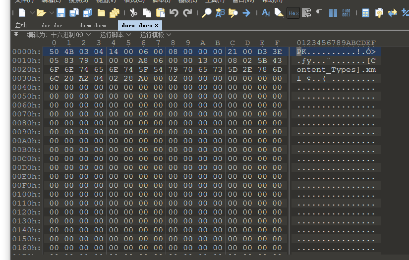
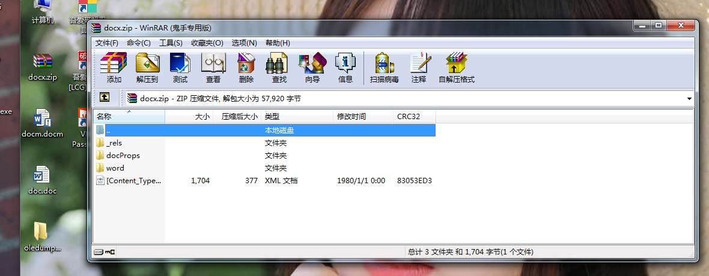
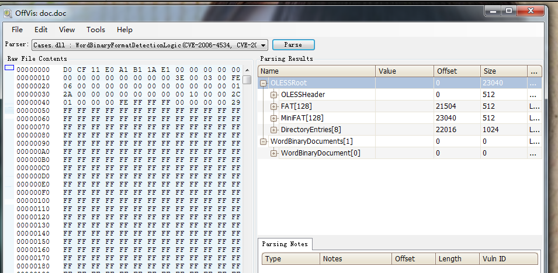
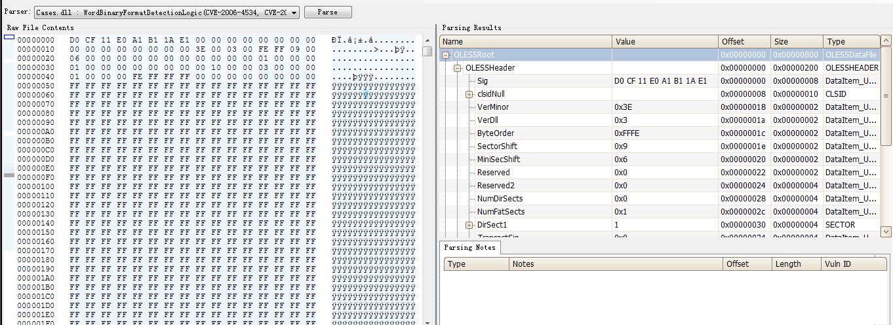
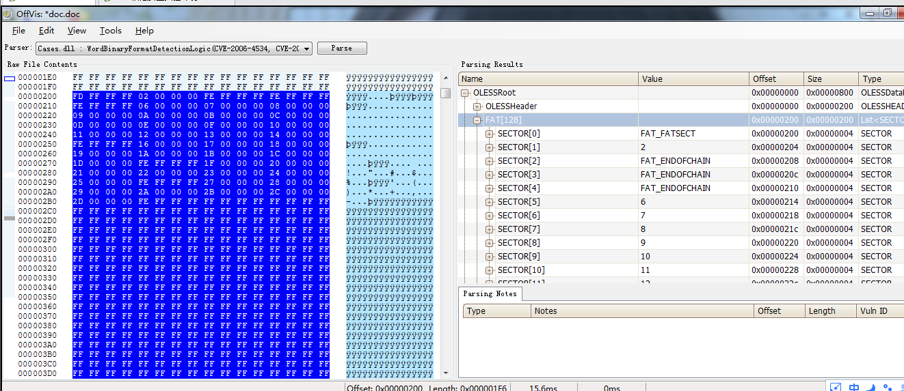
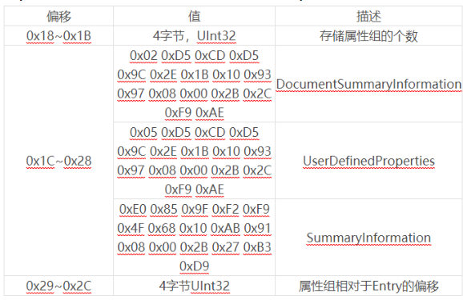
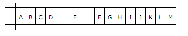
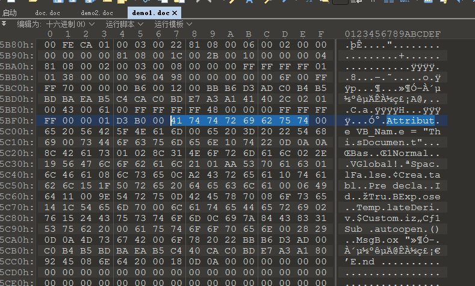

[TOC]

目前主流杀软在处理宏病毒时，都是直接删除含有宏病毒的文档，这样处理显得有些粗暴，将导致用户无法查看文档里的数据，如果是一些重要的业务数据，将造成业务数据的丢失，产生无法估计的后果。本文将介绍一种宏病毒处理思路，在不删除文档文件的情况下清除宏病毒。

## 复合文档二进制解析

在正式处理宏病毒前，我们必须对Office文档的数据结构以及宏的数据结构有着初步的了解。

### 复合文档数据结构解析

Office文档（如：.doc、.ppt、.xls等）很多是**复合文档（OLE文件）**，所有文件数据都是存储在一个或多个流中。每个流都有一个相似的数据结构，用于存储元数据的数据结构。这些元数据有用户和系统的信息、文件属性、格式信息、文本内容、媒体内容。宏代码信息也是以这种方式存储在复合文档中的。为了在Office文档文件中提取出宏代码，必须能够解析复合文档的二进制格式，下面以word为例，分析复合文档的二进制结构。

#### 准备工作

 （1）准备工具：

  Office Visualization Tool：微软提供的office二进制格式查看工具，用于学习doc，xls，ppt等文档二进制格式；

  010Editor：一款流行的二进制编辑器。

（2）doc、docx和docm

​      许多用户在新建word文档时会发现有两个选项，新建Microsoft Word 97 - 2003 文档和新建新建 Microsoft Word文档。当用户点击新建Microsoft Word 97 - 2003 文档时，就会创建出一个.doc文件；而用户点击新建Microsoft Word 文档时，就会创建出一个.docx文件，实际上Microsoft Word 2007及之后的Word版本还支持.docm文件，那么这三种文件有什么区别呢？.doc文件是一种普通的OLE文件(复合文件)，能够包含宏。而.docx和.docm文件，实际上都是是压缩文件，下图是.doc文件.docx和.docm文件头二进制数据的对比图：

将docx.docx文件的文件名修改为docx.zip就可以以压缩包的形式打开.docx文件，如图所示：

实际上.docx主要的内容基本都存在于word目录下，比较重要的有以下的内容：

- document.xml：记录Word文档的正文内容

- footer*.xml：记录Word文档的页脚

- header*.xml：记录Word文档的页眉

- comments.xml：记录Word文档的批注

- footnotes.xml：记录Word文档的脚注

- endnotes.xml：记录Word文档的尾注

利用同样的方式打开.docm文件，可以发现和.docx文件的内容基本相同，但是比.docx文件多了一个文件：

vbaProject.bin：这是一个复合文件，记录vba工程信息

#### 基础知识

 OLE文件数据的存储结构和**磁盘数据的存储结构**有很大的相似性，都是以扇区为单位进行存储的，但二者的扇区是截然不同的。

对于一个doc文件，其实质是一复合二进制文件（OLE文件），用**Office Visualization Tool**载入.doc文件，可以看到清晰的文件结构，如图所示：

  首先是文件头**Header**，是固定的512字节。Header中记录着文件解析必须的所有参数。Header之后的区域是不同的Sector。

 **Sector(扇区)**,一般是512字节,是实际数据存储的地方，复合文档中数据都是以扇区为单位进行存储的。扇区有两种Sector和Mini-Sector（Sector：扇区，一般是512字节；Mini-Sector：短扇区，64字节）。扇区内存储的数据有种类有Stroage、Stream、Directory、FAT、Mini-FAT（属于Mini-Sector）、DIF等，但每个扇区中只能存储一种数据类型。每个Sector都有一个SectorID，但是Header所在的扇区ID是-1，并不是0。Header后的Sector才是“第一个”Sector，其SectorID为0[22]。

**Storage与Stream**的功能相当于文件系统中的文件夹与文件的功能。Storage中是没有任何“实质性”的内容的，只会记录其包含的Stream和Storage，是一个Stream和Storage的目录。“实质性”的内容全在Stream里面。

**Directory**，中文“目录”，和Storage的“目录”功能有着很大区别，Directory是一个Storage和Stream的索引。这一部分存储空间是用来记录Storage和Stream的存储结构以及名称、大小、起始地址等信息。

 **FAT**是索引表。数据在硬盘上的存储是离散的，需要有一个索引表能找到这些数据，索引表中存放着数据的起始地址（即扇区的），其实每一条索引也是离散的，索引中一般还有一条数据指向下一条索引，类似于链表。FAT实际记录了该扇区指向的下一个扇区的地址。

 **DIFAT**是分区表，是FAT的索引表。FAT也是存储在Sector里面，但是FAT本身也比较大，所以利用DIFAT作为FAT的索引表，记录了FAT所在的Sector的起始地址以及逻辑关系

每个扇区占据512字节，Header占据一个扇区。除去文件头外，扇区ID从0开始。若要读取某个扇区的信息，可以采用以下的公式：

扇区ID x 扇区大小 + 512

但是要长扇区和短扇区，默认扇区是长扇区，长扇区大小为512字节，短扇区大小是64字节。

#### Header

复合文档的文件的头Header是固定的512字节，其中每一个字节都有十分重要的含义。图所示的是一个doc文件的Header部分:

下表是对图中这512字节的解析：

| 字节偏移     | 说明                                                         |
| ------------ | ------------------------------------------------------------ |
| 0x00H~0x07H  | 8个字节:固定值：0xD0 0xCF 0x11 0xE0 0xA1 0xB1 0x1A0xE1，表示此文件是复合文件 |
| 0x08H~0x17H  | 16个字节：ClassID，不过很多文件都置0                         |
| 0x18H~0x19H  | 2个字节：一般为0x3E，表示文件格式的修订号                    |
| 0x1AH~0x1BH  | 2个字节：一般为0x3，表示文件格式的版本号                     |
| 0x1CH~0x1DH  | 2个字节：一般0FE 0xFF，表示文档使用的存储格式是小端模式（理论上0xFF 0xFE则表示大端存储方式） |
| 0x1EH~0x1FH  | 2个字节：默认值:0x09 0x00，表示Sector的大小，当值为9时，即每个Sector为512（29）字节 |
| 0x20H~0x21H  | 2个字节：默认值:0x06 0x00，表示Mini-Sector的大小，当值为6时，即每个Mini-Sector为64（26）字节 |
| 0x22H~0x23H  | 2个字节，UInt16，预留值，置0                                 |
| 0x24H~0x27H  | 4个字节，UInt32，预留值，置0                                 |
| 0x28H~0x2BH  | 4个字节：表示目录扇区Directory Sectors的数量的数量；若版本号为3，则该值为0 |
| 0x2CH~0x2FH  | 4个字节：表示FAT的数量                                       |
| 0x30H~0x33H  | 4个字节：表示Directory开始的SectorID文件目录流的起始扇区编号 |
| 0x34H~0x37H  | 4个字节：一般置0，用于事务                                   |
| 0x38H~0x3BH  | 4个字节：表示ulMiniSectorCutoff，是最小串（Stream）的最大大小，默认为4096（0x00 0x10 0x00 0x00） |
| 0x3CH~0x3FH  | 4个字节：_sectMiniFatStart ，是MiniFAT表开始的SectorID       |
| 0x40H~0x43H  | 4个字节：表示MiniFAT表的数量                                 |
| 0x44H~0x47H  | 4个字节：表示DIFAT开始的SectorID，DIFAT的起始扇区编号        |
| 0x48H~0x4BH  | 4个字节：表示DIFAT的数量                                     |
| 0x4CH~0x1FFH | 436个字节：UInt32，包含了109个DIFAT，每个DIFAT占用4个字节，是前109块FAT表的SectorID。Header中存储的了109个DIFAT数据。但是有时候109个还不够，这时候可以使用其它扇区专门存储DIFAT数据，0x44H~0x47H中记录的就是除这109项外，其他的DIFAT数据的起始扇区编号。在DIFAT扇区的最后4个字节，存储了下个DIFAT扇区的ID，以表示下个DIFAT数据的存储位置 |

#### FAT

FAT实际记录了该扇区指向的下一个扇区的地址。

前文已述一个扇区能且只能存放一种类型的数据，但是复合文档怎么知道扇区中存储的是哪一种类型的数据？因而在复合文档的FAT数据中，除了表示扇区ID的数字，还有些特殊的数字ID表示一些特定的扇区，详细介绍见表：

| 类型           | ID值                  | 描述                                     |
| -------------- | --------------------- | ---------------------------------------- |
| REGSECT        | 0x00000000-0xFFFFFFF9 | 正常的数据扇区ID，表示下一个数据扇区     |
| MAXREGSECT     | 0xFFFFFFFA            | 扇区ID最大值                             |
| Not applicable | 0xFFFFFFFB            | 保留扇区ID                               |
| DIFSECT        | 0xFFFFFFFC            | DIFAT扇区ID，表示该扇区存储了DIFAT的数据 |
| FATSECT        | 0xFFFFFFFD            | FAT扇区ID，表示该扇区存储了FAT的数据     |
| ENDOFCHAIN     | 0xFFFFFFFE            | 结束字符                                 |
| FREESECT       | 0xFFFFFFFF            | 空扇区ID                                 |

一个扇区大小为512字节，一组FAT信息占据4个字节。因而一个FAT扇区中，最多能够存放128组FAT信息，可以利用DIFAT列表把不同的FAT扇区串联起来。FAT信息在一个扇区内部的存储都是连续的。比如某个FAT扇区，第1组FAT信息代表的扇区的ID是3的话，则这个扇区可以表示的扇区ID范围是3到131。

MINIFAT的解析，其方法和FAT类似，其起始扇区ID存放在Header信息中，MINIFAT表的顺序，当记录在FAT中，这里就不赘述了

#### Directory

复合文档从字面上理解就是很多内容放在一起复合形成文档，这么多内容当然需要有个目录，而Directory就是这个目录。Directory起始的SectorID需要从Header中读取，定位的方法在上文中提到（512+ 扇区大小 * 扇区ID）。Directory中每个DirectoryEntry固定为128字节，其主要结构如表所示：

| 偏移        | 描述                                                         |
| ----------- | ------------------------------------------------------------ |
| 0x00H~0x3FH | 64个字节：存储DirectoryEntry名称的，并且是以Unicode存储的，即每个字符占2个字节， |
| 0x40H~0x41H | 2个字节：DirectoryEntry名称的长度（包括最后的“\0”）          |
| 0x42H~0x42H | 1个字节：是DirectoryEntry的类型。0为非法，1为目录（storage），2为节点（Stream），5为根节点（Root Entry即第一个目录内容） |
| 0x43H~0x43H | 1个字节：节点的颜色                                          |
| 0x44H~0x47H | 4个字节：该DirectoryEntry左兄弟的EntryID（第一个DirectoryEntry的EntryID为0，下同） |
| 0x48H~0x4BH | 4个字节：该DirectoryEntry右兄弟的EntryID                     |
| 0x4CH~0x4FH | 4个字节：该DirectoryEntry一个孩子的EntryID                   |
| 0x50H~0x5FH | 16个字节：表示CLSID                                          |
| 0x60H~0x63H | 4个字节：表示UserFlags，一般是0                              |
| 0x64H~0x6BH | 8个字节：表示文件创建时间                                    |
| 0x6CH~0x73H | 8个字节：表示文件修改时间                                    |
| 0x74H~0x77H | 4个字节：表示该DirectoryEntry开始的SectorID                  |
| 0x78H~0x7BH | 4个字节：是该DirectoryEntry存储的所有字节长度                |
| 0x7CH~0x7FH | 4个字节：保留置0                                             |

Directory为Storage的有clsid、time、和sidChild，stream可能没有。Stream有个有效的sectdtart和ulsize，但是storage的是0。

当usize小于ulMiniSectorCutoff时，表示stream使用的是MiniFat。常见的Directory有很多，比较重要的有root entry、WordDocument、1Table、SummaryInformation、DocumentSummaryInformation、Macros和Vba。**root entry**是Directory里的第一个内容，只是作为根节点，有些文档中直接命名为R，接下来的介绍WordDocument、1Table、SummaryInformation、DocumentSummaryInformation、Macro都是位于root entry节点下的，其中Vba位于Orphaned节点下。DocumentSummaryInformation和SummaryInformation是摘要信息。对于DocumentSummaryInformation，其结构如表所示:

对于每个属性组，其结构如下：

1.0x00H~0x03H：是属性组大小。

2.0x04H~0x07H：是属性组中属性的个数。

3.从008H开始的每8字节，是属性的信息：

​      前4字节：属性的种类。

​      后4字节：属性内容相对于属性组的偏移。

常见的属性编号如表所示：

| 属性               | 值   | 属性                 | 值   |
| ------------------ | ---- | -------------------- | ---- |
| Unknown            | 0x00 | Scale                | 0x0B |
| CodePage           | 0x01 | HeadingPairs         | 0x0C |
| Category           | 0x02 | DocumentParts        | 0x0D |
| PresentationTarget | 0x03 | Manager              | 0x0E |
| Bytes              | 0x04 | Company              | 0x0F |
| LineCount          | 0x05 | LinksDirty           | 0x10 |
| ParagraphCount     | 0x06 | CountCharsWithSpaces | 0x11 |
| Slides             | 0x07 | SharedDoc            | 0x13 |
| Notes              | 0x08 | HyperLinksChanged    | 0x16 |
| HiddenSlides       | 0x09 | Version              | 0x17 |
| MMClips            | 0x0A | ContentStatus        | 0x1B |

对于每个属性，其结构如下：

1.0x00H~0x03H：属性内容的类型，值有：

  0x02表示UInt16

  0x03表示UInt32

  0x0B表示Boolean

  0x1E表示String

2.属性组中剩下的字节是属性的内容，当属性组中内容类型是String时，剩下字节不定长，剩下三种类型都是4个字节（多余字节置0）。

“WordDocument”和“1Table”是专门存储文档内容的DirectoryEntry。需要说明的是，Word中的存储文档内容的DirectoryEntry与PowerPoint和Excel中都不同，Word中是“WordDocument”和“1Table”，PowerPoint是“PowerPoint Document”，Excel是“Workbook”。

对于WordDocument，其最重要的应该是其中包含的FIB（File Information Block）了，FIB位于WordDocument的开头，其包含着Word文件非常重要的参数，诸如文件的加密方式、文字的编码等等。

FIB是可变长的，开头是固定32字节长的FibBase：

0x00H~0x01H：0xA5EC（0xEC 0xA5），表示Word二进制文件。

0x02H~0x03H：一般是0xC1，表示Word97版本，表示最低版本

0x0AH~0x0BH：16bit，被分成了13部分。除了第5部分占了4bit外，其余12部分各站1bit，总计16bit。说明下13部分是如何分配的，最左为最低位。

A：为文档是否是.Dot文件（Word模板文件）

B：目前该位没有解析出含义。

C：文档快速保存时生成的格式。

D，文档中是否存在图片。

E，快速保存的次数。

F，文档有没有加密。

G，文字存储的位置，为1表示1Table，为0表示0Table。

H，是否只读方式代开

I，是否含有写保护密码。

J，固定值1。

K，应用程序默认的语言和字体。

L，文档语言是东亚语言。

M，文档加密方式，1表示异或混淆，0则是其他加密方式；如果文档未加密则忽略该值。

0x0CH~0x0DH：一般为0x00BF，少数是0x00C1。

0x0EH~0x11H：文档加密的密钥；否则应置0。

0x12H~0x12H：置0。

0x13H~0x13H：16bit被划分为6部分

第1位：0。

第2位：新建文件的方式。

第3位：页面默认的格式。

第4位：忽略

第5位：忽略。

第6-8位：忽略。

014H~017H：置0，忽略。

018H~01FH：忽略。

FIB中内容仍然有很多，但是了解上述内容就可以读取文档的内容，之后的部分就不再介绍了。

“1Table”和“0Table”也是存储文档内容的目录，有时候也被叫做Table Stream，Table Stream其实是他们的总称，根据FIB中的信息判断文字存于“1Table”还是“0Table”。但是目前仍然不知道文字存储与哪一个扇区中。这些信息都存放在Table Stream中的Piece Table中，Piece Table的位置可以从FIB中获取到。Piece Table，其结构为：

0x00H~0x00H：固定值0x02，Piece Table的标识。

0x01H~0x04H：是Piece Table的大小。

Piece Table中数量的计算公式：

n=（Piece Table的大小 - 4）/（4 + Piece Element的大小）

随后的4*(n + 1)个字节，存储Piece Element中存储的文本的开始位置（结束位置即下一个的开始位置）。

之后的8*n个字节，存储每个Piece Element的信息。

由此可以获取Word中文本的存储位置，文字是按下面的顺序存储的：

正文内容（Main document）

脚注（Footnote subdocument）

页眉和页脚（Header subdocument）

批注（Comment subdocument）

尾注（Endnote subdocument）

文本框（Textbox subdocument）

页眉文本框（Textbox Subdocument of the header）

Macro和Vba的解析与WordDocument的解析类似，需要注意的是其Type标志为1。

#### 补充

在Word中，WordDocument永远是Header后的第一个扇区，但是PowerPoint Document不一定。不过，PowerPoint的数据都存储在PowerPoint Document中。

PowerPoint以**Record**为基础存储的内容。Record有Container Record和Atom Record两种。类似于Sector中的 Stroge和Stream，Container Record是容器，Atom Record是容器中的内容，那么其实PowerPoint Document中存储结构也类似于WordDocument的其实也就是树形结构。对于每一个Record，其结构如下：

0x00H~0x01H：Record的版本，其中低4位是recVer（如果是0x0F则一定为Container），高12位是recInstance。

0x02H~0x03H：Record的类型recType。

0x04H~0x07H：Record内容的长度recLen。

剩下的字节是Record的具体内容。

由于PowerPoint支持上百种Record，表举一些常用的Record：

| 值（16进制） | 值（10进制） | 描述                                                         |
| ------------ | ------------ | ------------------------------------------------------------ |
| 0x03E8       | 1000         | DocumentContainer                                            |
| 0x0FF0       | 4080         | MasterListWithTextContainer/SlideListWithTextContainer/NotesListWithTextContainer |
| 0x03F3       | 1011         | MasterPersistAtom/SlidePersistAtom/NotesPersistAtom          |
| 0x0F9F       | 3999         | TextHeaderAtom                                               |
| 0x03EA       | 1002         | EndDocumentAtom                                              |
| 0x03F8       | 1016         | MainMasterContainer                                          |
| 0x040C       | 1036         | DrawingContainer                                             |
| 0x03EE       | 1006         | SlideContainer                                               |
| 0x0FD9       | 4057         | SlideHeadersFootersContainer/NotesHeadersFootersContainer    |
| 0x03EF       | 1007         | SlideAtom                                                    |
| 0x03F0       | 1008         | NotesContainer                                               |
| 0x0FA0       | 4000         | TextCharsAtom                                                |
| 0x0FA8       | 4008         | TextBytesAtom                                                |
| 0x0FBA       | 4026         | CString，储存很多文字的Atom                                  |

### 宏代码数据结构解析

在使用oledump.py提取宏代码数据时，会发现每段宏代码起点处都是一段“Attribute”信息。实际上，我们可以使用“Attribute”字符来定位宏代码在文档中的存储位置。使用010Editor打开demo1.doc，搜索字符串”Attribut”，注意这里不是搜索“Attribute”，不要加e！！！：

从图中，我们可以看到autoopen()和MsgBox等字符，可以确定这里存储的就是宏代码数据

文档中的宏代码数据是分段存储的，每段最大是0xFFF字节，图中的D3和B0表示此段宏代码数据的长度：0x0*0x100+0xD3=0xD3，0xD3、0xB0后的数据就是宏代码数据（包含宏属性信息）

宏代码里的数据是按组进行划分的，每组包括一个字节的标志，和8个元素：

| Flag   | 0x01  | 0x02  | 0x04  | 0x08  | 0x10  | 0x20  | 0x40  | 0x80  |
| ------ | ----- | ----- | ----- | ----- | ----- | ----- | ----- | ----- |
| 标志字 | 元素1 | 元素2 | 元素3 | 元素4 | 元素5 | 元素6 | 元素7 | 元素8 |

一般来说一个元素对应一个字节，标志字Flag的每一位对应一个元素，表示这一个元素的具有两个字节。

在解析宏代码时，就是把这些元素拼接起来，组成完整的宏代码。

## 说明

- 本文并非原创，乃是征得作者同意后的转载 原作者为狐狸先生 未经允许,禁止转载
- 需要相关文件可以到我的Github下载:https://github.com/TonyChen56/Virus-Analysis
- 应作者要求 贴上知识星球图片 主要分享病毒分析和逆向破解技术，文章质量很高 我也在这个星球里 大家可以积极加入

