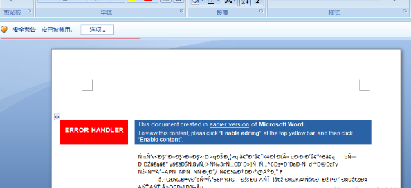
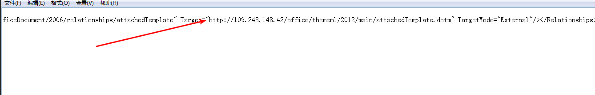

[TOC]

## 前言

docx文件可能是宏病毒吗？

如果你是一周前问笔者这个问题，笔者一定会斩钉截铁的说：”不可能！” 。笔者在之前的文章中提到过，docx中是不含宏的，所以不可能是宏病毒。但是，现在笔者却会斩钉截铁的说:”即使没有宏也可能是宏病毒！”。

故事要从很久很久以前说起，office文档诞生后不久，就迅速占领各大平台，成为使用最广泛的文档文件。office文档能够迅速占领各大平台市场，离不开其丰富多样的内容。为了组装其丰富多彩的内容，微软最初使用的是OLE文件格式，OLE文件数据管理方式类似磁盘管理，该方式能够有效组装各个零件，但是却不够灵活。在office2007中，微软推出了OpenXML文件格式，该文件格式其实是标准的压缩文件格式，通过XML组装各个零件。OpenXML文件格式足够灵活，同时也“解决”了office文档最大的安全问题——宏病毒威胁，微软将所有宏相关的内容都放进了vbaProject.bin文件中，只要文件中不包含vbaProject.bin，就不可能含有宏，也就不可能是宏病毒。于是，微软推出了以x结尾(docx)和以m结尾(docm)的两大类文档文件，这两类文件均是OpenXML文件，但是以x结尾的文件中不含有vbaProject.bin。

正所谓“道高一尺魔高一丈”，没有vbaProject.bin，攻击者们就不能使用宏病毒进行攻击了吗？

## 远程模板注入执行宏

既然本地文件中没有宏，攻击者便尝试执行远程文件中宏。来自[APT28的最新样本](https://mp.weixin.qq.com/s/zoaJAoUtjRtJzT6UkQuN5w)将此技术展现的淋漓尽致。

该样本是docx文件，文件内没有任何宏相关信息，但是打开该文件后，却会弹出经典的“宏安全告警”：

这个宏是哪里来的？

为了追踪这个宏的来源，我们开启行为监控软件，再次打开这个docx文件。这个时候就会发现，该docx文件打开了一个远程站点上的dotm文件：

以m结尾的文档文件是可能携带宏的。

查看宏代码，dotm文件中的宏和docx中的宏代码完全相同，可以确定docx文件中的宏就是来自于这个dotm文件。

继续追踪，docx文件为什么会打开这样远程dotm文件？

解压docx文件，遍历所有文件，搜索字符串"http://109.248.148.42/office/thememl/2012/main/attachedTemplate.dotm”，我们可以在./word/rels/settings.xml.rels中找到这段字符串：

远程链接的位置也找到了，但是新的问题又出现了，这段字符串在docx中是如何起作用的？接下来我们就需要分析docx文件的文件格式了。

## docx文件格式解析

将docx文件后缀名修改为zip，解压该文件，我们发现其文件结构如下：

其结构解释如下:

此内容摘自于[l1xnan](https://segmentfault.com/a/1190000010475463)，虽然没有提到settings.xml.rel，但我们可以根据document.xml.rels猜测settings.xml.rels也是用于定位文档各零件的。在rels文件Relationship标签中，Target表示零件的文件位置，正常情况下，给值是相对路径，且存在于压缩包中：

通过恶意构造Target，使其执行远程文件，就可以打开远程文件：

APT28就是利用这种方式打开远程含有宏病毒的文档模板

## 窃取NTLM Hashes

此攻击技术最早由[pentestlab](https://pentestlab.blog/2017/12/18/microsoft-office-ntlm-hashes-via-frameset/)提出，与前文不同的是，此技术中修改的是webSetings.xml.rels文件，且只有在Office2010及之后版本才能利用成功。详细的操作步骤请看pentestlab的分析文章，笔者就不赘述了，实验效果如下：

此攻击技术能获取NTLM Hashes的原因是，经过恶意构造的docx打开时会访问远程资源，访问远程资源使用NTLM协议进行身份验证，从而泄露NTLM Hashes信息。

## 小结

与传统的病毒文档相比，这个攻击文档本身不含有恶意代码，任何静态扫描程序都无法发现宏本身，邮件拦截系统也很难发现存在其中的威胁，可以预见此类宏病毒威胁将会越来越多。而随着此类攻击技术的发展，除了settings.xml.rels、webSettings.xml.rels，其他rels也可能成为被攻击的目标。

**参考资料：**
https://mp.weixin.qq.com/s/zoaJAoUtjRtJzT6UkQuN5w
http://blog.redxorblue.com/2018/07/executing-macros-from-docx-with-remote.html
http://www.4hou.com/technology/9403.html

## 说明

- 本文并非原创，乃是征得作者同意后的转载 原作者为狐狸先生 未经允许,禁止转载
- 需要相关文件可以到我的Github下载:https://github.com/TonyChen56/Virus-Analysis
- 应作者要求 贴上知识星球图片 主要分享病毒分析和逆向破解技术，文章质量很高 我也在这个星球里 大家可以积极加入

