[toc]
# 背景

​	Office版本历经十几年的变迁，现已趋于成熟，但仍存在着新老版本交替使用的问题。Office 97-2003 Word的文件后缀为doc，新版本的Office文件后缀为docx，包含宏的文档后缀为docm。微软是不会允许将包含宏的文档命名为docx，但是可以被命名为老版的doc。例如一个docm文件，文件头的魔数是504b0304（ZIP文件的魔数），修改其后缀为doc后，文件头的魔数不变，且能够正常执行。而老版的doc文件头的魔数是d0cf11e（docfile的十六进制表示^_^）,**所以我们可以通过文件后缀和魔数是否匹配来判断一个文档是不是恶意的。**

​	随着这几年APT攻击的兴起，诱饵文档越来越多，对MACRO的研究自然也达到了新的高度，很多未公开的特性可以用来规避和绕过杀软，对威胁分析员造成了巨大的挑战。下面我就以威胁分析员的角度来介绍几种技术

### VBA stomping

VBA在Office文档中可以以下面三种形似存在

1、源代码。宏模块的原始源代码被压缩，并存储在模块流的末尾。可以删除源代码，并不影响宏的执行

2、P-Code。与VB语言相同，VBA同样有P-Code，通过内置的VB虚拟机来解释P-Code并执行，平常我们Alt+F11打开所看到的正是反编译的P-Code。

3、ExeCodes。当P-Code执行一次之后，其会被一种标记化的形式存储在__SRP__流中,之后再次运行时会提高VBA的执行速度，可以将其删除，并不影响宏的执行。

​	**每一个流模块中都会存在一个未被文档化的PerformanceCache，其中包含了被编译后的P-Code代码，如果_VBA_PROJECT流中指定的Office版本与打开的Office版本相同，则会忽略流模块中的源代码，去执行P-Code代码**

官方文档解释_VBA_PROJECT流

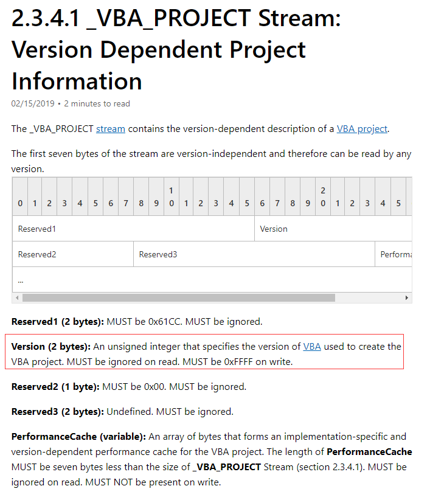

一定为（Must be）0xFFFF，而在实际文件中，以Office 2010（32位）为例

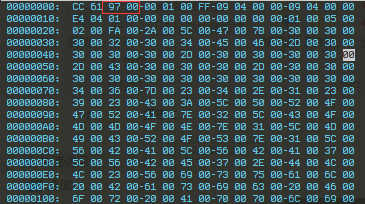

​	emmm，微软还是秀啊……

​	这种特性很适合用于定向攻击，且不容易被发现。通过信息收集得知目标的Office版本，利用VBA stomping使宏被特定版本的Office打开时才会执行恶意行为宏代码，除此之外的Office版本打开时执行正常宏代码

​	目前VBA stomping已有利用工具EvilClippy

```
https://github.com/outflanknl/EvilClippy
```

​	通过目前主流的宏分析工具（oletools，oledump，Pcodedmp）来探究分析此类样本的方法：

​	首先创建一个带宏的文档

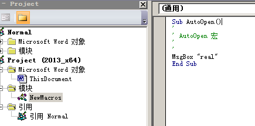

​	准备一个伪造的VBA文件fakecode_word_vba.txt

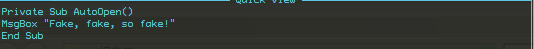

​	执行命令,-t参数指定Office版本

```
EvilClippy.exe -s fakecode_word_vba.txt -t 2010x64 x-encounter.doc
```

​	使用Office2010（64位）打开生成后的文档

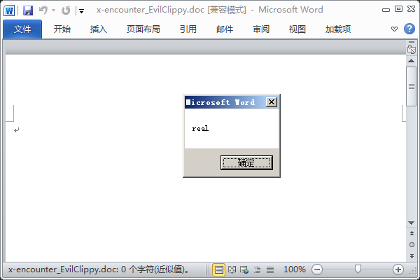

​	VBA编辑器

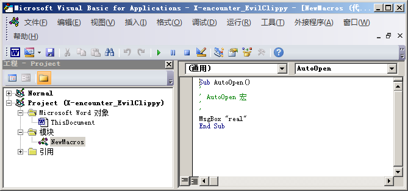

​	与原来的文档没有任何区别，接下来使用Office2013（64位）打开

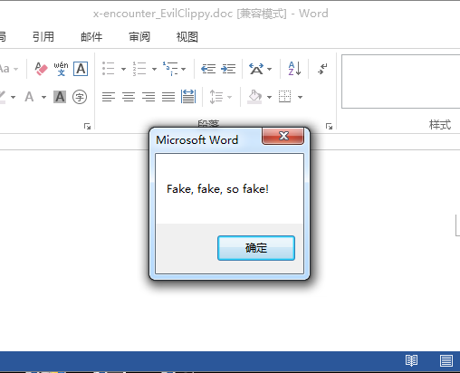

​	VBA编辑器

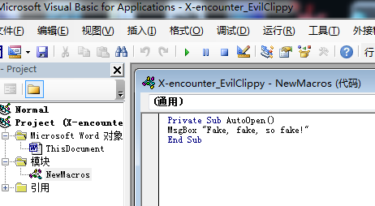

​	可以看到流模块中反编译的源代码被替换成了伪造的VBA代码，下面使用工具进行分析

​	OleTools

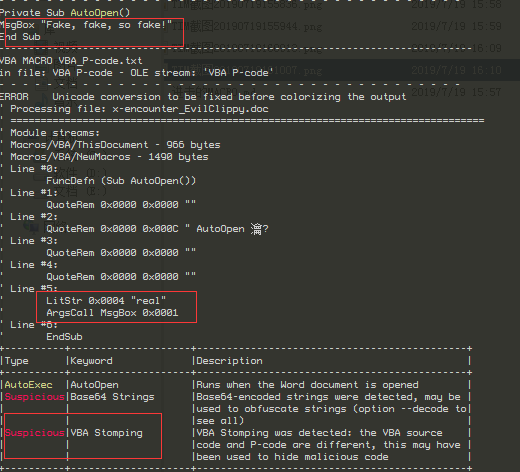

​	Olevba识别出来了所有的宏并给出VBA stomping警告

​	Oledump

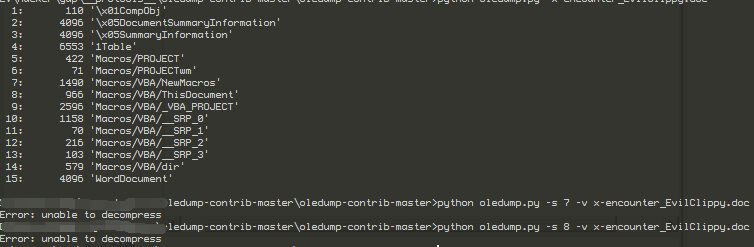

​	Oledump并没有识别出含有宏的流模块

​	Pcodedmp

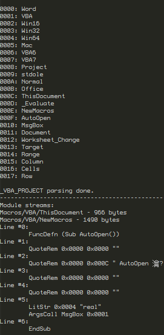

​	Pcodedmp精准的识别了真正的宏代码，忽略了伪造的VBA

​	通过VBA stomping原理可知，真正的代码存为了P-Code，所以olevba输出的结果中反编译形式的VBA即为真正的代码。可以通过Olevba判断是否使用了VBA stomping，如果是则直接使用Pcodedmp获取P-Code代码。静态看即可

​	如果想要调试，那么需要使用对应版本的Office，我这里通过_VBA_PROJECT中Version结构总结了一下32位下的版本号,64位研究方法一样。

2007(x86)   8800

2010(x86)   9700

2013(x86)   A300

2016(x86)   AF00

### 在VBA编辑器中隐藏宏

​	可以在VBA编辑器中隐藏真正的宏，只需要修改PROJECT流（可以将PROJECT流理解为VBA编辑器的配置文件）中的Module=NewMacros，将其抹零即可

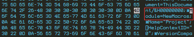

​	在VBA编辑器中，NewMacros已经消失了，宏正常执行

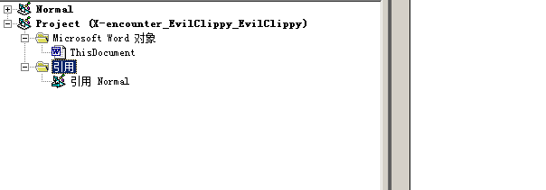

​	还可以使项目锁定且不可看，需要修改PROJECT流ProjectProtectionState和ProjectVisibilityState这两个属性

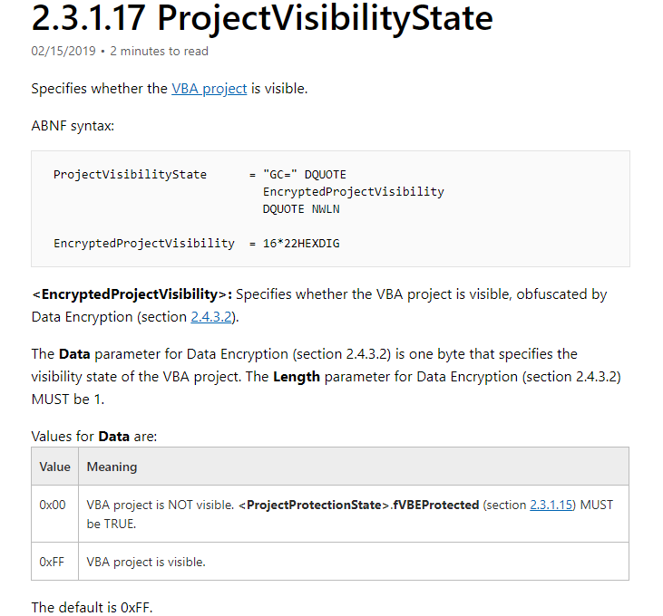

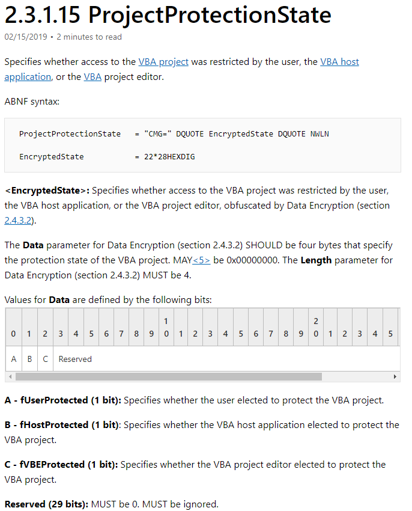

​	虽然这两个属性的内容都是被加密的内容，但是经过实验，将其内容改为任意值（更改时注意长度）

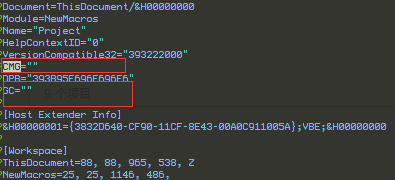

​	会使得VBA工程被锁定且不可看，如果只修改ProjectVisibilityState，VBA工程目录可看，但单个代码模块不可看

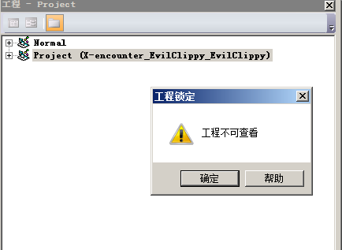

​	理论上该过程是不可逆的，但通过实验发现将相关属性改为有效值并模拟密码保护即可解除锁定

```
ID = {00000000-0000-0000-0000-000000000000}
CMG = CAC866BE34C234C230C630C6 
DPB = 94963888C84FE54FE5B01B50E59251526FE67A1CC76C84ED0DAD653FD058F324BFD9D38DED37 
GC = 5E5CF2C27646414741474
```

​	 可以使用EvilClippy解除锁定

```
EvilClippy -uu 目标文件
```

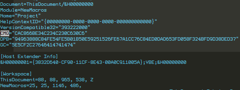

​	上述两种方法所隐藏的宏都可以通过工具检测出来。

### 使用旧版宏警告

​	新版本的宏警告

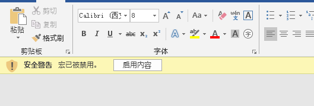

​	而旧版的宏警告提示更加的显眼

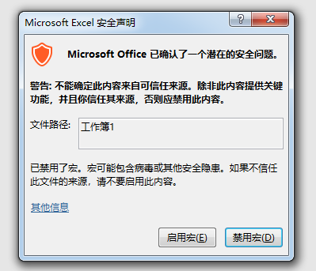

启动旧版宏警告步骤很简单

1. 将.xlsm重命名为.zip并解压缩
2. 将visibility =“hidden”属性添加到xl / workbook.xml文件中的workbookView元素。
3. 将所有文件再次压缩回一个xlsm文件

问题在于只有excel能弹出这种宏警告框，如何让Word也弹出类似的警告框呢？

研究一个样本：ffaa6e86c13b9bb1952b42d07d9c94882e27bc3b0cfe51e81b310a7fd0a5b29b

该word（RTF）文档内嵌了五个带有旧版宏警告的Excel表格


当启动word时，会启动excel并弹出excel旧版宏警告，点击禁用宏后还会启动第二个excel，一共启动五次，用户体验极差，当excel处理完成之后才会弹出Word文档

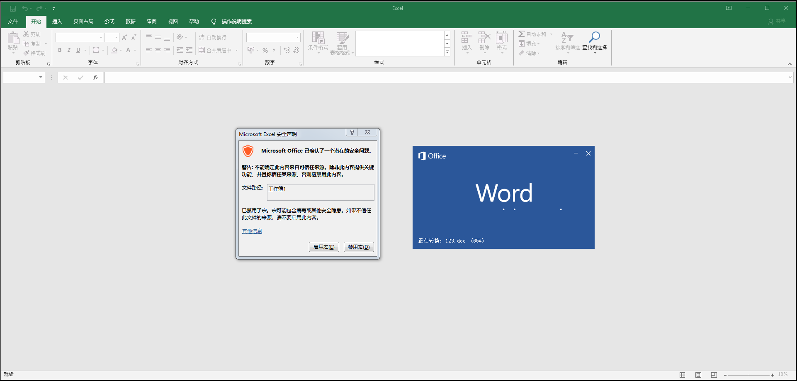

分析此类样本时可以使用rtfobj来查看Ole对象

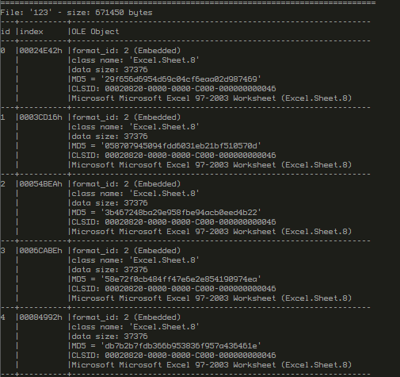

-s和-d参数dump出指定的嵌入对象，接着使用Olevba快速分析

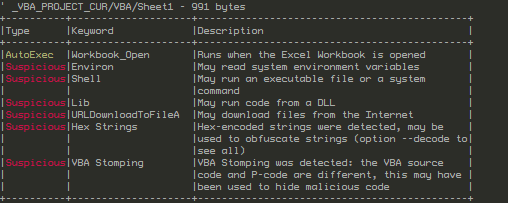

内嵌的宏使用了VBA Stomping，接着使用Pcodedmp将P-Code反编译出来，解混淆找到URL即可

### 常用的规避杀软的手法

一、

​	目前杀软查杀VBA基本上都是静态查杀，所以静态免杀至关重要，从源头上讲Word是一个zip文件，解压之后的vbaProject.bin包含着要执行的宏信息，也是杀软的重点关注对象，可以修改该文件名用于规避检测，步骤分以下三步

1.将“vbaProject.bin”重命名为“no_macros_here.txt”

2.更新“word / _rels / document.xml.rels”中的关系

3.在“[Content_Types] .xml”中，将“bin”替换为“txt”

二、

​	很多诱饵文档喜欢在VBA中启动脚本程序执行ps或者从网络上下载一段shellcode或恶意程序等等，这样非常容易被杀软的行为拦截拦住，同时沙箱可以根据进程链和流量判定该word文档是恶意的，安全分析人员可以轻易的通过监控进程树的方式观察恶意行为。

​	推荐使用WMI来执行后续攻击链，由WMI启动的进程的父进程为wmiprvse.exe而不是word.exe这样就可以与恶意word文档取消关联，规避检测

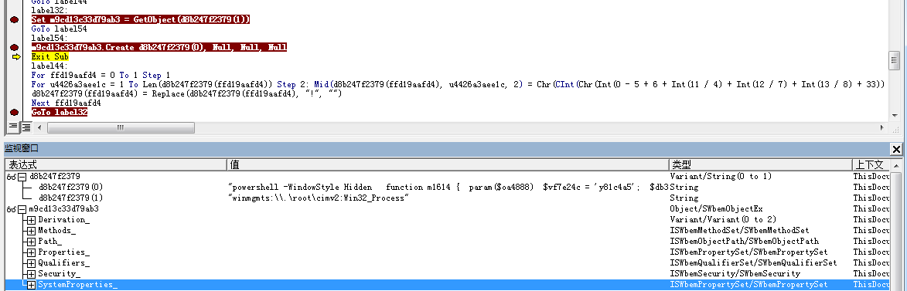

三、动态检测沙箱

​	可以利用dotnet属性以及WMI来检测Office：是否含有最近的文档，正在运行的任务数，特定进程检查（vbox，vmware等等），检测备用数据流（ADS），判断计算机是否是域的一部分（Win32_ComputerSystem类中PartOfDomain对象），检测Bios信息，检测即插即用信息（Win32_PnPEntity），检查用户名，检测文件名hash，检测文件名是否被易名，检测CPU核心（Win32_Processor），检测应用及个数。

​	在vmware虚拟机中运行结果

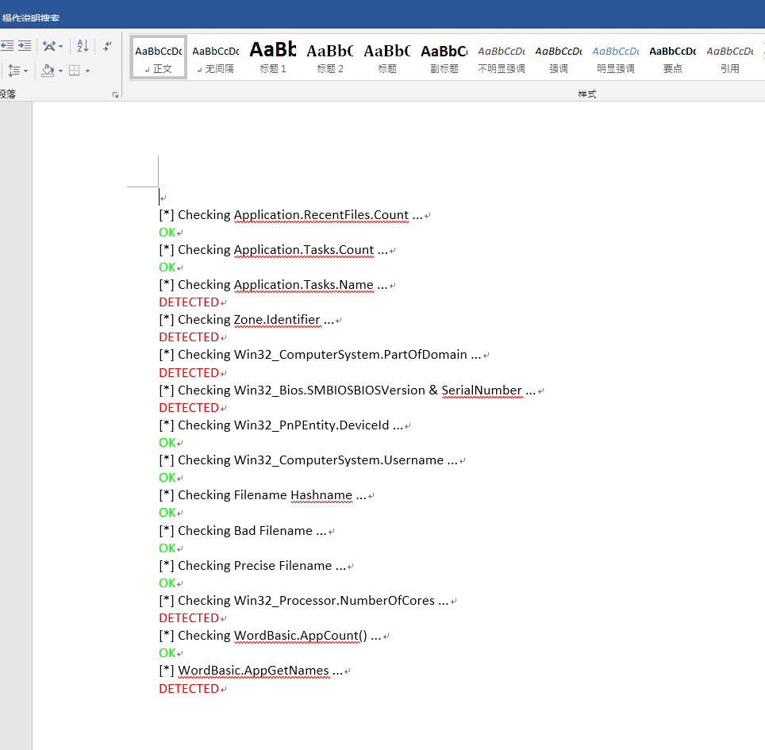

# 结语

想要一起交流学习最新的技术，逆向相关，威胁情报（APT样本）相关，恶意代码相关，欢迎加入信安之路病毒分析小组，Twitter搬运工诚邀您的到来。

# 参考文献

<https://medium.com/walmartlabs/ms-office-file-formats-advanced-malicious-document-maldoc-techniques-b5f948950fdf>

<https://medium.com/walmartlabs/evasive-vba-advanced-maldoc-techniques-1365e9373f80>

<https://medium.com/walmartlabs/vba-stomping-advanced-maldoc-techniques-612c484ab278>

<https://medium.com/walmartlabs/vba-project-locked-project-is-unviewable-4d6a0b2e7cac>

<https://outflank.nl/blog/2019/05/05/evil-clippy-ms-office-maldoc-assistant/>

<http://www.52bug.cn/content/plugins/openlink/viewPage.html?url=https://vbastomp.com/>


